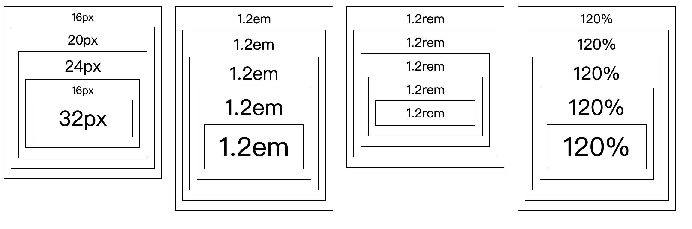
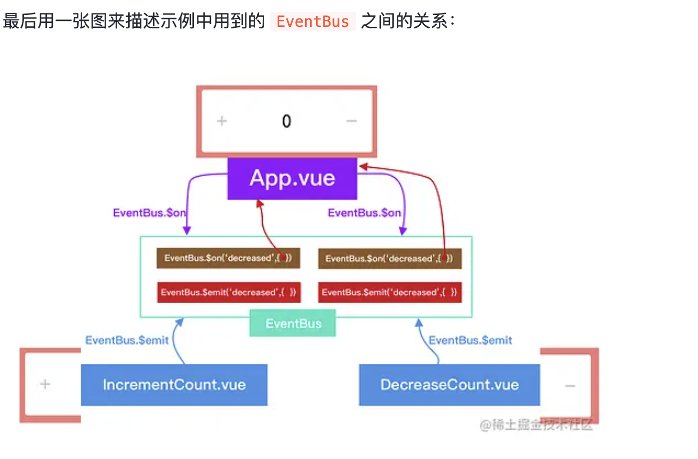

1. Vue2 和 Vue3 实现响应式的方式
- defineProperty
- proxy

2. computed 和 watch 的区别
- 应用场景不同：computed 用在根据 data 属性或者其他 computed 计算得到一个新值的情况，computed 的值一般用在渲染中，当依赖源变化且该 computed 被调用时 computed 才会更新（有缓存）；使用于一些简单的场景（数据计算、衍生等）；而 watch 用在监听数据变化，然后通过回调函数进行一些处理操作（主要在于触发副作用）
- 执行过程不同：computed 只有在依赖源变化且自身被调用或渲染时才回更新；watch 则是依赖的数据源一变化就会触发回调

3. vw、vh、em、rem
- link：https://www.oxxostudio.tw/articles/201809/css-font-size.html
  - 
- px：定义设备的物理像素
- em：子元素相对于父元素的大小（相对单位）
- rem：子元素相对于根元素的大小（相对单位）
- vw：视口宽度；1vw = 1%；不收父元素限制
- vh：视口高度
- 100%：相对于父元素的宽度或高度 * %（最大不会超过父元素）

4. flex: 1 是哪几个属性的缩写
- link（flex 缩写是什么？）：https://www.zhangxinxu.com/wordpress/2019/12/css-flex-deep/
- link（为什么推荐 flex 缩写？）：https://www.zhangxinxu.com/wordpress/2020/10/css-flex-0-1-none/
- link（flex-basis 用法？）：https://www.zhangxinxu.com/wordpress/2019/12/css-flex-basis/
- flex-basis
- flex-grow（富余增长）
- flex-shrink（不足压缩）

- 缩写
  - 实际浏览器渲染中：flex-basis 默认是 0%；flex-grow 默认是 1
  - flex: intial / flex: 0 1 auto（初始值
  - flex: 0 / flex: 0 1 0%
  - flex: 1 / flex: 1 1 0%（常用：适用于内容等分布局
  - flex: auto / flex: 1 1 auto（常用：适用于内容动态「根据 content」布局
  - flex: none / flex: 0 0 auto

5. 实现左右两侧固定，中间适应宽度的方法
- 左右两侧宽度固定，中间设置 `flex: 1` css 属性
- flex 是哪三个属性的缩写：flex-grow、flex-shrink、flex-basis

6. 组件封装（如何兼容组件自带的 props 和自己定义的 props

7. 组件封装的思想

8. hooks 的设计（表单 hooks、校验 hooks

9. Promise
- 三种状态
  - state: pending, result: undefined
  - state: filfulled, result: value
  - state: rejected, result: error

10. $nextTick
- nextTick() 可以在状态改变后立即使用，以等待 DOM 更新完成（当在 Vue 中更改响应式状态时，最终 DOM 的更新不是同步的，而是会将其缓存在任务队列中，等待下一个 tick 再执行，所以如果我们想立马拿到 DOM 更新后的属性数据的话，可以使用 nextTick

11. 如何停止一个 watch
- 调用 watch 返回的函数
```
const unWatch = watch(() => {})
const unWatchEffect = watch(() => {})

<!-- 下面两个函数调用可以用来停止 watch -->
unWatch()
unWatchEffect()
```

12. postcss 是什么

13. ts 中 type 和 interface 的区别
- chatGPT
  - 定义方式：type 通过 type 关键字、interface 通过 interface 关键字
  - 扩展方式不同：interface 可以通过 extends 实现扩展与继承；type 可以通过联合、交叉等实现扩展
  - 使用范围不同：interface 只能用来定义对象的结构，具体到每个字段；type 主要用来自定义类型、定义更复杂的类型、定义非对象和对象类型
  - 同名 interface 会自动合并；同名 type 会报错
  - 继承：interface 可以继承（即 interface 是「开放」的）；type 不可以（即 type 是「封闭」的）
- 其它文档：https://wangdoc.com/typescript/interface#interface-%E4%B8%8E-type-%E7%9A%84%E5%BC%82%E5%90%8C
  - 都可以表示对象类型
  ```JavaScript
  interface apiOne {
    name: string,
    age: number
  }
  type typeOne = {
    name: string,
    age: number
  }
  ```
  - 两者实现扩展的方式
  ```JavaScript
  type Foo = { x: number }
  interface Bar extends Foo {
    y: number
  }

  interface Foo {
    x: number
  }
  type Bar = Foo & { y: number }
  ```

14. ts 中 interface 如何继承
- interface 可以继承 interface、type、Class

15. pinia、vuex 中的全局状态是如何实现的
- https://vscode.dev/github/liulvcheng/202405-interview/blob/main/markdown/vue-basic.md#L208

16. 父子组件通信的方式有哪些
- props、emit
- provide、inject：父子间及祖先后代间
  - https://cn.vuejs.org/guide/components/provide-inject.html
- eventBus
  - 空的 Vue 实例作为事件总线
  - 触发：EventBus.$emit(key, value)
  - 调用：EventBus.$on(key, (value) => {})
  - 调用一次：EventBus.$once(key, (value) => {})
  - 移除：EventBus.$off(key, (value) => {}) or EventBus.$off()
  - 
  ```JavaScript
  // EventBus.js
  import Vue from 'vue';
  export const EventBus = new Vue();

  // 发送事件
  // 组件A
  <script>
  import { EventBus } from './EventBus.js';
  export default {
    methods: {
      sendEvent() {
        EventBus.$emit('eventName', 'Data from component A');
      }
    }
  }
  </script>

  // 监听事件
  // 组件B
  <script>
  import { EventBus } from './EventBus.js';
  export default {
    created() {
      EventBus.$on('eventName', (data) => {
        console.log(data);
      });
    }
  }
  </script>

  // eventBus once 修饰符：只监听一次事件的触发
  EventBus.$once(key, () => {})

  // 移除 eventBus 事件
  EventBus.$off(key)

  // 移除所有事件（不传参数即可）
  EventBus.$off()
  ```
- vuex、pinia
- refs（负组件直接通过 ref 调用子组件）
  ```JavaScript
  // 父组件
  <template>
    <ChildComponent ref="child" />
    <button @click="callChildMethod">Call Child Method</button>
  </template>
  <script>
  export default {
    methods: {
      callChildMethod() {
        this.$refs.child.childMethod();
      }
    }
  }
  </script>

  // 子组件
  <script>
  export default {
    methods: {
      childMethod() {
        console.log('Child method called');
      }
    }
  }
  </script>
  ```

17. 透传是什么
- link：https://cn.vuejs.org/guide/components/attrs.html
- '透传 attribute”指的是传递给一个组件，却没有被该组件声明为 props 或 emits 的 attribute 或者 v-on 事件监听器。最常见的例子就是 class、style 和 id'
- 透传是默认开启的
  - 可通过 `inheritAttrs: false` 来关闭
  - 关闭后想访问的话可以通过 `$attrs` 来访问到
  ```JavaScript
  // template
  <span>Fallthrough attribute: {{ $attrs }}</span>

  or

  <div class="btn-wrapper">
    <button class="btn" v-bind="$attrs">Click Me</button>
  </div>

  // js
  <script setup>
  import { useAttrs } from 'vue'

  const attrs = useAttrs()
  </script>
  ```