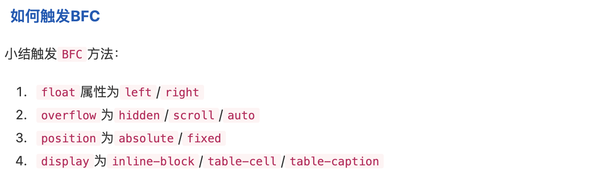

### props 如何同步更新父子组件
1. v-bind 加上 sync 修饰符（具体还是需要在子组件中 emit 事件，只是说父组件中不需要监听事件来手动改变 v-bind 绑定的值
```JavaScript
// 父组件
<template>
  <div>
    <ChildComponent :value.sync="parentValue" />
  </div>
</template>

<script>
import ChildComponent from './ChildComponent.vue';

export default {
  components: { ChildComponent },
  data() {
    return {
      parentValue: 'initial value'
    };
  }
};
</script>

// 子组件
<template>
  <div>
    <input :value="value" @input="handleInput" />
  </div>
</template>

<script>
export default {
  props: ['value'],
  methods: {
    handleInput(event) {
      // 触发后父组件不需要手动接收来改变
      this.$emit('update:value', event.target.value);
    }
  }
};
</script>

// sync 是 :prop 和 @update:prop 的结合
<ChildComponent :value.sync="parentValue" />
// 等同于
<ChildComponent :value="parentValue" @update:value="parentValue = $event" />
```

2. v-model 的本质（绑定 value 和监听 input 事件的结合
```JavaScript
// 父组件
<template>
  <div>
    <ChildComponent v-model="parentValue" />
  </div>
</template>

<script>
import ChildComponent from './ChildComponent.vue';

export default {
  components: { ChildComponent },
  data() {
    return {
      parentValue: 'initial value'
    };
  }
};
</script>

// 子组件
<template>
  <div>
    <input :value="value" @input="handleInput" />
  </div>
</template>

<script>
export default {
  props: ['value'],
  methods: {
    handleInput(event) {
      this.$emit('input', event.target.value);
    }
  }
};
</script>
```

### provide、inject 是动态的还是静态的（如何做到动态更新
1. 静态传递就是使用正常的变量；动态传递就是使用被 ref、reactive 包裹的变量
- 官方文档：'如果提供的值是一个 ref，注入进来的会是该 ref 对象，而不会自动解包为其内部的值。这使得注入方组件能够通过 ref 对象保持了和供给方的响应性链接'
- 官方文档：'当提供 / 注入响应式的数据时，建议尽可能将任何对响应式状态的变更都保持在供给方组件中。这样可以确保所提供状态的声明和变更操作都内聚在同一个组件内，使其更容易维护'
```JavaScript
// provide 普通值
<script setup>
import { provide } from 'vue'
provide(/* 注入名 */ 'message', /* 值 */ 'hello!')
</script>

// provide 响应式值
import { ref, provide } from 'vue'
const count = ref(0)
provide('key', count)
```

2. provide、inject 的使用建议保持单向数据流的原则
- provide 数据的改变建议在 provide 方执行（当然触发可以在 inject 一方）
- 实际运用中可以在 inject 方改变 provide 的数据，这是 provide 方的数据会同步更新，但这种方式在大型应用中可能会造成数据混乱或数据状态不好更新
```JavaScript
// 在供给方组件内
<script setup>
import { provide, ref } from 'vue'
const location = ref('North Pole')

// 改变数据的事件
function updateLocation() {
  location.value = 'South Pole'
}

provide('location', {
  location,
  updateLocation
})
</script>

// 在注入方组件
<script setup>
import { inject } from 'vue'
const { location, updateLocation } = inject('location')
</script>

<template>
  // 在 inject 方触发，但实际更改是在 provide 方
  <button @click="updateLocation">{{ location }}</button>
</template>
```

3. provide 的数据不能被修改（使用 readonly 包装
```JavaScript
<script setup>
import { ref, provide, readonly } from 'vue'

const count = ref(0)
provide('read-only-count', readonly(count))
</script>
```

4. 使用 Symbol 作为注入名（可以避免同名情况；减少潜在的冲突
```JavaScript
// keys.js
// 全局导出一个 Symbol 值（每次被调用时都是不一样的 Symbol
export const myInjectionKey = Symbol()

// 在供给方组件中
import { provide } from 'vue'
import { myInjectionKey } from './keys.js'
provide(myInjectionKey, { /*
  要提供的数据
*/ });

// 注入方组件
import { inject } from 'vue'
import { myInjectionKey } from './keys.js'
const injected = inject(myInjectionKey)
```

4. 应用层 provide（全局 provide 的感觉）
```JavaScript
import { createApp } from 'vue'
const app = createApp({})
app.provide(/* 注入名 */ 'message', /* 值 */ 'hello!')
```

5. 可以将父组件的 ref provide 给子组件，然后子组件可以调用父组件 ref 来调用某些父组件上的属性和方法
- 优点
  - GPT：'松耦合：子组件无需知道父组件的具体实现，只需通过 inject 获取需要的依赖，降低了耦合度'
  - GPT：'层级透明：即使组件层级较深，子组件也能轻松获取祖先组件提供的依赖，无需逐层传递'
  - GPT：'方便全局状态管理：适用于共享全局状态或依赖的场景，例如主题、配置等'
- 缺点
  - GPT：'隐式依赖（这其实是 provide - inject 的缺点，不能够直接的看到依赖传递关系）：子组件对 inject 依赖是隐式的，难以在代码中直接看出依赖关系，增加了理解难度'
  - GPT：'调试不便：当注入的依赖出现问题时，调试和排查问题可能会比较麻烦'
  - GPT：'适用范围有限：主要适用于祖先和后代组件间共享状态的场景，不适用于跨级的兄弟组件间直接传递数据'

6. 对于子组件 emit 的方式也可以将子组件自身的 ref 实例 emit 出去，父组件接收到可以调用 ref 上的 validator 等方法

### 具名插槽、作用域插槽
1. 默认内容
```JavaScript
// Submit 是默认内容，当外部有内容传入的情况下，外部内容会替代默认内容
<button type="submit">
  <slot>
    Submit <!-- 默认内容 -->
  </slot>
</button>
```

2. 作用域插槽：适用于需要在一个组件中插入多个不同内容块的场景
```TypeScript
<div class="container">
  <header>
    <slot name="header"></slot>
  </header>
  <main>
    <slot></slot>
  </main>
  <footer>
    <slot name="footer"></slot>
  </footer>
</div>

<BaseLayout>
  // <template v-slot:header>
  <template #header>
    <h1>Here might be a page title</h1>
  </template>

  <template #default>
    <p>A paragraph for the main content.</p>
    <p>And another one.</p>
  </template>

  <template #footer>
    <p>Here's some contact info</p>
  </template>
</BaseLayout>
```

3. 作用域插槽
- 官方文档：'插槽的内容无法访问到子组件的状态；然而在某些场景下插槽的内容可能想要同时使用父组件域内和子组件域内的数据。要做到这一点，我们需要一种方法来让子组件在渲染时将一部分数据提供给插槽；我们也确实有办法这么做！可以像对组件传递 props 那样，向一个插槽的出口上传递 attributes'
- 可以理解为父组件想要使用或者获取子组件的数组时可通过插槽的方式将子组件的相关内容暴露出来
```JavaScript
// 子组件传递 text、count 属性
<div>
  <slot :text="greetingMessage" :count="1"></slot>
</div>

// 父组件接受到子组件插槽暴露出的 text、count
// 直接取值方式
<MyComponent v-slot="slotProps">
  {{ slotProps.text }} {{ slotProps.count }}
</MyComponent>
// 解构取值方式
<MyComponent v-slot="{ text, count }">
  {{ text }} {{ count }}
</MyComponent>

// 01 - 实际运用：父组件
<template>
  <div>
    <DataTable :items="items">
      <template v-slot:default="{ item }">
        <tr>
          <td>{{ item.name }}</td>
          <td>{{ item.age }}</td>
        </tr>
      </template>
    </DataTable>
  </div>
</template>

<script>
import DataTable from './DataTable.vue';
export default {
  components: {
    DataTable
  },
  data() {
    return {
      items: [
        { name: 'John', age: 30 },
        { name: 'Jane', age: 25 }
      ]
    }
  }
}
</script>
// 01 - 实际运用：子组件
<template>
  <table>
    <tbody>
      <tr v-for="item in items" :key="item.name">
        <slot :item="item"></slot>
      </tr>
    </tbody>
  </table>
</template>

<script>
export default {
  props: {
    items: Array
  }
}
</script>

// 02 - 实际运用：父组件接受 item 并将其解构为 body、username、likes
<FancyList :api-url="url" :per-page="10">
  <template #item="{ body, username, likes }">
    <div class="item">
      <p>{{ body }}</p>
      <p>by {{ username }} | {{ likes }} likes</p>
    </div>
  </template>
</FancyList>
// 02 - 实际运用：子组件插槽上绑定 item
<ul>
  <li v-for="item in items">
    <slot name="item" v-bind="item"></slot>
  </li>
</ul>
```

### 对于函数而言 arguments 和 rest 参数的主要区别是什么
1. arguments
- 是类数组对象，不是真正的数组，有 length 属性，但是无法操作数组上的方法（需要转换为数组才可以）
- 语法和可读性差

2. rest 参数
- 是真正的数组，因此可以直接使用数组的方法
- 语法简洁且现代

3. 两者用于箭头函数的区别
```JavaScript
function outerFunction() {
  const arrowFunction = () => {
    console.log(arguments)
  }
  arrowFunction(4, 5, 6)
}
// arrowFunction 会从箭头函数最近的非箭头函数（父函数或外部函数）去找 arguments
outerFunction(1, 2, 3) // 输出：{ '0': 1, '1': 2, '2': 3 }

const arrowFunction = (...args) => {
  console.log(args);
};
arrowFunction(4, 5, 6); // 输出：[4, 5, 6]
```

### vue3 v-model 有什么变化
1. 可设置多个 v-model
```JavaScript
<UserName
  v-model:first-name="first"
  v-model:last-name="last"
/>

<script setup>
const firstName = defineModel('firstName')
const lastName = defineModel('lastName')
</script>

<template>
  // 子组件 firstName、lastName 的改变父子组件都会自动更新
  <input type="text" v-model="firstName" />
  <input type="text" v-model="lastName" />
</template>
```

2. defineModel 可对 v-model 的值进行限制处理
```JavaScript
const title = defineModel('title', {
  required: true,
  default: 'yo',
  // 校验
  validator: value => typeof value === 'string' && value.length > 0,
  // 数据类型
  type: String,
  // 将传入的值在子组件使用时进行处理（此处为去掉前后空格）
  coerce: value => value.trim()
});
```

3. 可自定义修饰符
- 本质上还是对 v-model 绑定的值进行处理（如首字母大写、全部大写等）

### css 中如何解决 margin 合并和 margin 塌陷
1. margin 合并
```JavaScript
// 01 - 相邻兄弟元素
// 两者之间 margin 为最大值 30px
<style>
  .box1 { margin-bottom: 20px; background: lightblue; }
  .box2 { margin-top: 30px; background: lightgreen; }
</style>
<div class="box1">Box 1</div>
<div class="box2">Box 2</div>

// 02 - 当一个父元素和其第一个或最后一个子元素的垂直外边距相遇时，这些外边距也会合并
// margin-top 会合并，最终外边距是 50px
<style>
  .parent { margin-top: 50px; background: pink; }
  .child { margin-top: 20px; background: yellow; }
</style>
<div class="parent">
  <div class="child">Child</div>
</div>
```

2. margin 塌陷
- 
```HTML
<!-- 下述代码会产生 margin 塌陷，具体表现为 son 元素距离 fathre 元素的 50px 塌陷了（即不见了） -->
<!DOCTYPE html>
<html>
  <head> </head>
  <body>
    <div class="father">
      <div class="son"></div>
    </div>
  </body>
</html>

<style>
  div.father {
    width: 200px;
    height: 200px;
    background-color: rgb(219, 68, 101);
    margin-left: 100px;
    margin-top: 100px;
    /* 添加 overflow: hidden / scroll / hidden 可以解决 */
    /* overflow: hidden; */
  }
  div.father div.son {
    width: 100px;
    height: 100px;
    background-color: rgb(56, 248, 207);
    margin-left: 50px;
    margin-top: 50px;
  }
</style>

```

3. 防止 margin 合并和塌陷
```JavaScript
// 01 - 使用内边距
<style>
  .parent { padding-top: 1px; }
  .child { margin-top: 20px; }
</style>
<div class="parent">
  <div class="child">Child</div>
</div>

// 02 - 使用 flex、grid 布局
<style>
  .container { display: flex; flex-direction: column; }
  .item { margin-top: 20px; }
</style>
<div class="container">
  <div class="item">Item 1</div>
  <div class="item">Item 2</div>
</div>
```

### eventBus 的 emit、on 事件
1. EventBus.$emit()

2. EventBus.$on() or EventBus.$once()

3. EventBus.$off(key)（key 表示具体事件）or EventBus.$off()（不传 key 的话表示取消所有 emit 的事件）

4. 监听完 emit 的事件后记得要移除它
```JavaScript
mounted() {
  // on 监听
  this.$EventBus.$on("aMsg", () => {});
},
beforeDestroy() {
  // off 移除
  this.$EventBus.$off("aMsg")
  // 移除所有
  this.$EventBus.$off()
}
```

### vue3 create 生命周期和 setup 谁先执行
1. 执行顺序
- setup、beforeCreate（命名不清楚是不是这个）、created（命名不清楚是不是这个）

2. vue3 composition api 中一般通过 onBeforeMount 来做一些组件实例挂载之前的事情，onMounted 做组件实例挂载之后的一些事情

### router push query 和 params 时如何在指定页面拿到对应的路由参数
1. query 方式
```JavaScript
// 跳转
this.$router.push({ path: '/example', query: { name: 'John', age: 30 } });

// 跳转后获取参数
export default {
  mounted() {
    console.log(this.$route.query.name); // 输出 'John'
    console.log(this.$route.query.age);  // 输出 30
  }
}
```

2. params 方式
```JavaScript
// 配置路由
const routes = [
  {
    path: '/user/:id',
    component: UserComponent
  }
];

// 跳转
this.$router.push({ name: 'user', params: { id: 123 } });

// 跳转后获取参数
export default {
  mounted() {
    console.log(this.$route.params.id); // 输出 123
  }
}
```

3. 注意事项
- GPT：'刷新页面：当页面刷新时，params 参数会丢失，因为它们不是直接嵌入到 URL 中。而 query 参数是嵌入到 URL 中的，即使刷新页面也不会丢失'
- GPT：'路径结构：使用 params 传递参数需要在路由配置中预定义路径结构，而 query 参数则可以在任何路径中使用'
