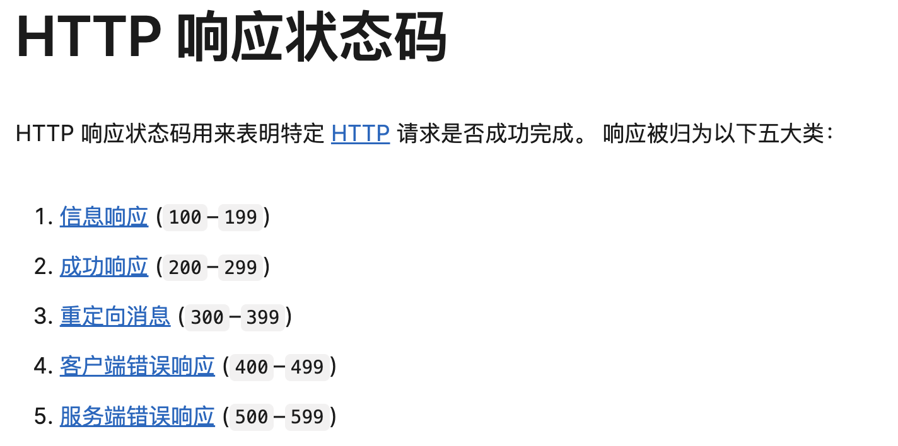

### html5 新的语义化标签
1. 新标签
- header、footer、article（独立的内容）、section、main、nav、mark（重要或高亮）

2. 作用
- GPT：'这些新的语义化标签帮助开发者更好地组织和描述网页内容，提高了网页的可读性、可维护性，并且有助于搜索引擎和辅助技术更准确地解析和呈现网页内容'
- GPT：'有利于残疾人通过屏幕阅读器使用已带来更好的体验'

### css 中选择器优先级
1. 主流的
- 内联、ID 选择器、类选择器及伪类、类型选择器（p、div）及伪元素、通配选择器（*）

2. css 中 !important 高于上述所有，但不宜过多的使用

### break、continue、return 退出循环有什么区别
1. 单层 for
```JavaScript
for (let i = 0; i < 5; i++) {
  if (i === 3) {
    break // 0 1 2（3 后面的全部跳过）
    return // 0 1 2
    continue // 0 1 2 4（只会跳过 3，即只会退出 if 判断逻辑）
  }
  console.log(`${i}`, i)
}
```

2. 双层 for
```JavaScript
for (let i = 0; i < 3; i++) {
  for (let j = 0; j < 5; j++) {
    if (j === 3) {
      break // 00 01 02 10 11 12 20 21 22（遇到 3 退出单层 for）
      return // 00 01 02（遇到 3 退出双层 for）
      continue // 00 01 02 04 10 11 12 14 20 21 22 24（遇到 3 退出当前判断逻辑即 if 判断）
    }
    console.log(`${i}`, j)
  }
}
```

3. return 和 break
- break 常见于循环、switch - case 中；return 常见于 if、函数中
- return 会返回一直值（显性指定或是默认值 undefined）；break 不会有返回值

### 浏览器的重排和重绘
1. 重排
- GPT：'重排，也称为 布局（Layout），是指浏览器重新计算文档的几何属性和位置。当页面的结构（DOM）或样式（CSS）发生变化，影响元素的尺寸、位置或其他几何属性时，就会触发重排'
- 触发重排的操作
  - 添加、删除或修改 DOM 元素
  - 改变元素的尺寸、边距、填充或边框
  - 改变页面布局（例如，改变元素的 display 属性）
  - 调用某些 JavaScript 方法（如 offsetWidth、offsetHeight、getBoundingClientRect）
- 重排的代价
  - 重排是一个代价高昂的操作，因为它可能涉及到整个页面或部分页面的重新计算和布局。
  - 频繁的重排会导致性能问题，特别是在大规模或复杂的页面上

2. 重绘
- GPT：'重绘 是指在不影响页面布局的前提下，重新绘制元素的外观。当元素的外观（例如颜色、背景、边框颜色等）发生变化时，就会触发重绘'
- 触发重绘的操作
  - 改变元素的颜色、背景色或边框颜色
  - 改变元素的可见性（如 visibility）
  - 改变文字颜色或字体样式
- 重绘的代价
  - 相对于重排，重绘的代价较小，因为它不涉及页面布局的重新计算
  - 但频繁的重绘操作仍然会影响性能，特别是在低性能的设备上或复杂的页面中
- 优化重绘
  - 尽量减少样式的频繁变更
  - 合并多次样式更改为一次操作

### 同源策略是什么
1. 同源的规定
- GPT：'只有当两个 URL 具有相同的协议、主机和端口时，才被认为是同源'
- 协议（http、https），主机（可以理解为域名），端口（8080、9090）
```JavaScript
// 协议不同不同源
http://www.example.com/page1
https://www.example.com/page2
```

2. 同源限制了哪些操作
- GPT：'Cookie、LocalStorage 和 IndexedDB：只能被同源的页面访问'
- GPT：'一个源上的脚本不能读取或修改另一个源中的 DOM'
- GPT：'一个源上的脚本只能向同源的 URL 发送请求'
- GPT：'js 对象或者 window 对象只能被同源的页面访问'

3. 绕过同源限制的方法
- GPT：'CORS（跨源资源共享，Cross-Origin Resource Sharing）：服务器可以通过设置 HTTP 响应头来指示浏览器允许特定的跨源请求'
```JavaScript
Access-Control-Allow-Origin: http://anotherdomain.com
```
- GPT：'JSONP（JSON with Padding）：通过 <script> 标签来加载跨源的 JSON 数据。这种方法只适用于 GET 请求'
```JavaScript
<script src="http://anotherdomain.com/data.json?callback=myCallback"></script>
```
- GPT：'代理服务器：通过同源的服务器代理请求到不同源的服务器，再返回结果给浏览器'
```JavaScript
// 01 - 客户端 a 和服务端 b 不同源，通过代理服务器 c 来解决
// 02 - 客户端 a 和代理服务器 c 同源
// 03 - 代理服务器 c 和服务端 b 为服务端间的通信没有同源限制
```


### 常见的 http 状态码有哪些（403、5xx、3xx、2xx）
1. code 分类
- 

2. 200 ok 表示请求成功

3. 400 Bad Request
- MDN：'由于被认为是客户端错误（例如，错误的请求语法、无效的请求消息帧或欺骗性的请求路由），服务器无法或不会处理请求'
- get 用了 post 方法；post url 拼接参数用了 formData

4. 403 Forbidden
- MDN：'客户端没有访问内容的权限；也就是说，它是未经授权的，因此服务器拒绝提供请求的资源。与 401 Unauthorized 不同，服务器知道客户端的身份'

5. 404 Not Found
- MDN：'服务器找不到请求的资源。在浏览器中，这意味着无法识别 URL。在 API 中，这也可能意味着端点有效，但资源本身不存在。服务器也可以发送此响应，而不是 403 Forbidden，以向未经授权的客户端隐藏资源的存在。这个响应代码可能是最广为人知的，因为它经常出现在网络上'

6. 500 Internal server Error
- MDN：'服务器遇到了不知道如何处理的情况'
- 一般出现在后端服务还没启动或者正在启动的过程 api 响应会是 500

7. 502 Bad Gateway
- MDN：'此错误响应表明服务器作为网关需要得到一个处理这个请求的响应，但是得到一个错误的响应'
- 网关相关

8. 503 Service Unavailable
- MDN：'服务器没有准备好处理请求。常见原因是服务器因维护或重载而停机。请注意，与此响应一起，应发送解释问题的用户友好页面。这个响应应该用于临时条件和如果可能的话，HTTP 标头 Retry-After 字段应该包含恢复服务之前的估计时间。网站管理员还必须注意与此响应一起发送的与缓存相关的标头，因为这些临时条件响应通常不应被缓存'

### css 的引入方式有哪些
1. link 标签对引入外部 css 文件
```JavaScript
// 本地
<head>
  <link rel="stylesheet" href="styles.css">
</head>
<body>
  <div class="example">Hello World</div>
</body>

// cdn
<head>
  <link
    rel="stylesheet"
    href="https://stackpath.bootstrapcdn.com/bootstrap/4.5.2/css/bootstrap.min.css"
  >
</head>
<body>
  <div class="container">
    <h1>Hello, world!</h1>
  </div>
</body>
```

2. @import 在 style 标签对中引入 css
```CSS
/* styles.css */
/* 同样可以引入本地、cdn 文件 */
@import url("other-styles.css");
@import url('https://stackpath.bootstrapcdn.com/bootstrap/4.5.2/css/bootstrap.min.css');

.example {
  color: green;
  font-size: 16px;
}
```

3. link 和 @import 的区别
- GPT：'加载顺序：@import 引入的样式会在页面加载完成后进行处理，可能会导致渲染阻塞和样式的延迟应用。因此，不推荐在生产环境中大量使用 @import'
- GPT：'性能问题：与直接在 <link> 标签中引入样式相比，@import 的加载性能较差。尽量使用 <link> 标签来引入外部样式表'
- GPT：'@import 必须放在 CSS 文件或 style 标签的最前面，不能出现在任何其他 CSS 规则之后'

### vu2、vue3 的区别
1. 按需引入的方式 composition api

2. hooks

3. 更好的 ts 支持

4. 响应式的实现方式不同，通过 Proxy 来实现，Proxy 可以监听数组和对象的新增或删除属性，解决了 Vue 2 中的一些限制

### async await 是用来编写同步代码的嘛
1. async await 使得一些异步操作代码（延时执行的回调函数、延时执行的 Promise）可以同步执行

2. async await 不会阻塞事件循环（还是不太理解）
```JavaScript
// GPT：'在 func 函数内部，执行到 await 时，函数暂停，但事件循环继续运行，不会被阻塞。事件循环仍然可以处理其他异步任务或事件，即使此时没有其他任务，事件循环仍然处于等待状态，准备处理未来到达的任务（有可以做其它事情的能力但没其它事情可做）。这样，应用程序可以保持响应性'
// 当代码中不只有 func 函数的时候 func 函数 await 时事件循环可以走其他的代码逻辑
async function func() {
  console.log('1')
  await new Promise((resolve) =>
    setTimeout(() => {
      console.log('3')
      resolve()
    }, 1000)
  )
  console.log('2')
}

func() // 1 3 2
```

### vue2 中 data 的定义为什么需要是函数 return 而不是一个对象这样
1. 可以理解为一种闭包，通过隔离数据的方式来使得各个组件实例互不影响

2. GPT
- '独立的组件实例状态：每个组件实例都会有一个独立的 data 对象。通过函数返回对象的方式，可以确保每个组件实例的 data 状态是独立的，不会相互影响'
- '避免数据共享：如果 data 直接是一个对象，那么所有组件实例将共享同一个 data 对象，导致一个组件实例中的数据变化会影响到其他组件实例，这通常不是期望的行为'

### 数组去重有哪些方法
1. set
```JavaScript
const array = [1, 2, 2, 3, 4, 4, 5];
const uniqueArray = [...new Set(array)];

console.log(uniqueArray); // [1, 2, 3, 4, 5]
```

2. filter + indexOf
```JavaScript
const array = [1, 2, 2, 3, 4, 4, 5];
const uniqueArray = array.filter((item, index) => array.indexOf(item) === index);

console.log(uniqueArray); // [1, 2, 3, 4, 5]
```

3. reduce
```JavaScript
const array = [1, 2, 2, 3, 4, 4, 5];
const uniqueArray = array.reduce((acc, item) => {
  if (!acc.includes(item)) {
    acc.push(item);
  }
  return acc;
}, []);

console.log(uniqueArray); // [1, 2, 3, 4, 5]
```

4. 利用对象键或者 Map 键的唯一性
```JavaScript
// Object
const array = [1, 2, 2, 3, 4, 4, 5];
const uniqueObj = {};
const uniqueArray = array.filter(item => {
  if (!uniqueObj[item]) {
    uniqueObj[item] = true;
    return true;
  }
  return false;
});

console.log(uniqueArray); // [1, 2, 3, 4, 5]

// Map
const array = [1, 2, 2, 3, 4, 4, 5];
const map = new Map();
const uniqueArray = [];

array.forEach(item => {
  if (!map.has(item)) {
    map.set(item, true);
    uniqueArray.push(item);
  }
});

console.log(uniqueArray); // [1, 2, 3, 4, 5]
```

5. lodash 库
```JavaScript
const _ = require('lodash'); // 或者使用 <script src="https://cdn.jsdelivr.net/npm/lodash/lodash.min.js"></script>
const array = [1, 2, 2, 3, 4, 4, 5];
const uniqueArray = _.uniq(array);

console.log(uniqueArray); // [1, 2, 3, 4, 5]
```

### 箭头函数有自己的 argments 嘛
1. 箭头函数没有自己的 argments
```JavaScript
const arrowFunc = () => {
  console.log(arguments)
}
function func() {
  console.log(arguments)
}
// GPT：'因为箭头函数不会创建自己的 arguments 对象。它会引用其外部作用域中的 arguments 对象，但在这个例子中，外部作用域是全局作用域，arguments 并不存在或未定义。因此，可能会抛出错误或者输出一个空的 arguments 对象或 undefined'
arrowFunc(1, 2, 3) // 输出一推奇怪的东西
func(1, 2, 3) // [Arguments] { '0': 1, '1': 2, '2': 3 }
```

2. 箭头函数的 this 是其定义时父级作用域的 this（最顶层就是 window、global）

3. 箭头函数不能用作构造函数
- 没有 this 绑定、没有 prototype 属性
```JavaScript
// 箭头函数不能作为构造函数
const ArrowFunc = () => {
  this.value = 42;
};
// 尝试用箭头函数作为构造函数
try {
  const obj = new ArrowFunc();
} catch (e) {
  console.log(e); // TypeError: ArrowFunc is not a constructor
}

// es5
function NormalFunc() {
  this.value = 42;
}
const obj = new NormalFunc();
console.log(obj.value); // 42

// es6
class MyClass {
  constructor() {
    this.value = 42;
  }
}
const obj = new MyClass();
console.log(obj.value); // 42
```

### 伪类、伪元素
1. 伪类
- 用于选择元素的特殊状态，如 hover、focus、visited 等

2. 伪元素
- 用于选择元素的一部分或创建新的虚拟元素
- GPT：'伪元素在样式上存在，可以应用 CSS 样式、插入内容，但在实际的 DOM 树中并不存在对应的节点'
```CSS
p::before {
  /* 实际的 DOM 树上并没有 Note 对应的节点 */
  content: "Note: "; /* 在段落前插入 "Note: " */
}
```

3. 单冒号和双冒号并不能判断是伪类还是伪元素
- GPT：'在 CSS2 中，伪类和伪元素都使用单冒号'
- GPT：'在 CSS3 中，为了区分伪类和伪元素，规定伪元素使用双冒号 ::，而伪类仍使用单冒号 :。不过，现代浏览器大多也支持用单冒号表示伪元素（为向后兼容）'
