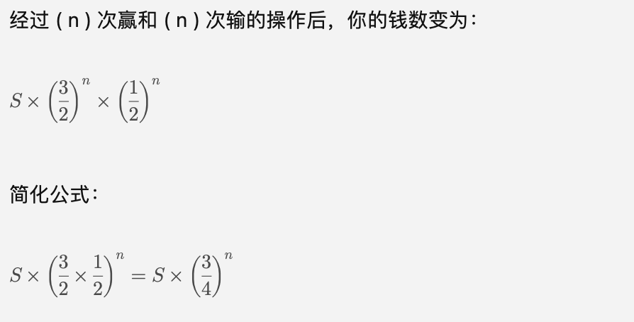

### abcde，ab 不能站最中间（即 1 2 3 4 5 五个位置，a b 不能在 3 位置有哪几种可能性）
1. 五个数字排列总共有 5 阶乘种方法，而 a 在位置 3 或者 b 在位置 3 时其它位置可以随意组合，所以不符合条件的总共有 2 * 4 的阶乘种；最终结果为 5 的阶乘减去 2 * 4 的阶乘

2. 结果为 5 * 4 * 3 * 2 * 1 - (2 * 4 * 3 * 2 * 1) = 120 - 48 = 72

### 创建对象实例后通过循环调取 get、set 为实例添加值
```JavaScript
class Parent {
  constructor(a) {
    this.a = a
  }
  getA() {
    return this.a
  }
  setA(a) {
    this.a = a
  }
}
class Child1 {
  static main() {
    let list = []
    const parent = new Parent()
    for (let item of [1, 2, 3, 4]) {
      // 每次 setA 传入的 item 虽然不一样，但是 list.push 进去的 parent 是同一个
      // 所以可以理解为，每一次 setA 都将之前 push 进去的 parent 对应的 a 设置为新的值（最后即是 4）
      parent.setA(item)
      list.push(parent)
    }
    console.log('here1', list) // [ Parent { a: 4 }, Parent { a: 4 }, Parent { a: 4 }, Parent { a: 4 } ]

    let result = []
    for (let item of list) {
      result.push(item.getA()) // 4 4 4 4
    }
    console.log('here1', result)
  }
}
Child1.main()

class Child2 {
  static main() {
    let list = []
    for (let item of [1, 2, 3, 4]) {
      // 每次循环都创建一个对象新实例，保证数据隔离
      // 创建赋值一起
      const parent = new Parent(item)
      // or
      // 先创建再赋值
      const parent = new Parent()
      parent.setA(item)

      list.push(parent)
    }
    console.log('here2', list) // 打印 [Parent { a: 1 }, Parent { a: 2 }, Parent { a: 3 }, Parent { a: 4 }]

    let result = []
    for (let item of list) {
      result.push(item.getA()) // [1, 2, 3, 4]
    }
    console.log('here2', result)
  }
}
Child2.main()
```

### 每次赌博出一半的钱，在 2n 次赌博后（赢和输都是 n 次）相对于原始赢还是输
1. 简单理解，100 变 50 只亏 50%，但从 50 变 200 需要涨 100%

2. 对于赢一次而言 money 变为 3 * money/2，输一次变为 money/2，对于输赢概率都是 50% 的情况 2n 次循环后总数变为 money * Math.pow(3 * money/2, n) * Math.pow(money/2, n)
- 

### 每次花钱的二分之一并减去一块钱，在 n 次后剩下一块钱，求最开始的钱有多少
- 1 - 4 - 10 - 22 - 46 - 94
```JavaScript
function getMoneyNum(n) {
  let remain = 1
  for (let i = 1; i <= n; i++) {
    remain = (remain + 1) * 2
  }
  return remain
}
console.log(getMoneyNum(1)) // 1
console.log(getMoneyNum(2)) // 4
console.log(getMoneyNum(3)) // 10
console.log(getMoneyNum(4)) // 22
console.log(getMoneyNum(5)) // 46
```

### vue 中的动态组件是什么？动态组件有什么用？
1. 动态组件例子 1
- 切换 component 上的 is 来动态渲染通过 import 的组件
```JavaScript
<template>
  <div>
    <!-- 动态组件 -->
    <component :is="currentComponent"></component>
    
    <!-- 控制渲染的按钮 -->
    <button @click="switchComponent('ComponentA')">显示 Component A</button>
    <button @click="switchComponent('ComponentB')">显示 Component B</button>
  </div>
</template>

<script>
import ComponentA from './ComponentA.vue'
import ComponentB from './ComponentB.vue'

export default {
  data() {
    return {
      currentComponent: 'ComponentA' // 初始组件
    }
  },
  components: {
    ComponentA,
    ComponentB
  },
  methods: {
    switchComponent(componentName) {
      this.currentComponent = componentName
    }
  }
}
</script>
```

2. 动态组件例子 2
```JavaScript
<template>
  <div>
    <!-- 动态懒加载视图 -->
    <component :is="currentView"></component>

    <!-- 导航按钮 -->
    <button @click="navigateTo('HomeView')">Home</button>
    <button @click="navigateTo('ProfileView')">Profile</button>
    <button @click="navigateTo('SettingsView')">Settings</button>
  </div>
</template>

<script>
export default {
  data() {
    return {
      currentView: null // 初始时不加载任何视图
    }
  },
  methods: {
    navigateTo(viewName) {
      this.currentView = () => import(`./views/${viewName}.vue`)
    }
  }
}
</script>
```

3. 作用
- GPT：'条件渲染：可以通过 is 绑定的值来切换不同组件，对于需要根据业务对很多个组件进行展示的话，用动态组件的方式可以使得代码更简洁（避免书写太多的 if else）'
- GPT：'动态组件可以按需加载（结合 Vue 的懒加载功能），从而减少初始加载时间，提升应用性能'

4. 通过 Suspense 组件来解决动态组件可能延迟加载的情况
```JavaScript
<template>
  <div>
    <Suspense>
      // 展示具体的动态组件
      <template #default>
        <component :is="currentView"></component>
      </template>
      // 切换动态组件，解析其 Promise 时展示 loading
      <template #fallback>
        <div>Loading...</div>
      </template>
    </Suspense>
    
    <button @click="navigateTo('HomeView')">Home</button>
    <button @click="navigateTo('ProfileView')">Profile</button>
    <button @click="navigateTo('SettingsView')">Settings</button>
  </div>
</template>

<script>
export default {
  data() {
    return {
      currentView: null
    }
  },
  methods: {
    navigateTo(viewName) {
      this.currentView = () => import(`./views/${viewName}.vue`)
    }
  }
}
</script>
```

5. 通过 async - await 来解决动态组件可能延迟加载的情况
```JavaScript
async function loadComponent(viewName) {
  try {
    const module = await import(`./views/${viewName}.vue`);
    return module.default;
  } catch (err) {
    console.error('Failed to load component:', err);
  }
}

export default {
  data() {
    return {
      currentView: null
    }
  },
  methods: {
    async navigateTo(viewName) {
      // 使用 async/await 动态加载组件
      this.currentView = await loadComponent(viewName);
    }
  }
}
```

6. import、import()
- 静态导入适用于导入一些全局组件、utils 函数、全局变量函数等
- 动态导入适用于组件按需加载（动态组件）、路由懒加载等
```JavaScript
// import 静态导入
import myFunction from './utils.js';
import MyComponent from './MyComponent.vue';

// 这些模块在使用时已经加载完成
myFunction();

// 动态导入时会返回一个 Promise；函数的方式
async function loadComponent() {
  const module = await import('./MyComponent.vue');
  const MyComponent = module.default;
  // 使用加载的组件
}
```

7. 动态路由配置、动态组件加载
- GPT：'触发条件：路由懒加载是基于路由的变化（用户导航到新页面），而动态组件的加载是基于应用状态或属性的变化（如某个按钮被点击或某个条件满足）'
- GPT：'使用场景：路由懒加载主要用于大型单页应用（SPA）中的页面级组件的加载，而动态组件更常用于需要在同一个视图中切换不同组件的场景，如选项卡（tabs）切换、模态框（modal）内容切换等'

### vue 中性能优化的方式举例三种
1. 懒加载路由
```JavaScript
// 路由配置文件中使用懒加载
const routes = [
  {
    path: '/about',
    name: 'About',
    component: () => import('./components/About.vue')
  }
]
```

2. v-once
- 对于那些不常更新的模版语法或者默认文字显示这种可以添加 v-once 指令，使得其只渲染一次

3. 动态组件
```JavaScript
async function loadComponent() {
  const module = await import('./MyComponent.vue');
  const MyComponent = module.default;
  // 使用加载的组件
}
```

4. 为重复渲染的代码或者组件添加 key
- GPT：'在 Vue 的虚拟 DOM diff 算法中，如果没有 key，Vue 会通过默认的就地更新策略进行比较，这可能会导致一些不必要的重新渲染。通过绑定唯一的 key，Vue 能够更加准确地识别哪些元素发生了变化，从而只更新必要的部分'

5. 使用 KeepAlive 组件
- GPT：'在路由切换或条件渲染时，缓存不需要频繁重渲染的组件'
```JavaScript
<keep-alive>
  <router-view></router-view>
</keep-alive>
```

6. Object.freeze()
- GPT：'对于静态数据，可以使用 Object.freeze 来防止 Vue 进行深度观测，从而减少性能开销'
- shallowRef、shallowReactive 来创建浅层响应式的数据
```JavaScript
const staticData = Object.freeze({
  foo: 'bar'
});
```

7. 添加适当的节流和防抖函数
```JavaScript
import _ from 'lodash';

// 防抖
const debouncedFunction = _.debounce(function() {
  // 事件处理逻辑
}, 300);

// 节流
const throttledFunction = _.throttle(function() {
  // 事件处理逻辑
}, 300);
```

### Promise 为什么可以链式调用
1. then、catch 方法会返回一个新的 Promise（可以显性的返回一个 Promise、返回一个具体的值「对于该具体的值可以理解为被 resolve 函数包裹的值」、throw 一个错误「该错误会被后续的 catch 捕获」）

2. GPT：'then、catch 方法允许返回值是一个普通值或另一个 Promise。如果返回的是普通值，它会被包裹成一个 resolved 状态的 Promise。如果返回的是另一个 Promise，那么新的 Promise 的状态会依赖于这个返回的 Promise 的状态'
```JavaScript
// then 返回普通值
Promise.resolve(1)
  .then((value) => {
    console.log(value); // 1
    return value + 1; // 返回一个普通值 2
  })
  .then((value) => {
    console.log(value); // 2
  });

// then 返回 Promise
Promise.resolve(1)
  .then((value) => {
    console.log(value); // 1
    return new Promise((resolve) => setTimeout(() => resolve(value + 1), 1000)); // 返回一个 Promise
  })
  .then((value) => {
    console.log(value); // 2 （经过 1 秒后输出）
  });

// catch 返回普通值
Promise.reject(new Error('Something went wrong'))
  .catch((error) => {
    console.error(error); // Error: Something went wrong
    return 'Recovered'; // 返回一个普通值
  })
  .then((value) => {
    console.log(value); // 'Recovered'
  });

// catch 返回 Promise
Promise.reject(new Error('Something went wrong'))
  .catch((error) => {
    console.error(error); // Error: Something went wrong
    return new Promise((resolve) => setTimeout(() => resolve('Recovered'), 1000)); // 返回一个 Promise
  })
  .then((value) => {
    console.log(value); // 'Recovered' （经过 1 秒后输出）
  });
```

3. then、catch 的链式调用
```JavaScript
function promise() {
  return new Promise((resolve, reject) => {
    resolve(100)
  })
}
// then、catch 可以链式调用
promise()
  .then((res1) => {
    console.log('res1', res1) // res1 100
    return Promise.resolve(200)
  })
  .then((res2) => {
    console.log('res2', res2) // res2 200
    return Promise.reject(300)
  })
  .catch((err1) => {
    console.log('err1', err1) // err1 300
    return Promise.reject(400)
  })
  .catch((err2) => {
    console.log('err2', err2) // err2 400
    return Promise.resolve(500)
  })
  .then((res3) => {
    console.log('res3', res3) // res3 500
    // 没有显性指定（指没有 return 语句或者 return 后没有返回东西的情况）返回值时默认返回 undefined
  })
  .then((res4) => {
    console.log('res4', res4) // res4 undefined
    throw new Error('res5 error')
  })
  .catch((err5) => {
    console.log('err5', err5) // Error: res5 error
  })
```
