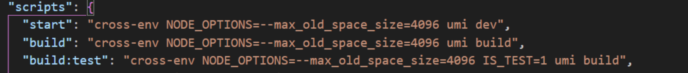

### x86 版本单个 node 进程使用内存只能是 1gb 左右
1. 相关问题讨论：https://stackoverflow.com/questions/53230823/fatal-error-ineffective-mark-compacts-near-heap-limit-allocation-failed-javas

2. 为什么 x86 版本的 node 内存较少
- GPT：'32-bit 内存地址空间限制：32-bit 应用程序的虚拟地址空间上限为 4GB（2 的 32 次方字节），而实际可用的内存通常更少，尤其在 Windows 系统上，用户态进程通常只能使用约 2GB 左右的内存'
- GPT：'V8 引擎限制：Node.js 使用的 V8 引擎（用于执行 JavaScript）在 32-bit 架构上默认限制单个进程最多使用 1.4GB 的堆内存。这是出于性能和稳定性的考虑'
```JavaScript
// 在上述限制下下述增加 node 使用内存的方法可能没有效果
node --max-old-space-size=2048 your_script.js

// windows 下
set NODE_OPTIONS="--max-old-space-size=8192"
setx NODE_OPTIONS="--max-old-space-size=8192"
```

3. 查看当前进程内存使用限制
```JavaScript
node -e 'console.log(v8.getHeapStatistics().heap_size_limit/(1024*1024))'
```

4. x64 版本的 node 设置内存限制
```JavaScript
node -e 'console.log(v8.getHeapStatistics().heap_size_limit/(1024*1024))' // 4144
// mac 下
export NODE_OPTIONS=--max_old_space_size=8192
node -e 'console.log(v8.getHeapStatistics().heap_size_limit/(1024*1024))' // 8240
echo $NODE_OPTIONS // 8192
```

5. 通过配置 scripts 为项目设置内存限制
```JavaScript
"scripts": {
  "serve": "vue-cli-service serve --max-old-space-size=8192"
  "build": "vue-cli-service build --max-old-space-size=8192"
}
```

6. 第三方插件（increase-memory-limit）配合使用
- https://blog.csdn.net/qq_35624642/article/details/81084331

7. 付费群友回答
