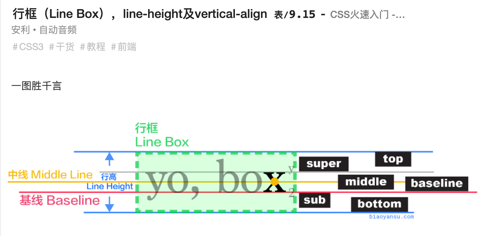

### css 设计原则
1. styles 代码组织结构 & 全局样式配置：https://zuozizhen.com/blog/css-standard/

### document
1. getElementById()
- id 唯一；id 区分大小写；找不到返回 null，找到返回 DOM 节点（Element 对象

2. getElementByClassName()
- 可同时查找多个 className；找不到返回 []（可以看作是空 array
```
document.getElementByClass('class1 class2')
document.getElementById('id1').getElementByClass('class1 class2')
```

3. querySelector()
- 找第一个符合要求的；找不到返回 null，找到返回 DOM 节点（Element 对象

4. querySelectorAll()
- all 所有符合要求的，返回值为 nodeList（类数组，可用 Array.form 等方法转换后进行数组 api 操作，保险些这样
- 查找时可添加 :scope 属性：https://developer.mozilla.org/zh-CN/docs/Web/API/Document/querySelectorAll#:~:text=%3Ascope%20%E4%BC%AA%E7%B1%BB%E7%AC%A6%E5%90%88%E9%A2%84%E6%9C%9F%E7%9A%84%E8%A1%8C%E4%B8%BA%EF%BC%8C%E5%8F%AA%E5%8C%B9%E9%85%8D%E5%9F%BA%E6%9C%AC%E5%85%83%E7%B4%A0%E5%90%8E%E4%BB%A3%E7%9A%84%E9%80%89%E6%8B%A9%E5%99%A8%EF%BC%9A

### :not()
- :not(.first, .second) 等同于 :not(.first):not(.second)
- 用于防止特定的元素被选中，'匹配不符合一组选择器的元素'

### :has()

### :is()、:where()
- '在 CSS 中，当使用选择器列表时，如果任何一个选择器无效，则整个列表将被视为无效。使用 :is() 或 :where() 时，如果一个选择器无法解析，整个选择器列表不会被视为无效，而是会忽略不正确或不支持的选择器，并使用其他的选择器。'
- :is() 不能匹配伪元素（优先级动态，'由选择器列表中优先级最高的选择器决定的'
- :where() 优先级总是为 0

```
/* 0 级 */
h1 {
  font-size: 30px;
}

/* 1 级 */
section h1,
article h1,
aside h1,
nav h1 {
  font-size: 25px;
}

/* 2 级 */
section section h1,
section article h1,
section aside h1,
section nav h1,
article section h1,
article article h1,
article aside h1,
article nav h1,
aside section h1,
aside article h1,
aside aside h1,
aside nav h1,
nav section h1,
nav article h1,
nav aside h1,
nav nav h1 {
  font-size: 20px;
}

/* 3 级 */
/* 想都别想！ */


/* 0 级 */
h1 {
  font-size: 30px;
}
/* 1 级 */
:is(section, article, aside, nav) h1 {
  font-size: 25px;
}
/* 2 级 */
:is(section, article, aside, nav) :is(section, article, aside, nav) h1 {
  font-size: 20px;
}
/* 3 级 */
:is(section, article, aside, nav)
  :is(section, article, aside, nav)
  :is(section, article, aside, nav)
  h1 {
  font-size: 15px;
}
```

### css 选择器
- mdn：https://developer.mozilla.org/zh-CN/docs/Web/CSS/CSS_Selectors

1. `+` 相邻兄弟
```
<!-- 图片后面紧跟着的段落将被选中 -->
img + p {
  font-weight: bold;
}

elementui el-button 间距
.el-button + .el-button {
  margin-left: 10px;
}

```

2. `>` 子选择器
- 只匹配直接子元素（所有直接子元素
```
<!-- 选择属于“my-things”类的无序列表（ul）的直接子列表元素（li） -->
ul.my-things > li {
  margin: 2em;
}
```

3. `~` 后续兄弟选择器
- '匹配第二个选择器的所有迭代元素，位置无须紧邻于第一个元素，只须有相同的父级元素。'
- 只匹配到有相同父元素的元素（祖元素不算
```
<!-- 在任意图像后的兄弟段落 -->
img ~ p {
  color: red;
}

```

4. ` ` 后代选择器
- 可匹配到父元素、祖元素、祖祖元素
```HTML
li {
  list-style-type: disc;
}

li li {
  list-style-type: circle;
}

<ul>
  <li>
    <div>Item 1</div>
    <ul>
      <li>Subitem A</li> // 匹配
      <li>Subitem B</li> // 匹配
    </ul>
  </li>
  <li>
    <div>Item 2</div>
    <ul>
      <li>Subitem A</li> // 匹配
      <li>Subitem B</li> // 匹配
    </ul>
  </li>
</ul>
```

5. 元素选择器
```HTML
  <div>
    <h1>111</h1>
    <h2>222</h2>
    <h3>333</h3>
  </div>
```
```CSS
h1, h2, h3 {
  background-color: yellow;
}
h1 {
  border-color: red;
}
```

6. 复合选择器
```CSS
/* 同时作用两个类 */
.first.inner-first {
  color: red;
}
```

7. 后代（子、孙等等）选择器
```CSS
/* 类 first 的后代 inner-first 类 */
.first .inner-first {
  color: red;
}
```

8. 属性选择器
```CSS
/* 匹配 title 属性 */
[title] {
  color: red;
}

/* 匹配 title 属性的具体值 */
[title='login'] {
  color: red;
}

/* 匹配 title 属性包含具体值 */
[title*='login'] {
[title&='login'] {
[title^='login'] {
  color: red;
}
```

9. 相邻、通用相邻选择器
- 注意是从某个位置开始选择，该位置之前的不受影响
```HTML
<div class="a"></div>
<div class="b"></div>
<div class="c"></div>
```
```CSS
/* 相邻选择器 */
/* 从类开始的下一个 div */
.a + div {
  color: red;
}
/* 通用相邻选择器 */
/* 从类 a 开始的所有 div */
.a ~ div {
  color: red;
}
```

10. 伪类选择器
```CSS
button:hover {}
button:active {}
input:focus {}
a:visited {}
```

11. 伪元素选择器
```CSS
/* 字符串的第一个字符 */
p::first-letter {
  font-size; 50px;
}

p::before {}
p::after {}
p:first-child {}
p:nth-child {}
```

### line-height
1. line-height 可以小于、等于、大于 font-size
```CSS
p {
  /* 默认是 1，>1 即等比方法、<1 即等比缩小 */
  line-height: 1;
}
```

### null、none
- null：读音类似 low
- none：读音类似浪

### display
- inline：垂直方向的 padding、margin 会没有效果；height 会没有效果
```CSS
p {
  /* 块级 */
  display: block;
  /* 行级 */
  display: inline;
  /* 行内块 */
  display: inline-block;
}
```

### 盒模型
1. content -> padding -> border -> margin

2. 

### vertical-align
1. 

### inherit
1. 子元素继承自父元素的权重很低，通过 `* {}` 选择器都可以将其改变

### text-shadow 文字阴影
- 可多层
```
text-shadow:
    1px 1px 2px black,
    0 0 1em blue,
    0 0 0.5em blue,
    0 0 1em blue,
    0 0 2em blue;
```

### text-align
1. text-align
- 文本对齐
- cneter、justify

2. text-align-last
- 设置最后一行对齐效果（冒号会影响对齐效果，如 ':' or '：'

### margin 重叠问题
- '两个相邻的外边距都是正数时，折叠结果是它们两者之间较大的值；两个相邻的外边距都是负数时，折叠结果是两者绝对值的较大值；两个外边距一正一负时，折叠结果是两者的相加的和。'

### others
1. 元素消失
```
opacity: 0; // 不显示；事件有效
visibility: hidden; // 不显示；事件无效
display: none; // 从 DOM tree 中移除
```

2. inline、inline-block、block
- inline：不会换行；宽度和高度由内容决定，不可设置；padding 和 margin 的垂直方向不影响布局
- inline-block：不会换行；可以设置宽度和高度；padding 和 margin 在所有方向正常生效
- block：会换行；宽度默认占满父容器，可以设置宽度和高度；padding 和 margin 在所有方向正常生效

3. aspect-ratio（保持图像横纵比
```
.demo {
  aspect-ratio: 1 / 1';
  aspect-ratio: 1（正方形
  aspect-ratio: 1.618（黄金比例
}
```

4. 文本溢出处理
```
<!-- 单行 -->
.ellipsis {
  width: 200px; // 设置固定宽度，文本内容超过宽度才会出现省略效果
  overflow: hidden; // 隐藏溢出部分
  text-overflow: ellipsis; // 使用省略号代替溢出部分
  white-space: nowrap; // 不允许换行
}

<!-- 多行 -->
.ellipsis {
  display: -webkit-box;
  width: 100px;
  overflow: hidden;
  text-overflow: ellipsis;
  word-break: break-all; // 只要到达指定宽度，就强制拆分英文单词，使其换行
  -webkit-box-orient: vertical; // 垂直布局内容
  -webkit-line-clamp: 3; // 设置行数
}
```

5. 垂直居中 inner
```
<div class="outter">
  <div class="inner"></div>
</div>

<!-- position 定位 -->
.outter {
  background-color: forestgreen;
  aspect-ratio: 1;
  position: relative;
}
.inner {
  width: 50px;
  height: 50px;
  background-color: red;
  position: absolute;
  top: 45%;
  left: 45%;
  <!-- 此时是以左上角为锚点，需要偏离自身的 50% -->
  transform: translate(-50%, -50%);
}

<!-- flex -->
.outter {
  background-color: forestgreen;
  aspect-ratio: 1;
  display: flex;
  justify-content: center;
  align-items: center;
}
.inner {
  width: 50px;
  height: 50px;
  background-color: red;
}
```

6. gap
- link（row-gap）：https://developer.mozilla.org/zh-CN/docs/Web/CSS/row-gap
- gap 属性包括 row-gap 和 column-gap

7. width: 100%; 和 width: auto;
- link：https://juejin.cn/post/7312510748310863887?searchId=2024061220255810BDD977B77167882398
- 建议用 auto，设置 100% 需要考虑到父元素的 border、padding、margin 以及子元素的相关属性；auto 则会自动适应 content 宽度（100% 是子元素的 content 撑满父元素的 content，auto 是子元素的 border、padding 等属性加起来撑满父元素的 content）
- 另外一种解决方法是设置 box-sizing 为 border-box（将盒子的 border、padding、content 合并为 content，需注意 margin 不包括
```CSS
/* 全局设置盒子渲染规则 */
* {
  box-sizing: border-box;
}

or

*,
*::before,
*::after {
  box-sizing: border-box;
}

/* , 选择器（选择用 , 分割所有的元素 */
h1, h2, h3 {
  color: blue;
}

/* 类 & 标签 */
.button, button {
  background-color: green;
  color: white;
}

.card, .card::before, .card::after {
  box-sizing: border-box;
}

/* id & 类 */
#header, .footer {
  padding: 10px;
  background-color: grey;
}

input[type="text"], input[type="password"] {
  border: 1px solid black;
}
```

8. 设置浏览器根元素的字体大小
- 浏览器根元素默认 font-size 为 16px
```JavaScript
// 例如 innerWidth 为 1000px，设计图的 presetWidth 为 2000px，通过下述方式可以设置根元素 font-size 从 16px 变为 1/2 rem 即 8px
document.documentElement.style.fontSize = window.innerWidth / presetWidth + 'rem'

// 通过媒体查询根据屏幕大小设置 font-size
/* 屏幕宽度小于 768px 时 */
@media (max-width: 767px) {
  html {
    font-size: 14px; /* 修改根元素的字体大小为 14px */
  }
}
/* 屏幕宽度大于等于 768px 且小于 1024px 时 */
@media (min-width: 768px) and (max-width: 1023px) {
  html {
    font-size: 15px; /* 修改根元素的字体大小为 15px */
  }
}
/* 屏幕宽度大于等于 1024px 时 */
@media (min-width: 1024px) {
  html {
    font-size: 16px; /* 修改根元素的字体大小为 16px */
  }
}
```