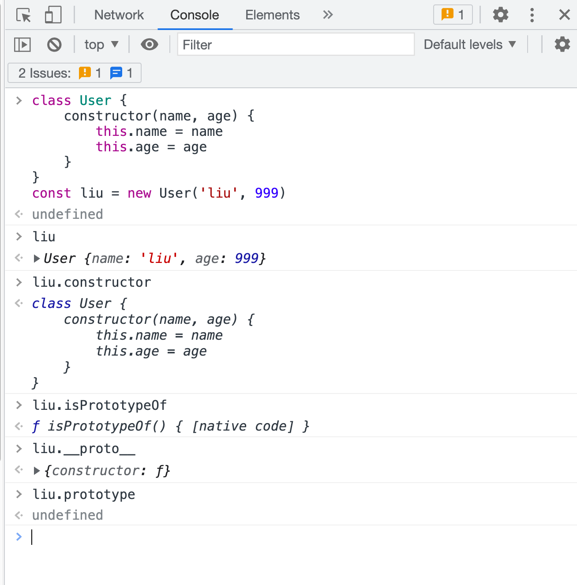
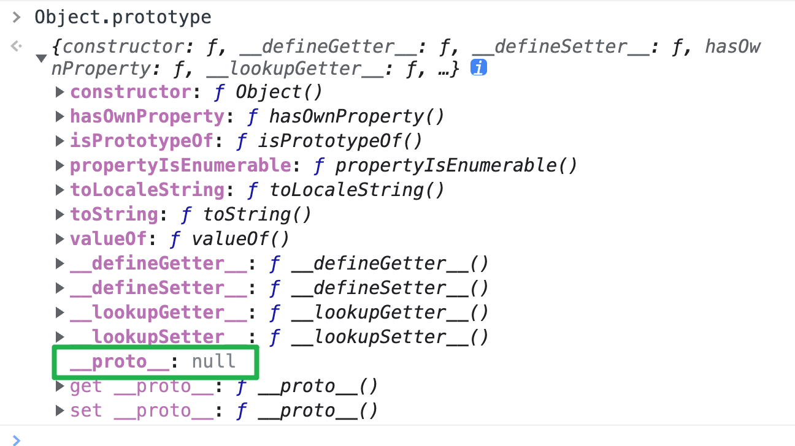
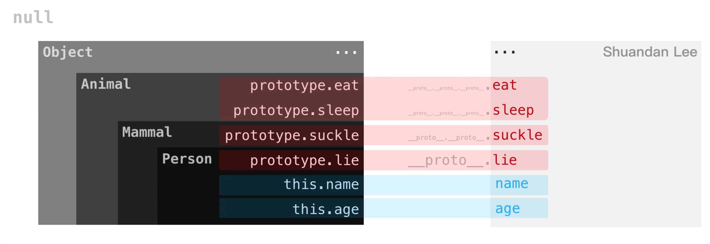
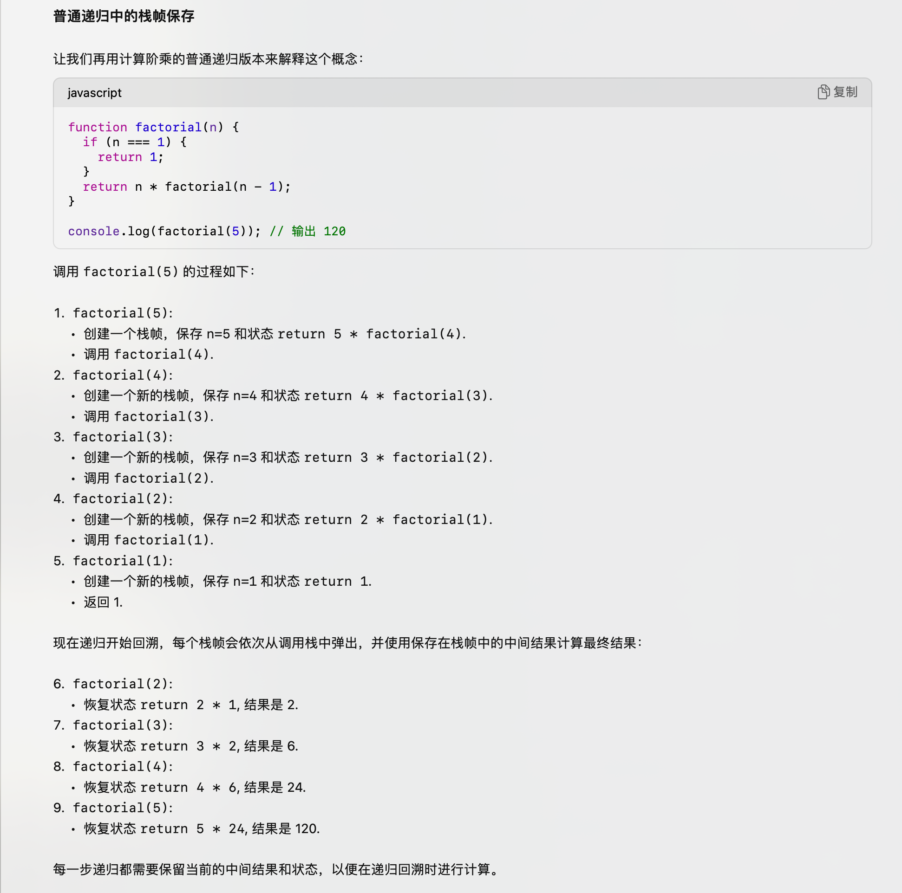
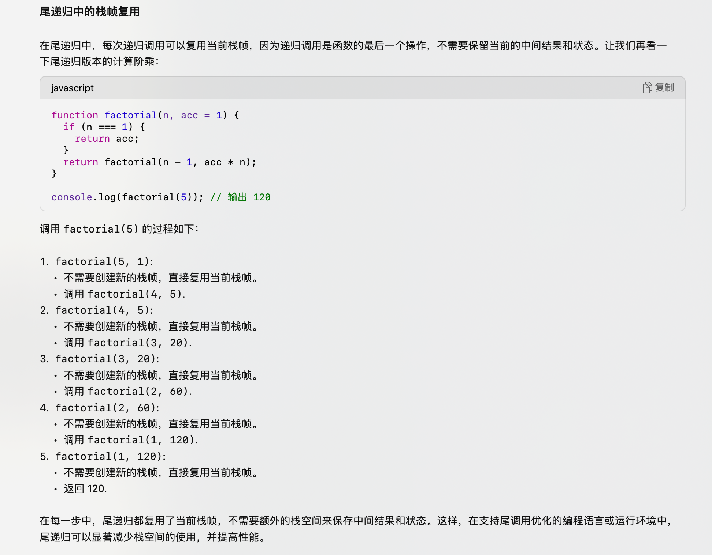

### this 指向
1. this 的值取决于函数调用时的上下文
- 全局上下文：browser 环境下为 window；node 环境下为 global
- 函数上下文：普通函数内部且非严格模式下为 window；作为对象内的函数使用时为该对象；箭头函数从创建时的父作用域继承 this（从当前的上下文环境开始往父级找 this）
```JavaScript
const user = {
  email: 'my@email.com',
  updateEmailOne: (email) => {
    this.email = email
  },
  updateEmailTwo: function (email) {
    this.email = email
  },
}

// updateEmailOne 箭头函数中的 this 不指向 user
user.updateEmailOne('new01@email.com')
console.log('1', user.email) // my@email.com

// updateEmailTwo 函数声明中的 this 指向调用它的东西（这里指 user）
user.updateEmailTwo('new02@email.com')
console.log('2', user.email) // new02@email.com
```

2. event.currentTarget and event.target
- link：https://leetcode.cn/problems/array-prototype-last/solutions/2506895/shu-zu-yuan-xing-dui-xiang-de-zui-hou-yi-4phe/#:~:text=event.currentTarget%EF%BC%9A%E8%AF%A5,%E5%88%B0%E7%9A%84%E5%85%83%E7%B4%A0%E3%80%82
- event.currentTarget：该属性引用附加了事件处理程序（如 addEventListener）的元素。这是在事件处理程序函数的上下文中 this 引用的内容。
- event.target：该属性引用引发事件的实际 DOM 元素。对于会冒泡的事件特别重要。如果你点击内部元素，事件将冒泡到外部元素，触发它们的事件监听器。对于这些外部元素，event.target 将是实际被点击的最内层元素，而 event.currentTarget（或 this）将是当前处理程序附加到的元素。
```
// 在这种情况下，如果你点击外部 div，所有三个日志都将打印 "outer"，因为点击的元素（target）和处理程序附加的元素（currentTarget 或 this）是相同的。但是，如果你点击内部 div 中的 "或者点击我" 文本，event.target 将是 "inner"（因为这是你点击的元素），而 event.currentTarget（或 this）仍将是 "outer"（因为这是事件处理程序附加的元素）。
<div id="outer">点击我
  <div id="inner">或者点击我</div>
</div>

<script>
document.getElementById('outer').addEventListener('click', function(event) {
  console.log("currentTarget: ", event.currentTarget.id);
  console.log("this: ", this.id);
  console.log("target: ", event.target.id);
});
</script>
```


### bind()、call()
1. leetcode 对 bind、call 的解释
```JavaScript
// link：https://leetcode.cn/problems/array-prototype-last/solutions/2506895/shu-zu-yuan-xing-dui-xiang-de-zui-hou-yi-4phe/#:~:text=JavaScript%20%E6%8F%90%E4%BE%9B%E4%BA%86,%E5%BC%95%E7%94%A8%E7%9A%84%E5%AF%B9%E8%B1%A1%E3%80%82
function greet() {
  return `你好，我是 ${this.name}`;
}

let person1 = { name: 'Alice' };
let person2 = { name: 'Bob' };

// 创建一个与 `person1` 绑定的函数（bind()
let greetPerson1 = greet.bind(person1);

console.log(greetPerson1()); // 你好，我是 Alice

// 尝试使用 `call` 方法更改上下文；但是，它仍然使用 `person1` 作为 `this` 上下文
console.log(greetPerson1.call(person2)); // 你好，我是 Alice

// 相比之下，正常函数调用允许使用 `call` 方法设置 `this` 上下文
console.log(greet.call(person2)); // 你好，我是 Bob
```

2. '使用 bind 多次绑定一个函数，后续的绑定能生效吗?'
- 不能，被绑定后，后续再次使用 bind 绑定没有作用。最后执行函数 fn 时，this 始终是被指向第一次 bind 时的 thisArg
```JavaScript
const obj1 = {
  name: 'obj1',
  log() {
    console.log(this.name)
  },
}
const obj2 = {
  name: 'obj2',
}
const obj3 = {
  name: 'obj3',
}
let bindLog1 = obj1.log.bind(obj2)
let bindLog2 = bindLog1.bind(obj3) // 将 bindLog1 绑定到 obj3 后赋值给新变量 bingLog2
let bindLog3 = obj1.log.bind(obj2).bind(obj3) // 上面相等于同时 bind 了两次不同的对象；或者后续调用 apply、call 都不会改变 this 的指向
obj1.log() // obj1
bindLog1() // obj2
bindLog2() // obj2（对 bindLog1 再重新 bind 新的对象不会改变其 this
bindLog3() // obj2

let bindLog4 = obj1.log.bind(obj2)
bindLog4() // obj2
bindLog4 = obj1.log.bind(obj3) // 这里是改变了 bindLog4 的值
bindLog4() // obj3
```

3. bind 后修改及 call 等
```JavaScript
function test() {
  console.log(this)
}
// test() // window or global

let boundTest = test.bind({ name: 'ly' })
boundTest() // => { name: 'ly' }

boundTest.call({ name: 'bob' }) // => { name: 'ly' }

// 对已有的进行绑定
// boundTest = boundTest.bind({ name: 'ly' }).bind({ name: 'dongdong' })
boundTest = boundTest.bind({ name: 'dongdong' })
boundTest() // => { name: 'ly' }

// 重新绑定
boundTest = test.bind({ name: 'john' })
boundTest() // => { name: 'john' }
```


### 真值、假值
1. 真值、假值
- link：https://developer.mozilla.org/zh-CN/docs/Glossary/Falsy
- 假值如：null、undefined、NaN、''、false、0、-0 等（具体见上述 link

2. 逻辑运算符
- and：a && b；or：a || b；nullish：a ?? b

3. for...of 遍历数组；for...in 遍历对象 or 遍历数组的索引


### hasOwnProperty
1. in（直接 or 间接属性） and for...in（作用于直接属性）
```JavaScript
const example = {};
example.prop = "exists";

// `hasOwnProperty` 仅对直接属性返回 true：
example.hasOwnProperty("prop"); // 返回 true
example.hasOwnProperty("toString"); // 返回 false
example.hasOwnProperty("hasOwnProperty"); // 返回 false

// 对于直接或继承的属性，`in` 运算符将返回 true：
"prop" in example; // 返回 true
"toString" in example; // 返回 true
"hasOwnProperty" in example; // 返回 true
```


### 只允许一次函数调用
```
/**
 * @param {Function} fn
 * @return {Function}
 */
var once = function(fn) {
  // 通过 isCalled 的 true、false 来判断返回值；isCalled 只定义一次，后续赋值可更改
  let isCalled = false
  return function(...args){
    if (!isCalled) {
      isCalled = true
      return fn(...args)
    }
    return undefined
  }
};

/**
 * let fn = (a,b,c) => (a + b + c)
 * let onceFn = once(fn)
 *
 * onceFn(1,2,3); // 6
 * onceFn(2,3,6); // returns undefined without calling fn
 */
```

### Fetch
- link：https://www.ruanyifeng.com/blog/2020/12/fetch-tutorial.html
- AbortController：https://developer.mozilla.org/zh-CN/docs/Web/API/AbortController
  - abort() 函数用于取消 fetch；.signal 创建一个属性使其关联 fetch 请求
- Fetch and Axios：https://blog.logrocket.com/axios-vs-fetch-best-http-requests/
```JavaScript
let controller
const url = 'video.mp4'

const downloadBtn = document.querySelector('.download')
const abortBtn = document.querySelector('.abort')

downloadBtn.addEventListener('click', fetchVideo)

abortBtn.addEventListener('click', () => {
  if (controller) {
    //  取消
    controller.abort()
    console.log('中止下载')
  }
})

function fetchVideo() {
  controller = new AbortController()
  const signal = controller.signal
  // 将 signal 作为参数
  fetch(url, { signal })
    .then((response) => {
      console.log('下载完成', response)
    })
    .catch((err) => {
      console.error(`下载错误：${err.message}`)
    })
}
```

1. fetch 的用法
```JavaScript
// 原始
fetch('https://api.github.com/users/ruanyf')
  .then(response => {
    const { ok, status, statusText } = response
    // 这几个状态是 fetch 自带的，需要与业务系统（业务系统中可能存在同样的字段，但会是在 response.json() 处理后）中的区分开
    console.log(ok, status, statusText)
    return response.json()
  })
  .then(json => console.log(json))
  .catch(err => console.log('Request Failed', err)); 

// 使用 async - await 改写
async function getJSON() {
  let url = 'https://api.github.com/users/ruanyf';
  try {
    let response = await fetch(url);
    return await response.json();
  } catch (error) {
    console.log('Request Failed', error);
  }
}
```

2. 判断 fetch 请求是否成功
```JavaScript
// 通过 response 上的 ok、status 来判断
async function fetchText() {
  let response = await fetch('/readme.txt');

  // status
  if (response.status >= 200 && response.status < 300) {
    return await response.text();
  } else {
    throw new Error(response.statusText);
  }

  // ok
  if (response.ok) {
    // 请求成功
  } else {
    // 请求失败
  }
}
```

3. 读取内容的方法
- 阮一峰：'response.text()：得到文本字符串'
- 阮一峰：'response.json()：得到 JSON 对象'
- 阮一峰：'response.blob()：得到二进制 Blob 对象'
- 阮一峰：'response.formData()：得到 FormData 表单对象'
- 阮一峰：'response.arrayBuffer()：得到二进制 ArrayBuffer 对象'
- 阮一峰：'上面5个读取方法都是异步的，返回的都是 Promise 对象。必须等到异步操作结束，才能得到服务器返回的完整数据'

4. Response.clone
- Stream 对象只能读取一次，所以下述操作会报错
```JavaScript
let text =  await response.text();
let json =  await response.json();  // 报错
```
- 通过 response.clone() 复制后使其可以读取多次
```JavaScript
const response1 = await fetch('flowers.jpg');
const response2 = response1.clone();

const myBlob1 = await response1.blob();
const myBlob2 = await response2.blob();

image1.src = URL.createObjectURL(myBlob1);
image2.src = URL.createObjectURL(myBlob2);
```

5. fetch 的第二个参数
- 常见配置（其他见 link 对应的文档）
  - 阮一峰：'method：HTTP 请求的方法，POST、DELETE、PUT 都在这个属性设置'
  - 阮一峰：'headers：一个对象，用来定制 HTTP 请求的标头'
  - 阮一峰：'body：POST 请求的数据体，GET 没有请求体则不需要设置'
```JavaScript
fetch(url, optionObj)

// 提交 JSON 数据
const user =  { name:  'John', surname:  'Smith'  };
const response = await fetch('/article/fetch/post/user', {
  method: 'POST',
  headers: {
   'Content-Type': 'application/json;charset=utf-8'
  }, 
  body: JSON.stringify(user) 
});

// 提交 formData
const form = document.querySelector('form');
const response = await fetch('/users', {
  method: 'POST',
  body: new FormData(form)
})

// 上传二进制数据
let blob = await new Promise(resolve =>   
  canvasElem.toBlob(resolve,  'image/png')
);
let response = await fetch('/article/fetch/post/image', {
  method:  'POST',
  body: blob
});
```

6. 取消 fetch 请求
- GPT：'如果多个 fetch 请求使用同一个 AbortController 实例，它们会同时被中止。要为每个请求创建单独的 AbortController 实例；fetch 请求完成后不能被取消'
```JavaScript
let controller = new AbortController();
setTimeout(() => controller.abort(), 1000);

try {
  let response = await fetch('/long-operation', {
    signal: controller.signal
  });
} catch(err) {
  // 检测错误类型是否为 AbortError
  if (err.name == 'AbortError') {
    console.log('Aborted!');
  } else {
    throw err;
  }
}
```

7. axios、xhr 都可以配置 timeout，fetch 不可以，可以通过 Promise.race 设置一个 timeout 请求来实现
```JavaScript
function fetchWithTimeout(url, options, timeout = 5000) {
  return Promise.race([
    fetch(url, options),
    new Promise((_, reject) =>
      setTimeout(() => reject(new Error('Request timed out')), timeout)
    )
  ]);
}

// 使用示例
fetchWithTimeout('https://example.com/api', {}, 5000)
  .then(response => {
    if (!response.ok) {
      throw new Error('Network response was not ok ' + response.statusText);
    }
    return response.json();
  })
  .then(data => {
    console.log('Response:', data);
  })
  .catch(error => {
    if (error.message === 'Request timed out') {
      console.error('The request timed out.');
    } else {
      console.error('Error:', error);
    }
  });
```

### Error
1. error 集合
link：https://developer.mozilla.org/zh-CN/docs/Web/JavaScript/Reference/Global_Objects/AggregateError


### others
1. ...args and arguments

2. splice and slice
- link：https://developer.mozilla.org/zh-CN/docs/Web/JavaScript/Reference/Global_Objects/Array/splice
  - splice 的示例可以多看看：https://developer.mozilla.org/zh-CN/docs/Web/JavaScript/Reference/Global_Objects/Array/splice#:~:text=%E6%98%AF%E4%B8%8D%E5%8F%AF%E5%8F%98%E7%9A%84%E3%80%82-,%E7%A4%BA%E4%BE%8B,-%E5%9C%A8%E7%B4%A2%E5%BC%95%202
- link: https://developer.mozilla.org/zh-CN/docs/Web/JavaScript/Reference/Global_Objects/Array/slice
- slice 不会改变原数组，splice 会改变（可用 toSpliced 替代，类似于 sort 和 toSorted）
```JavaScript
let arr1 = [1, 2, 3]
let arr2 = [1, 2, 3]

// 参数为空时两者返回的情况不一样
console.log('1', arr1.splice()) // []
console.log('2', arr2.slice()) // [1, 2, 3]

// 参数不为空
console.log('3', arr1.splice(0, 1)) // [1]
console.log('4', arr2.slice(0, 1)) // [1]
```

3. sort、compareFunction
```
let arrOne = [1, 10, 2, 20]
let arrTwo = [1, 10, 2, 20]
const resultOne = arrOne.sort()
const resultTwo = arrTwo.sort((a, b) => a - b)
console.log('1', resultOne); // [ 1, 10, 2, 20 ]
console.log('2', resultTwo); // [ 1, 2, 10, 20 ]

// object call sort
let obj = {
  3: '3',
  2: '2',
  1: '1',
}
console.log('here', Array.prototype.sort.call(obj)) // { 1: '1', 2: '2', 3: '3' }
```

4. array、object 转换
- link：Array.form：https://developer.mozilla.org/zh-CN/docs/Web/JavaScript/Reference/Global_Objects/Array/from
- link：Object.assign：https://developer.mozilla.org/zh-CN/docs/Web/JavaScript/Reference/Global_Objects/Object/assign

- array to object：{...arr}、Object.assign({}, arr)
- object to array：Object.keys、Object.values、Object.entries
- object 合并：Object.assign({}, obj1, obj2, ...)

5. 幂运算
- 10 ** 2 // 100；Math.pow(10, 2) // 100

6. Map and Set
- link：https://zh.javascript.info/map-set
- Map 类似于 Object（键值对的形式；支持链式调用
- 注意 Map 对某些类型键（Array、Object）的取值：https://es6.ruanyifeng.com/#:~:text=)%0A//%20undefined-,%E6%B3%A8%E6%84%8F,-%EF%BC%8C%E5%8F%AA%E6%9C%89%E5%AF%B9%E5%90%8C
- Map 与其它数据结构的转换：https://es6.ruanyifeng.com/#:~:text=%EF%BC%881%EF%BC%89-,Map%20%E8%BD%AC%E4%B8%BA%E6%95%B0%E7%BB%84,-%E5%89%8D%E9%9D%A2%E5%B7%B2%E7%BB%8F%E6%8F%90%E8%BF%87
- Set 类似于 Array（值的形式；set.keys() 和 set.valus() 效果是一样的；每个值唯一无重复（可用于快速去重）；支持链式调用；克通过 forEach、for...of 等遍历
- map.set()、map.has()；set.add()、set.has()
```JavaScript
let map = new Map
map.set(1, 1).set(2, 2)...
map.keys()、map.values()、map.entries() 返回值都是可迭代对象（可使用 for...of 来遍历

let set = new Set()
set.add(1).add(2).add(3)
```

- object to map
```JavaScript
let obj = {
  name: 'john',
  age: 99
}
let map = new Map(Object.entries(obj))
```
- map to object
```JavaScript
let map = new Map()
map.set('name', 'john').set('age', 99)
let objOne = Object.formEntries(map)

let objTwo = {}
for (let [key, value] of map) {
  objTwo[key] = value
}
```

- set 并集、交集、差集
```JavaScript
let a = new Set([1, 2, 3]);
let b = new Set([4, 3, 2]);

// 并集
let union = new Set([...a, ...b]);
// Set {1, 2, 3, 4}

// 交集
let intersect = new Set([...a].filter(x => b.has(x)));
// set {2, 3}

// （a 相对于 b 的）差集
let difference = new Set([...a].filter(x => !b.has(x)));
// Set {1}
```

7. WeakMap and WeakSet
- link（1）：https://zh.javascript.info/weakmap-weakset
- link（2）：https://github.com/Advanced-Frontend/Daily-Interview-Question/issues/6
- 能做键的数据类型不一样；与垃圾回收机制有关；两者都不能遍历
- WeakSet
  - 成员都是对象
  - 成员都是弱引用；可以被垃圾回收机制回收；可以用来保存 DOM 节点，不容易造成内存泄漏
  - 不能遍历，方法有 add、delete、has
- WeakMap
  - 只接受对象作为键名（null 除外），不接受其他类型的值作为键名
  - 键名是弱引用，键值可以是任意的，键名所指向的对象可以被垃圾回收，此时键名是无效的
  - 不能遍历，方法有 get、set、has、delete

8. 同步任务、微任务、宏任务
- 同步任务：立即执行，按顺序执行（console、赋值等
- 微任务：在当前事件循环的末尾执行，优先级高于宏任务（Promise 等
- 宏任务：在下一次事件循环时执行，优先级低于微任务（setTimeout、setInterval 等
- 例题 01：https://github.com/lydiahallie/javascript-questions/blob/master/zh-CN/README-zh_CN.md#:~:text=30.-,%E8%BE%93%E5%87%BA%E6%98%AF%E4%BB%80%E4%B9%88%EF%BC%9F,-const%20foo%20%3D
```
console.log("同步任务 1");

Promise.resolve().then(() => {
  console.log("微任务 1");
});

console.log("同步任务 2");

setTimeout(() => {
  console.log("宏任务 1");
}, 0);

console.log("同步任务 3");

queueMicrotask(() => {
  console.log("微任务 2");
});

setTimeout(() => {
  console.log("宏任务 2");
}, 0);

console.log("同步任务 4");

同步任务按顺序执行：
输出 "同步任务 1"
输出 "同步任务 2"
输出 "同步任务 3"
输出 "同步任务 4"
微任务在当前事件循环的末尾执行：
输出 "微任务 1"
输出 "微任务 2"
宏任务在下一次事件循环时执行：
输出 "宏任务 1"
输出 "宏任务 2"
```

9. event loop 相关
- link：http://www.ruanyifeng.com/blog/2014/10/event-loop.html
- video：https://www.youtube.com/watch?v=eiC58R16hb8
- js 单进程
- 任务（同步、异步）需要排队
  - 同步任务到 call stack（先进后出
  - 异步任务到 task queue or microTask queue（先进先出
    - 异步任务分为微任务（microTask）、宏任务（task）
  - 同步任务执行完后 event loop 将 task queue or microTask queue 中的任务添加到 call stack 中执行

10. 变量提升
- 'var 声明的变量会被提升到作用域的顶部，并初始化为 undefined，因此在变量声明之前可以访问，但值为 undefined'
- 'let 和 const 声明的变量会被提升到作用域的顶部，但不会初始化（不会初始化表示这里对变量进行操作会报错），在初始化之前访问这些变量会导致 ReferenceError（称为暂时性死区）。此外，const 声明的变量必须在声明时初始化'

11. **Promise**
- Promise.prototype.catch()：https://developer.mozilla.org/zh-CN/docs/Web/JavaScript/Reference/Global_Objects/Promise/catch

- Promise.prototype.then()：https://developer.mozilla.org/zh-CN/docs/Web/JavaScript/Reference/Global_Objects/Promise/then
  - then(onFulfilled, onRejected)
  - 返回值：https://developer.mozilla.org/zh-CN/docs/Web/JavaScript/Reference/Global_Objects/Promise/then#:~:text=%E8%BF%94%E5%9B%9E%E4%B8%80%E4%B8%AA%E5%80%BC%EF%BC%9Ap%20%E4%BB%A5%E8%AF%A5%E8%BF%94%E5%9B%9E%E5%80%BC%E4%BD%9C%E4%B8%BA%E5%85%B6%E5%85%91%E7%8E%B0%E5%80%BC%E3%80%82

- Promise.prototype.finally()：https://developer.mozilla.org/zh-CN/docs/Web/JavaScript/Reference/Global_Objects/Promise/finally
  - 返回值将被忽略（onFinally 回调函数不接受任何参数，因此不应该在 finally 里面处理与状态相关的逻辑）

- Promise 一创建就会执行
- Promise.all 和 Promise.allSettled 的返回值会和传入的参数顺序一致，无论传参（promise、fetch 等）对应的执行时间

- Promise.allSettled 的返回值
```
// 异步操作成功时
{status: 'fulfilled', value: value}

// 异步操作失败时
{status: 'rejected', reason: reason}
```

```
let promise = new Promise(function(resolve, reject) {
  console.log('Promise');
  resolve();
});

promise.then(function() {
  console.log('resolved.');
});

console.log('Hi!');

// Promise
// Hi!
// resolved
```

```
<!-- finally -->
<!-- 注意下面这种情况，在 finally 中抛出错误 -->
<!-- link：https://developer.mozilla.org/zh-CN/docs/Web/JavaScript/Reference/Global_Objects/Promise/finally#:~:text=%E5%A4%87%E6%B3%A8%EF%BC%9A%20%E5%9C%A8%20finally%20%E5%9B%9E%E8%B0%83%E5%87%BD%E6%95%B0%E4%B8%AD%E6%8A%9B%E5%87%BA%E9%94%99%E8%AF%AF%EF%BC%88%E6%88%96%E8%BF%94%E5%9B%9E%E8%A2%AB%E6%8B%92%E7%BB%9D%E7%9A%84%20promise%EF%BC%89%E4%BB%8D%E4%BC%9A%E5%AF%BC%E8%87%B4%E8%BF%94%E5%9B%9E%E7%9A%84%20promise%20%E8%A2%AB%E6%8B%92%E7%BB%9D%E3%80%82%E4%BE%8B%E5%A6%82%EF%BC%8CPromise.reject(3).finally(()%20%3D%3E%20%7B%20throw%2099%3B%20%7D)%20%E5%92%8C%20Promise.reject(3).finally(()%20%3D%3E%20Promise.reject(99))%20%E9%83%BD%E4%BB%A5%E7%90%86%E7%94%B1%2099%20%E6%8B%92%E7%BB%9D%E8%BF%94%E5%9B%9E%E7%9A%84%20promise%E3%80%82 -->
Promise.reject(3)
  .finally(() => { throw 99; })
  .catch(error => console.log(error)); // 输出: 99
```

11. 函数声明提升
- '函数声明提升：函数声明会提升到作用域的顶部。多次声明的同名函数，后声明的会覆盖前声明的'
- '变量声明提升：变量声明会提升到作用域的顶部，但赋值操作会保留在原来的位置（只提升声明，不提升初始化）'
- 函数声明比变量声明更靠前
```JavaScript
function foo() {
  console.log('foo')
}
var foo = 'here'
function foo() {
  cosnole.log('bar')
}
foo()

等价于下列代码

function foo(){ console.log('foo') } // 两者函数声明一样，或者覆盖前者
function foo(){ console.log('bar') }
var foo
foo = 'here'
foo() // error：foo 是个变量，不能被当作函数调用
```

12. var
- var 作用域（有全局、函数、无块）：https://developer.mozilla.org/zh-CN/docs/Web/JavaScript/Reference/Statements/var#:~:text=%E9%87%8D%E8%A6%81%E7%9A%84%E6%98%AF%EF%BC%8C%E5%85%B6%E4%BB%96%E5%9D%97%E7%BA%A7%E7%BB%93%E6%9E%84%EF%BC%8C%E5%8C%85%E6%8B%AC%E5%9D%97%E8%AF%AD%E5%8F%A5%E3%80%81try...catch%E3%80%81switch%20%E4%BB%A5%E5%8F%8A%E5%85%B6%E4%B8%AD%E4%B8%80%E4%B8%AA%20for%20%E8%AF%AD%E5%8F%A5%E7%9A%84%E5%A4%B4%E9%83%A8%EF%BC%8C%E5%AF%B9%E4%BA%8E%20var%20%E5%B9%B6%E4%B8%8D%E5%88%9B%E5%BB%BA%E4%BD%9C%E7%94%A8%E5%9F%9F%EF%BC%8C%E8%80%8C%E5%9C%A8%E8%BF%99%E6%A0%B7%E7%9A%84%E5%9D%97%E5%86%85%E9%83%A8%E4%BD%BF%E7%94%A8%20var%20%E5%A3%B0%E6%98%8E%E7%9A%84%E5%8F%98%E9%87%8F%E4%BB%8D%E7%84%B6%E5%8F%AF%E4%BB%A5%E5%9C%A8%E5%9D%97%E5%A4%96%E9%83%A8%E8%A2%AB%E5%BC%95%E7%94%A8%E3%80%82
- let、const（块）
- 块语句（常见于控制流）：https://developer.mozilla.org/zh-CN/docs/Web/JavaScript/Reference/Statements/block

13. 闭包
- 函数 + 声明该函数的词法环境（上下文环境）：https://developer.mozilla.org/zh-CN/docs/Web/JavaScript/Closures#:~:text=%E4%B8%8E%E6%AD%A4%E4%B8%8D%E5%90%8C%E3%80%82-,%E5%8E%9F%E5%9B%A0%E5%9C%A8%E4%BA%8E,-%EF%BC%8CJavaScript%20%E4%B8%AD%E7%9A%84%E5%87%BD%E6%95%B0

14. class
- 静态成员、方法（被定义在类自身而不是类的实例上）；实例成员、方法；静态方法调用静态成员，动调动，上述调用是在存在同名成员变量的情况下
- 'constructor() 方法是类的默认方法，通过 new 命令生成对象实例时，自动调用该方法。一个类必须有 constructor() 方法，如果没有显式定义，一个空的 constructor() 方法会被默认添加。'
```
class Point {
}

// 等同于
class Point {
  constructor() {}
}
```
- 私有属性、方法（# 号表示）；存在静态私有属性、方法

15. 函数参数的长度
- https://developer.mozilla.org/zh-CN/docs/Web/JavaScript/Reference/Global_Objects/Function/length#:~:text=%E7%A4%BA%E4%BE%8B-,%E4%BD%BF%E7%94%A8%20function%20length,-JS

16 sleep 函数
- 可用于等待一段时间后执行（优化体验
```
function sleep(delay) {
  return new Promise((resolve, reject) => {
    setTimeout(resolve, delay)
  })
}
```

17. 变量定义
```
num = 1 // 实际为 global.num = 1 or window.num = 1
console.log(num) // 1
```

18. 给函数添加属性合法
```
function func() {}
console.log('1', func)
func.num = 1
console.log('2', func)

1 [Function: func]
2 [Function: func] { num: 1 }
```

19. 事件传播的三个阶段
- 捕获 -> target -> 冒泡
- '在捕获（capturing）阶段中，事件从祖先元素向下传播到目标元素。当事件达到目标（target）元素后，冒泡（bubbling）才开始'
```
event.target、event.currentTarget、event.stopPropagation()（阻止向上传播
```

20. sessionStorage and localStorage
- sessionStorage
- 生命周期：数据只在页面会话期间有效。页面会话在浏览器打开页面时开始，并在关闭页面或浏览器窗口时结束；数据在同一个页面会话中始终存在，页面刷新或重新加载不会影响数据的存储；关闭浏览器窗口或标签页后，sessionStorage 中的数据将被清除
- 作用范围：数据在同一页面会话的同源窗口（或标签页）中共享；不同页面会话之间的数据不共享，即使它们来自同一个源

- localStorage
- 生命周期：数据具有持久性，即使浏览器关闭后，数据仍然存在；数据只有在明确删除时才会被清除（例如，通过 JavaScript 代码或用户手动清除浏览器存储）；数据在不同的浏览器窗口和标签页中都可用，只要它们属于同一个源（协议、主机和端口）
- 作用范围：数据在同源的所有窗口和标签页中共享；不同源（协议、主机和端口）的数据不共享

```
方法：setItem、getItem、removeItem、clear
```

21. hasOwnProperty and in（操作符）
- 自有属性 and 继承属性：https://developer.mozilla.org/zh-CN/docs/Web/JavaScript/Reference/Global_Objects/Object/hasOwnProperty#:~:text=%E5%80%BC%E4%B8%BA%20undefined-,%E7%9B%B4%E6%8E%A5%E5%B1%9E%E6%80%A7%20vs%20%E7%BB%A7%E6%89%BF%E5%B1%9E%E6%80%A7,-%E4%BB%A5%E4%B8%8B%E7%A4%BA%E4%BE%8B%E5%8C%BA%E5%88%86

22. continue and break
```
for (let i = 1; i < 5; i++) {
  if (i === 3) continue
  console.log(i) // 1 2 4
}

for (let i = 1; i < 5; i++) {
  if (i === 3) break
  console.log(i) // 1 2
}
```

22. javaScript 类型
- null \ undefined \ number \ string \ boolean \ object(array / object / function) \ symbol \ bigint
- javaScript 中一切都是类型 + 对象

23. 函数参数值传递与引用传递（Array、Object）
- link：https://github.com/lydiahallie/javascript-questions/blob/master/zh-CN/README-zh_CN.md#:~:text=51.-,%E8%BE%93%E5%87%BA%E7%9A%84%E6%98%AF%E4%BB%80%E4%B9%88%EF%BC%9F,-function%20getInfo

24. 解构赋值
```
let [x] = '123' // 1
let [x] = [1, 2, 3] // 1
let [x] = new Set([1, 2, 3]) // 1
let [x] = new Map([1, 2, 3]) // [1, 1]

let [x = 1, y = x] = [];     // x=1; y=1
let [x = 1, y = x] = [2];    // x=2; y=2
let [x = 1, y = x] = [1, 2]; // x=1; y=2
let [x = y, y = 1] = [];     // ReferenceError: y is not defined

let { foo: baz } = { foo: 'aaa', bar: 'bbb' }; 等价于 let { foo: foo, bar: bar } = { foo: 'aaa', bar: 'bbb' };
```

25. String.raw（输出原始字符串
- link：https://developer.mozilla.org/zh-CN/docs/Web/JavaScript/Reference/Global_Objects/String/raw
```JavaScript
// 注意下述两者的输出是不一样的
console.log(String.raw`Line1\tLine2`) // Line1\tLine2

const path = `Line1\tLine2` // \t 被转译
console.log(String.raw`${path}`) // Line1 Line2
```

26. 字符串补全
- link（padStart and padEnd）：https://www.zhangxinxu.com/wordpress/2018/07/js-padstart-padend/
```
<!-- 对月份进行补 0 -->
var month = String(new Date().getMonth() + 1).padStart(2, '0')

<!-- 对时间戳进行补 0（前后端时间戳格式不一样时 -->
timestamp = String(timestamp).padEnd(13, '0') // String
timestamp = +String(timestamp).padEnd(13, '0') // Number
```

27. push
- link：https://developer.mozilla.org/zh-CN/docs/Web/JavaScript/Reference/Global_Objects/Array/push
```
<!-- push 方法返回的时执行原数组的长度 -->
let arr = [1, 2]
console.log(arr.push(3)) // 3 - arr.length
```

28. symbol
- link：https://www.zhangxinxu.com/wordpress/2018/04/known-es6-symbol-function/
- Symbol 具有唯一性；Symbol 类型是不可枚举的；Symbol 访问需要用到 `Object.getOwnPropertySymbols()` 方法（即普通的遍历方法拿不到 Object 中的 Symbol 属性，具有隐藏性 ）
```JavaScript
typeof Symbol() === "symbol"
typeof Symbol("foo") === "symbol"
typeof Symbol.iterator === "symbol"

// symbol 对比
let symbolOne = Symbol('yo')
let symbolTwo = Symbol('yo')
symbolOne == or === symbolTwo // false

// 可作为唯一键标识
let info1 = {
  name: '婷婷',
  age: 24,
  job: '公司前台',
  [Symbol('description')]: '平时喜欢做做瑜伽，人家有男朋友，你别指望了'
}
let info2 = {
  [Symbol('description')]: '这小姑娘挺好的，挺热情的，嘿嘿嘿……'
}
let target = {};
Object.assign(target, info1, info2); // target 中会包含两个 symbol，对应的 description 不同

// getOwnPropertySymbols()
let obj = {
  name: 'liu',
  age: 99,
  [Symbol('001')]: 'test001',
  [Symbol('002')]: 'test002',
  [Symbol('003')]: 'test003',
}
console.log(Object.getOwnPropertySymbols(obj)) // [ Symbol(001), Symbol(002), Symbol(003) ]
```

29. import and required
- link（思否讨论）：https://segmentfault.com/q/1010000043526848
- import：编译时加载（效率高、方便排查错误）；import 的内容只可读（本质是 import 引用；import 对象时改变对象的属性是可以的「不建议这样操作」）
- export：可对外输出的东西（函数「函数声明、函数表达式」、类、变量「let、const、var」）
- required：运行时加载（可动态引入）；required 的内容可读可写（本质是 required 值的拷贝；多个同模块引用隔离）
```JavaScript
// export default
// 第一组
export default function crc32() { // 输出
  // ...
}
import crc32 from 'crc32'; // 输入

// 第二组
export function crc32() { // 输出
  // ...
};
import { crc32 } from 'crc32'; // 输入


// 跨模块常量
// constants.js 模块
export const A = 1;
export const B = 3;
export const C = 4;

// test1.js 模块
import * as constants from './constants';
console.log(constants.A); // 1
console.log(constants.B); // 3

// test2.js 模块
import { A, B } from './constants';
console.log(A); // 1
console.log(B); // 3

// ES2020 中的 import() 函数实现运行时加载
link：https://es6.ruanyifeng.com/#:~:text=constants/index%27%3B-,import(),-%C2%A7%20%E2%87%A7

可通过 async-await 来动态引入 import 中的内容
// say.js
export function hi() {
  alert(`Hello`);
}
export function bye() {
  alert(`Bye`);
}

let { hi, bye } = await import('./say.js');
hi();
bye();
```

30. Boolean and new boolean
- link：https://developer.mozilla.org/zh-CN/docs/Web/JavaScript/Reference/Global_Objects/Boolean
```JavaScript
// 创建基础类型（Boolean）值为 false
let booleanOne = false
// 创建 Boolean 的对象包装器，值为 [Boolean: true]；在 if or Boolean() 中会被判断为 true
let booleanTwo = new Boolean(false)
booleanOne === booleanTwo // false

// 使用建议
const x = Boolean(expression); // use this...
const x = !!expression; // ...or this
const x = new Boolean(expression); // don't use this!
```

31. ...args 剩余参数只能在最后，否则会抛出语法错误
- link：https://github.com/lydiahallie/javascript-questions/blob/master/zh-CN/README-zh_CN.md#:~:text=94.-,%E8%BE%93%E5%87%BA%E4%BB%80%E4%B9%88,-%EF%BC%9F
```JavaScript
function getItems(fruitList, ...args, favoriteFruit) {
  return [...fruitList, ...args, favoriteFruit]
}
getItems(["banana", "apple"], "pear", "orange") // SyntaxError

function getItems(fruitList, favoriteFruit, ...args) {
  return [...fruitList, ...args, favoriteFruit]
}
getItems(["banana", "apple"], "pear", "orange") // [ 'banana', 'apple', 'orange', 'pear' ]
```

32. Object 转换为字符串
```JavaScript
let obj = { name: 'liu' }
console.log(obj + 'here') // [object Object]here（Object 都会被转换成 [object Object] or [Object object]
```

33. JSON.stringify and JSON.parse
- JSON.stringify：JS 值转换为 JSON 字符串
- JSON.parse：JSON 字符串转换为 JS 值

34. eval
- link：https://developer.mozilla.org/zh-CN/docs/Web/JavaScript/Reference/Global_Objects/eval
- 'eval() 函数会将传入的字符串当做 JavaScript 代码进行执行'

35. isNaN and Number.isNaN
- link：https://developer.mozilla.org/zh-CN/docs/Web/JavaScript/Reference/Global_Objects/Number/isNaN
- isNaN 会将传参不是 Number 类型的转换为 Number 类型（存在迷惑行为）；Number.isNaN 不会转换类型，如果传入非 Number 类型会直接返回 false，传入 NaN 会返回 true
```JavaScript
const name = 'Lydia Hallie'
const age = 21

console.log(Number.isNaN(name)) // false
console.log(Number.isNaN(age)) // false

console.log(isNaN(name)) // true（isNaN 接收 Number 类型的参数
console.log(isNaN(age)) // false
```

36. super
- link：https://developer.mozilla.org/zh-CN/docs/Web/JavaScript/Reference/Operators/super
```JavaScript
class Bird {
  constructor() {
    console.log("111")
  }
}

class Flamingo extends Bird {
  constructor() {
    console.log("222")
    // 这里 super() 相当于调用父类 Bird 中的构造函数；super() 只能被调用一次
    super() // 111
    super() // Error
  }
}

const pet = new Flamingo()
```

37. Object.fromEntries()
- link：https://developer.mozilla.org/zh-CN/docs/Web/JavaScript/Reference/Global_Objects/Object/fromEntries
- 和 Object.entries() 互为逆操作
```JavaScript
console.log(
  Object.fromEntries([
    [1, 2], // key：1，value：2
    [2, 3],
  ])
) // { '1': 2, '2': 3 }

console.log(
  Object.fromEntries([
    [
      [1, 2], // key
      [1, 2], // value
    ],
    [[2, 3]], // key，不存在 value 即 undefiend
  ])
) // { '1,2': [ 1, 2 ], '2,3': undefined }

// Map to Obj
const map = new Map([
  ['foo', 'bar'],
  ['baz', 42],
])
const obj = Object.fromEntries(map)
console.log(obj) // { foo: "bar", baz: 42 }

// Array to Obj
const arr = [
  ['0', 'a'],
  ['1', 'b'],
  ['2', 'c'],
]
const obj = Object.fromEntries(arr)
console.log(obj) // { 0: "a", 1: "b", 2: "c" }

// 对象 value 操作
const object1 = { a: 1, b: 2, c: 3 }
const object2 = Object.fromEntries(
  Object.entries(object1).map(([key, val]) => [key, val * 2])
)
console.log(object2) // { a: 2, b: 4, c: 6 }
```

38. flat and flatMap
- link（flat）：https://developer.mozilla.org/zh-CN/docs/Web/JavaScript/Reference/Global_Objects/Array/flat
- link（flatMap）：https://developer.mozilla.org/zh-CN/docs/Web/JavaScript/Reference/Global_Objects/Array/flatMap
```JavaScript
// Infinity 用于将数组层次全部展开
array.flat(Infinity)

// 三种方式用于去除负数且将剩余值 * 2
// 001
const a = [5, 4, -3, 20, 17, -33, -4, 18]
const resultOne = a.filter((item) => item > 0).map((item) => item * 2)
console.log(resultOne) // [ 10, 8, 40, 34, 36 ]

// 002
const resultTwo = a.reduce((pre, cur) => {
  if (cur > 0) {
    return [...pre, cur * 2]
  }
  return pre
}, [])
console.log(resultTwo) // [ 10, 8, 40, 34, 36 ]

// 003
const resultThree = a.flatMap((item) => item > 0 ? [item * 2] : [])
console.log(resultThree) // [ 10, 8, 40, 34, 36 ]

// 去除负数并将剩余值为奇数的全部转换为偶数
// 假设我们想要删除所有负数，并将奇数拆分成偶数和 1
const a = [5, 4, -3, 20, 17, -33, -4, 18]
//         |\  \  x   |  | \   x   x   |
//        [4,1, 4,   20, 16, 1,       18]
const result = a.flatMap((n) => {
  if (n < 0) {
    return []
  }
  return n % 2 === 0 ? [n] : [n - 1, 1]
})
console.log(result) // [4, 1, 4, 20, 16, 1, 18]
```

39. Proxy
- link（mdn）：https://developer.mozilla.org/zh-CN/docs/Web/JavaScript/Reference/Global_Objects/Proxy
- link（阮一峰）：https://es6.ruanyifeng.com/#docs/proxy
```JavaScript
// 代理转发一直会发生
// 代理转发：在 Proxy 中，如果我们不定义任何拦截器，所有对代理对象的操作（例如属性读取、属性设置、函数调用等）都会自动转发到目标对象，Proxy 影响到 target
let target = { name: 'Alice', age: 30 };

// 没有拦截器，默认行为
let proxy1 = new Proxy(target, {});

proxy1.name = 'Bob';
console.log(target.name);  // 输出: 'Bob'
console.log(proxy1.name);  // 输出: 'Bob'

// 有拦截器，自定义行为
let handler = {
  get: function(target, prop, receiver) {
    if (prop === 'name') {
      return 'Intercepted: ' + target[prop];
    }
    return target[prop];
  },
  set: function(target, prop, value) {
    if (prop === 'age') {
      if (value < 0) {
        throw new Error('Age cannot be negative');
      }
    }
    target[prop] = value;
    return true;
  }
};

let proxy2 = new Proxy(target, handler);

proxy2.name = 'Charlie';
console.log(target.name);  // 输出: 'Charlie'（代理转发发生了，即操作 proxy2.name 影响到了 target
console.log(proxy2.name);  // 输出: 'Intercepted: Charlie'

proxy2.age = 25;
console.log(target.age);   // 输出: 25

try {
  proxy2.age = -5;
} catch (e) {
  console.log(e.message);  // 输出: 'Age cannot be negative'
}

// 通过 Proxy 实现负索引访问 Array 元素（通过 Proxy 劫持数组原有操作
function createArray(...elements) {
  let handler = {
    get(target, propKey, receiver) {
      let index = Number(propKey)
      if (index < 0) {
        propKey = String(target.length + index)
      }
      // 直接访问属性
      return target[propKey]
      // 通过 Reflect 访问
      // return Reflect.get(target, propKey, receiver)
    },
  }

  let target = []
  target.push(...elements)
  return new Proxy(target, handler)
}

let arr = createArray('a', 'b', 'c')
console.log(arr[-1]) // c
```

40. 类数组转数组
- 是什么：类数组指的是像 arguments，jquery 对象一样可以使用下标访问还有 length 属性的和数组很像但并不是数组的一类对象
```JavaScript
// es5
function func() {
  const array = Array.prototype.slice.call(arguments);
  console.log(array.slice(0, 1)); // [ 'Google' ]
  console.log(array.slice(0)); // [ 'Google', 'facebook', 'Microsoft' ]
  console.log(array.slice(0, Infinity)); // [ 'Google', 'facebook', 'Microsoft' ]
}
func('Google', 'facebook', 'Microsoft')

// es6 扩展运算符
function func() {
  console.log([...arguments]);
}
func('Google', 'facebook', 'Microsoft'); // [ 'Google', 'facebook', 'Microsoft' ]

// es6 Array.from()
function func() {
  console.log(Array.from(arguments));
}
func('Google', 'facebook', 'Microsoft'); // [ 'Google', 'facebook', 'Microsoft' ]
```

41. call、apply、bind
- 都可以用来改变 this 的指向
- call、apply 接收参数不一样，call 接收多个参数，apply 接收多个参数组成的数组
- bind 返回以原函数被绑定 this 后的新函数，该新函数绑定了 this 后就不能修改了，即使通过 call、apply 手动调用其他的 this 也不会，通过 bind 再次绑定其它 this 也没用
```JavaScript
// call、apply
const defaultPerson = {
  name: 'default',
  age: 0,
  info() {
    console.log('name', this.name, 'age', this.age)
  },
}
const person = { name: 'liu', age: 19 }
defaultPerson.info.call(person) // name liu age 19
defaultPerson.info.apply(person) // name liu age 19

// bind
function test() {
  console.log(this)
}
// 一旦绑定后 this 不在改变
let boundTest = test.bind({ name: 'ly' })
boundTest() // => { name: 'ly' }
boundTest = boundTest.bind({ name: 'dongdong' })
boundTest() // => { name: 'ly' }
boundTest.call({ name: 'bob' }) // => { name: 'ly' }

// 多参函数转换为单个数组参数调用
let arr1 = [1, 2, 3]
let arr2 = [4, 5, 6]
// 相当于 arr1.push(...arr2)：这里将 arr1 作为函数对 arr2 执行 push 方法，且对于 apply 来说，arr2 必须是个数组
Array.prototype.push.apply(arr1, arr2)
console.log(arr1) // [1, 2, 3, 4, 5, 6]

// es6 方法
arr1.push(...arr2)

// 类数组转换为数组
const array = Array.from(arguments)
const array = [...arguments]
```

42. 原型链
- prototype、__proto__
  - 实例.__proto__ === 父类.prototype
- __proto__ 指向该对象的原型；constructor 指向该对象的构造函数

- prototype
  - 只有函数对象（包括普通函数、构造函数和类）才会有 prototype 属性。其他类型的对象（如普通对象、数组等）不会有 prototype 属性
  - 普通函数：每个普通函数都有 prototype 属性
	- 构造函数：构造函数的 prototype 属性用于定义由该构造函数创建的实例的原型
	- 类 (ES6 Classes)：类的 prototype 属性用于定义由该类创建的实例的原型
	- 内置对象构造函数：JavaScript 的内置对象构造函数（如 Array、Function 等）都有 prototype 属性
- 对象（实例化对象）的 __proto__ 指向父类构造函数的 prototype
- 对象（实例化对象）的 constructor 父类的构造函数

- 
- 
- 

```JavaScript
class classUser {
  constructor(name, age) {
    this.name = name
    this.age = age
  }
}
// 在类 calssUser 上定义一个新的属性 info
classUser.prototype.info = 'info'

// 实例化
const classLiu = new classUser('classLiu', 999)
const classLi = new classUser('classLi', 888)

console.log('1', classUser.prototype.info) // 'info'
console.log('2', classLiu.__proto__.info) // 'info'
// 从同一个父类实例化的两个实例都拥有同一个原型对象、构造函数
console.log('3', classLiu.__proto__ === classLi.__proto__) // true
// 实例化的 __proto__ === 父类的 prototype
console.log('4', classLiu.__proto__ === classUser.prototype) // true

console.log(classLiu.__proto__, classLiu.constructor) // { info: 'info' }, [class classUser]
```

- new Object
```JavaScript
const obj1 = {}
const obj2 = new Object()
console.log(obj1.constructor === obj2.constructor) // true
```

43. 迭代和递归的区别
- 迭代（如 for、while 等循环）
```JavaScript
function sum1(n) {
  let result = 0
  for (let i = 0; i <= n; i++) {
    result += i
  }
  return result
}
```

- 递归（需要有退出条件；容易造成栈溢出、性能问题）
- 执行解释（可以理解为进栈出栈操作）：
```JavaScript
// 执行过程
// sum2(5)
//   => 5 + sum2(4)
//   => 5 + (4 + sum2(3))
//   => 5 + (4 + (3 + sum2(2)))
//   => 5 + (4 + (3 + (2 + sum2(1))))
//   => 5 + (4 + (3 + (2 + 1)))
//   => 15

function sum2(n) {
  if (n === 1) {
    return 1
  }
  return n + sum2(n - 1)
}
```

- 尾递归（需要退出条件；相比递归不需要额外的临时栈空间「变相减少了栈溢出的可能，从而减少内存消耗」）
- '尾递归在支持尾递归优化的编译器或解释器中，通过复用当前的栈帧来避免栈的增长，从而实现常数空间复杂度；具体实现来源于编译器或解释器的优化技术'
- 执行解释：
```JavaScript
// 执行过程
// sum3(5, 0)
//   => sum3(4, 5)
//   => sum3(3, 9)
//   => sum3(2, 12)
//   => sum3(1, 14)
//   => sum3(0, 15)
//   => 15

function sum3(n, result = 1) {
  if (n === 1) {
    return result
  }
  return sum3(n - 1, result + n)
}
```

### answer
1. null vs undefined
- undefined 用于指示不存在任何值或者缺少属性；如定义了变量未赋值该变量默认会是 undefined，或者函数接受参数时但是未传参该参数会默认是 undefiend；用于变量声明未赋值、函数无返回参数或默认传参但没传、访问对象不存在的属性
- null 会被显性的分配给变量、属性或者需要该特殊值的任何对象值，通常用于特殊处理；用于显性的将变量初始化、表示一个对象已被清空（不指向任何对象）

2. 如何将 html 页面转换为图片
- html2canvas 库：https://html2canvas.hertzen.com/
```
<template>
  <div class="demo" id="demo" @click="downloadHtml">
    {{ 'this is a demo html' }}
  </div>
<template>

<script setup>
import html2canvas from 'html2canvas'

const downloadHtml = () => {
  const demoDOM = document.getElementById('demo')
  html2canvas(demoDOM).then((canvas) => {
    <!-- canvas 回调 -->
    var ctx = canvas.getContext('2d')
    var img = new Image()
    img.src = canvas.toDataURL('image/png')

    <!-- 创建 a 标签 -->
    const a = document.createElement('a')
    a.innerHTML = 'click to download'
    a.download = 'demo.png'
    a.href = img.src

    document.body.appendChild(a)
  })
}
</script>
```

3. 函数与模版字面量
```
function getPersonInfo(one, two, three) {
  console.log(one)
  console.log(two)
  console.log(three)
}

const person = 'Lydia'
const age = 21

getPersonInfo`${person} is ${age} years old`

输出：["", " is ", " years old"] "Lydia" 21
```

4. 对象引用
- link：https://github.com/lydiahallie/javascript-questions/blob/master/zh-CN/README-zh_CN.md#:~:text=46.-,%E8%BE%93%E5%87%BA%E6%98%AF%E4%BB%80%E4%B9%88%EF%BC%9F,-let%20person%20%3D
```
let objOne = { name: 'liu' }
let objTwo = objOne

<!-- objOne、objTwo 两者原本引用同一个对象，这里将 objOne 的引用指向 null -->
objOne = null
console.log(objOne); // null
console.log(objTwo); // { name: 'liu' }

<!-- 2 -->
objOne.name = 'da'
console.log(objOne); // { name: 'da' }
console.log(objTwo); // { name: 'da' }
```

5. parseInt
```JavaScript
['1', '2', '3'].map(parseInt)

等价于

['1', '2', '3'].map((item, index) => {
  return parseInt(item, index)
})
parseInt(1, 0) // 1
parseInt(2, 1) // NaN
parseInt(3, 2) // NaN

// parseInt 二进制时
console.log(parseInt('0', 2)) // 0
console.log(parseInt('1', 2)) // 1
console.log(parseInt('10', 2)) // 2
console.log(parseInt('101', 2)) // 5
console.log(parseInt('1101', 2)) // 13
console.log(parseInt('2', 2)) // NaN
console.log(parseInt('123', 2)) // 1 (只解析第一个有效字符 '1')
```

6. String.raw
- link：https://github.com/lydiahallie/javascript-questions/blob/master/zh-CN/README-zh_CN.md#:~:text=72.-,%E8%BE%93%E5%87%BA%E4%BB%80%E4%B9%88%EF%BC%9F,-console.log
```
<!-- path 定义时 \D、\P、\t 会被转译（其中 \D、\P 无效果 -->
const path = `C:\Documents\Projects\table.html`
String.raw`${path}` // "C:DocumentsProjects able.html"

String.raw`C:\Documents\Projects\table.html` // C:\Documents\Projects\table.html
```

7. 普通函数和箭头函数的 prototype
- link：https://github.com/lydiahallie/javascript-questions/blob/master/zh-CN/README-zh_CN.md#:~:text=92.-,%E8%BE%93%E5%87%BA%E4%BB%80%E4%B9%88%EF%BC%9F,-function%20giveLydiaPizza(
- '每一个函数（无论是函数声明还是函数表达式「这里函数表达式需要排除箭头函数」）在创建时都会自动拥有一个 prototype 属性，这个属性是一个对象。这个对象默认会有一个 constructor 属性指向函数自身'
  - 函数声明和函数表达式（除开箭头函数）在创建时都会自动拥有一个 prototype 属性；Prototype 属性 是一个对象，这个对象默认会有一个 constructor 属性指向函数自身
  - 箭头函数没有 prototype 属性；箭头函数不能用作构造函数，不能使用 new 操作符实例化
``` JavaScript
function funcOne() {}
const funcTwo = () => {}
const funcThree = function() {}

console.log('1', funcOne.prototype) // {}
console.log('2', funcTwo.prototype) // undefined
console.log('3', funcThree.prototype) // {}
```

8. JS 处理解释语句
- link：https://github.com/lydiahallie/javascript-questions/blob/master/zh-CN/README-zh_CN.md#:~:text=106.-,%E8%BE%93%E5%87%BA%E4%BB%80%E4%B9%88%EF%BC%9F,-const%20colorConfig%20%3D
- 'JavaScript 解释（或取消装箱）语句。当我们使用方括号表示法时，它会看到第一个左方括号 `[` 并一直进行下去，直到找到右方括号 `]`。只有这样，它才会评估该语句。如果我们使用了 colorConfig[colors[1]]，它将返回 colorConfig 对象上 red 属性的值'
```JavaScript
const colorConfig = {
  red: true,
  blue: false,
  green: true,
  black: true,
  yellow: false,
}

const colors = ["pink", "red", "blue"]

console.log(colorConfig.colors[1]) // TypeError
console.log(colorConfig[.colors[1]]) // true
```

9. Generator
- link：https://github.com/lydiahallie/javascript-questions/blob/master/zh-CN/README-zh_CN.md#:~:text=112.-,%E8%BE%93%E5%87%BA%E4%BB%80%E4%B9%88%EF%BC%9F,-function*%20generatorOne
```JavaScript
function* generatorOne() {
  yield ['a', 'b', 'c'];
}

function* generatorTwo() {
  yield* ['a', 'b', 'c'];
}

const one = generatorOne()
const two = generatorTwo()

console.log(one.next().value) // ['a', 'b', 'c']
console.log(one.next().value) // undefined

console.log(two.next().value) // a
console.log(two.next().value) // b
console.log(two.next().value) // b
console.log(two.next().value) // undefined
```

10. Array.prototype.entries 和 Object.prototype.entries
```JavaScript
// Array
// 返回的是类数组对象（Array 迭代器对象），可以通过 Array.from 或者 ... 展开运算符来转为数组
// 不转换
let arr = [10, 20, 30];
let iterator = arr.entries();
console.log(iterator.next().value); // [0, 10]
console.log(iterator.next().value); // [1, 20]
console.log(iterator.next().value); // [2, 30]

// 转换后
let arr = [10, 20, 30];
let entriesArray = Array.from(arr.entries());
// or
let entriesArray = [...arr.entries()];
console.log(entriesArray);
// 输出: [ [0, 10], [1, 20], [2, 30] ]
```