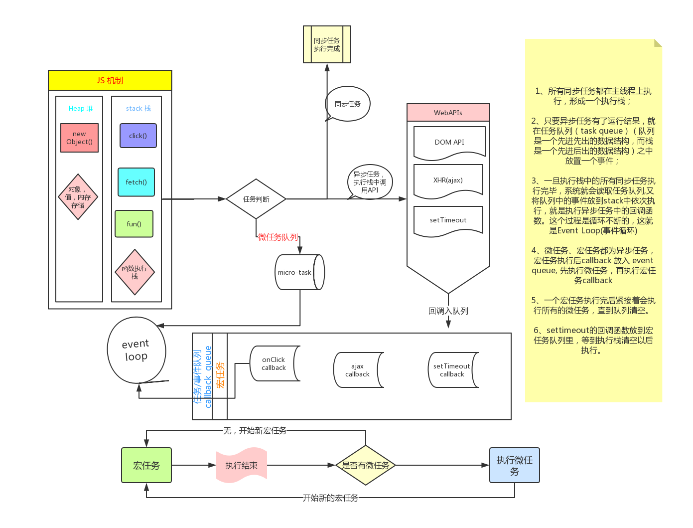

### 现代 javaScript 教程必读
- Promise: https://zh.javascript.info/async
- 网络请求：https://zh.javascript.info/network

### 防抖、节流
1. link：https://github.com/Advanced-Frontend/Daily-Interview-Question/issues/5
2. 节流：'控制函数执行频率，在一定时间内只能执行一次，适用于需要限制频率的场景'
- 如滚动事件（scroll）、窗口大小变化
```JavaScript
function throttle(fn) {
  let canRun = true // 通过闭包保存一个标记
  return function () {
    if (!canRun) return // 在函数开头判断标记是否为 true，不为 true 则 return
    canRun = false // 立即设置为 false
    setTimeout(() => {
      // 将外部传入的函数的执行放在 setTimeout 中
      fn.apply(this, arguments)
      // 最后在 setTimeout 执行完毕后再把标记设置为 true （关键）表示可以执行下一次循环了。当定时器没有执行的时候标记永远是 false，在开头被 return 掉
      canRun = true
    }, 500)
  }
}
function sayHi(e) {
  console.log(e.target.innerWidth, e.target.innerHeight)
}
window.addEventListener('resize', throttle(sayHi))

// 根据传入的 delay 来动态执行节流
function throttle(fn, delay) {
  let preTime = Date.now()
  return function () {
    let context = this
    let args = arguments
    // 判断时间戳间隔是否大于 delay
    if (Date.now() - preTime >= delay) {
      fn.apply(context, args)
      preTime = Date.now()
    }
  }
}
```

3. 防抖：'在事件停止触发后一段时间才执行函数，适用于需要在操作停止后进行处理的场景'
- 输入框搜索、按钮点击
```JavaScript
function debounce(fn) {
  let timeout = null // 创建一个标记用来存放定时器的返回值
  return function () {
    clearTimeout(timeout) // 每当用户输入的时候把前一个 setTimeout clear 掉
    timeout = setTimeout(() => {
      // 然后又创建一个新的 setTimeout, 这样就能保证输入字符后的 interval 间隔内如果还有字符输入的话，就不会执行 fn 函数
      fn.apply(this, arguments)
    }, 500)
  }
}
function sayHi() {
  console.log('防抖成功')
}

var inp = document.getElementById('inp')
inp.addEventListener('input', debounce(sayHi)) // 防抖

// 优化绑定 this、arguments
function debounce(fn, wait) {
  let timeoutId
  return function () {
    // 确保 setTimeout 绑定的 this、arguments 正确
    let context = this
    let args = arguments
    if (timeoutId) {
      clearTimeout(timeoutId)
    }
    timeoutId = setTimeout(() => {
      // 01
      fn.apply(context, args)
      // 02
      fn(...args)
    }, wait)
  }
}
```

4. 两者都是通过闭包创建一个局部变量，通过该局部变量来判断事件是否执行；防抖在于短时间内的重复操作只有最后一次操作会起作用；节流在于节省性能开销（固定时间间隔下执行一次）
- 如 scroll 事件中，防抖可以在滚动停止时触发事件来进行后续操作（在于只触发一次）；而节流可以在滚动事件中间隔一段固定的时间去触发事件（如更新实时滚动位置、触发动画，通过此来减少滚动过程中每一帧「帧、秒都可以，看怎么理解」变化都要触发事件的开销）

### setTimeout、Promise、async and await
1. link：https://github.com/Advanced-Frontend/Daily-Interview-Question/issues/33
- 异步代码题：https://github.com/Advanced-Frontend/Daily-Interview-Question/issues/7
2. 微任务、宏任务分类
- microtask
  - process.nextTick
  - promise
  - Object.observe (废弃)
  - MutationObserver
- macrotask
  - setTimeout
  - setImmediate
  - setInterval
  - I/O
  - UI 渲染
3. async-await 为什么是异步的：在 async-await 构建的上下文中代码是同步的；但与该上下文平行的其它代码块相当于 async-await 是异步的；await 只是暂停 async 函数而不阻塞整个线程
4. 
```JavaScript
// 注意 async1 end 的输出顺序
async function async1() {
  console.log('async1 start')
  await async2()
  // await 后续代码被放入微任务队列中
  console.log('async1 end')
}
async function async2() {
  console.log('async2')
}

console.log('script start')
async1()
console.log('script end')

// 输出顺序：
// script start
// async1 start
// async2
// script end
// async1 end

// 继发、并发
// 继发一
async function loadData() {
  var res1 = await fetch(url1)
  var res2 = await fetch(url2)
  var res3 = await fetch(url3)
  return 'when all done'
}
// 继发二
async function loadData(urls) {
  for (const url of urls) {
    const response = await fetch(url)
    console.log(await response.text())
  }
}

// 并发一
async function loadData() {
  var res = await Promise.all([fetch(url1), fetch(url2), fetch(url3)])
  return 'when all done'
}
// 并发二
async function loadData(urls) {
  // 并发读取 url
  const textPromises = urls.map(async (url) => {
    const response = await fetch(url)
    return response.text()
  })
  // 按次序输出
  for (const textPromise of textPromises) {
    console.log(await textPromise)
  }
}
```

### 判断数组的方法
1. link：https://github.com/Advanced-Frontend/Daily-Interview-Question/issues/23
2. 三种方法 
- Object.prototype.toString().call()
- instanceof
- Array.isArray
```JavaScript
let arr = [1, 2]
let num = 1
let str = '1'
let obj = { name: 'liu' }
// 需要加 call
console.log('1', Object.prototype.toString.call(arr)) // '[object, Array]'
console.log('11', Object.prototype.toString.call(num)) // '[object, Number]
console.log('111', Object.prototype.toString.call(str)) // '[object, String]
console.log('1111', Object.prototype.toString.call(obj)) // '[object, Object]
console.log('2', Array.isArray(arr)) // true
console.log('3', arr instanceof Array) // true
console.log('4', arr instanceof Object) // true（所有类型对 instanceof Object 都返回 true

// 兼容性
if (!Array.isArray) {
  Array.isArray = function (arg) {
    return Object.prototype.toString.call(arg) === '[object Array]'
  }
}
```

### 实现 sleep 函数
1. link：https://github.com/Advanced-Frontend/Daily-Interview-Question/issues/63
```JavaScript
// Promise
const sleep = (time) => {
  return new Promise((resolve) => setTimeout(resolve, time))
}
sleep(1000).then(() => {
  console.log(1)
})

// Generator
function* sleepGenerator(time) {
  yield new Promise(function (resolve, reject) {
    setTimeout(resolve, time)
  })
}
sleepGenerator(1000)
  .next()
  .value.then(() => {
    console.log(1)
  })

// async
function sleep(time) {
  return new Promise((resolve) => setTimeout(resolve, time))
}
async function output() {
  let out = await sleep(1000)
  console.log(1)
  return out
}
output()

// ES5
function sleep(callback, time) {
  if (typeof callback === 'function') {
    return setTimeout(callback, time)
  }
}

function output() {
  console.log(1)
}
sleep(output, 1000)
```

### ts 的优点和缺点
1. 优点：https://wangdoc.com/typescript/intro#%E9%9D%99%E6%80%81%E7%B1%BB%E5%9E%8B%E7%9A%84%E4%BC%98%E7%82%B9
2. 缺点：https://wangdoc.com/typescript/intro#%E9%9D%99%E6%80%81%E7%B1%BB%E5%9E%8B%E7%9A%84%E7%BC%BA%E7%82%B9
- 丧失了灵活性
- 引入了独立的编译步骤：类型编译、ts 代码转为 js
- 兼容性问题

### devDependencies 和 dependencies
1. devDependencies 应用于开发环境和构建过程，不会应用于生产环境
- 好处在于可以区分开发、生产环境依赖；优化生产环境，减少部署的包大小，从而优化性能和资源使用；提高可维护性，更好的管理和维护项目的依赖关系
- 如 ESLint 用于在开发环境中检查代码规范、Jest 用于在开发环境中进行单元测试（对于 ESLint、Jest 而言在生产环境中没有作用所以可以放置在 devDependencies 中）

2. dependencies 应用于生产环境（比如 vue、axios、element 这种测试和生产环境都需要用到的库应该安装在 dependencies 中）

### 事件简介
1. onXXX
- 不能为一个事件分配多个处理程序；后面的事件会覆盖前面的事件
```HTML
<input type="button" id="elem" onclick="alert('Before')" value="Click me">
<script>
  elem.onclick = function() { // 覆盖了现有的处理程序
    alert('After'); // 只会显示此内容
  };
</script>

<!-- 取消事件 -->
elem.onclick = null
```

```JavaScript
input.onclick = function() { alert(1); }
// ...
input.onclick = function() { alert(2); } // 替换了前一个处理程序
```

2. addEventListener 替代 onXXX
```JavaScript
// 触发
element.addEventListener(event, handler[, options]);

// 移除
element.removeEventListener(event, handler[, options]);

// options 参数
- onec：true、false（触发后自动删除监听器

// 正确的移除操作（handler 参数需是同一个函数，即同一个引用
function handler() {
  alert( 'Thanks!' );
}
input.addEventListener("click", handler);
// ....
input.removeEventListener("click", handler);
```

3. event 事件
- event.type
- event.currentTarget（注意箭头函数 eventTarget 的区分
  - 普通函数 this 会指向绑定事件的元素
  - 箭头函数没有自己的 this 绑定，它会从定义它的上下文（即其外部作用域）中继承 this。这意味着 this 在箭头函数中不会指向事件绑定的元素，而是指向箭头函数定义时的上下文（因此在 html 对应的事件处理函数中最好不要使用箭头函数）
```HTML
<!-- 普通函数 -->
<!DOCTYPE html>
<html>
  <head>
    <title>普通函数 currentTarget 示例</title>
  </head>
  <body>
    <button id="myButton">Click me</button>

    <script>
      document
        .getElementById('myButton')
        .addEventListener('click', function (event) {
          console.log(event.currentTarget) // <button id="myButton">Click me</button>
          console.log(this) // <button id="myButton">Click me</button>
        })
    </script>
  </body>
</html>

<!-- 箭头函数 -->
<!DOCTYPE html>
<html>
  <head>
    <title>箭头函数 currentTarget 示例</title>
  </head>
  <body>
    <button id="myButton">Click me</button>

    <script>
      document.getElementById('myButton').addEventListener('click', (event) => {
        console.log(event.currentTarget) // <button id="myButton">Click me</button>
        console.log(this) // Window object or undefined depending on the context
      })
    </script>
  </body>
</html>
```

### blog 总结 01（js 中的类型
1. link：https://yutengjing.com/posts/%E5%85%A8%E9%9D%A2%E6%80%BB%E7%BB%93-javascript-%E7%B1%BB%E5%9E%8B%E7%9B%B8%E5%85%B3%E7%9F%A5%E8%AF%86%E7%82%B9/

2. string 字符串
```JavaScript
const obj = {
  name: '1',
  age: 1,
}
console.log('1', obj) // { name: '1', age: 1 }
console.log('2', JSON.stringify(obj), typeof JSON.stringify(obj)) // "{"name":"1","age":1}"string
console.log('3', `${obj}`) // [object, Object]
```

3. number
- js 精度问题：精度在可控制范围内可看作相等；引用第三方库；使用 bigInt
```JavaScript
const result = 0.1 + 0.2;
console.log(result); // => 0.30000000000000004
// 精度要求误差小于 1 亿分之一
const isEqual = result - 0.3 < 1e-8;
console.log(isEqual); // => true
```

- 取整问题
```JavaScript
// 向下取整
console.log(Math.floor(2.6)); // => 2
// 向上取整
console.log(Math.ceil(6.1)); // => 7
// 四舍五入
console.log(Math.round(0.4)); // => 0
console.log(Math.round(0.5)); // => 1
// 纯粹的取整，不要小数部分
console.log(Math.trunc(0.6)); // => 0
console.log(Math.trunc(0.4)); // => 0
console.log(Math.trunc(-0.8)); // => 0
```

4. boolean
```JavaScript
Object.is(NaN, NaN) // true
console.log(NaN === NaN) // false

// 判断一个变量是不是 NaN
Number.isNaN()
```

5. undefined and null
- undefined 表示一个变量被声明了但是没被赋值，而 null 表示获取不到值，一般是你刻意设置的空值
```JavaScript
// ==：value 是在判断是否与 undefined、null 相等
if (value == null) {...}
console.log(null == undefined) // true
console.log(null === undefined) // false
```

6. typeof
```JavaScript
console.log(typeof abc) // => undefined
console.log(def instanceof Object) // 报错：ReferenceError: def is not defined

// 暂时性死区的情况
function test() {
  console.log(typeof num1) // error
  console.log(typeof num2) // error
  const num1 = 1
  let num2 = 2
}
test()

// 判断类的实例
console.log(typeof Number(6)); // => number
console.log(typeof new Number()); // => object
console.log(typeof new Boolean(false)); // => object
```

7. instanceof
- 用于检查对象与构造函数之间的关系，通过检查对象的原型链
```JavaScript
// 源码实现
const isObject = require('../is/isObject');
function instanceOf(obj, constructor) {
  if (!isObject(constructor)) {
    throw new TypeError(`Right-hand side of 'instanceof' is not an object`);
  } else if (typeof constructor !== 'function') {
    throw new TypeError(`Right-hand side of 'instanceof' is not callable`);
  }
  // isPrototypeOf 是 JavaScript 中的一个内置方法。它是 Object.prototype 上的方法，用于检查一个对象是否在另一个对象的原型链上。具体来说，constructor.prototype.isPrototypeOf(obj) 用来判断 obj 是否是 constructor 构造函数的实例
  return constructor.prototype.isPrototypeOf(obj);
}

// instanceof 不能用于判断基本类型
console.log(1 instanceof Number); // => false
console.log(Symbol() instanceof Symbol); // => false
console.log(BigInt(5) instanceof BigInt); // => false2
```

8. Object.prototype.toString().call()
- https://developer.mozilla.org/zh-CN/docs/Web/JavaScript/Reference/Global_Objects/Object/toString
```JavaScript
const toString = Object.prototype.toString

// null 和 undefined 有区分
console.log(toString.call(1)) // => [object Number]
console.log(toString.call(true)) // => [object Boolean]
console.log(toString.call(null)) // => [object Null]
console.log(toString.call(undefined)) // => [object Undefined]
console.log(toString.call({})) // => [object Object]
console.log(toString.call(new Date())) // => [object Date]
console.log(toString.call(/e/)) // => [object RegExp]
function Foo() {}
console.log(toString.call(new Foo())) // => [object Object]

// 加 call 与不加 call
// 普通类型
const toString = Object.prototype.toString

console.log(toString(1)) // => Error: Cannot convert object to primitive value
console.log(toString(true)) // => Error: Cannot convert object to primitive value
console.log(toString(null)) // => Error: Cannot convert object to primitive value
console.log(toString(undefined)) // => Error: Cannot convert object to primitive value

console.log(toString.call(1)) // => [object Number]
console.log(toString.call(true)) // => [object Boolean]
console.log(toString.call(null)) // => [object Null]
console.log(toString.call(undefined)) // => [object Undefined]

// 对象类型
const toString = Object.prototype.toString

console.log(toString({})) // => [object Undefined]
console.log(toString(new Date())) // => [object Undefined]
console.log(toString(/e/)) // => [object Undefined]
function Foo() {}
console.log(toString(new Foo())) // => [object Undefined]

console.log(toString.call({})) // => [object Object]
console.log(toString.call(new Date())) // => [object Date]
console.log(toString.call(/e/)) // => [object RegExp]
function Foo() {}
console.log(toString.call(new Foo())) // => [object Object]

// 对象自定义 toString 方法
const obj = {
  toString() {
    return 'Custom toString'
  },
}
console.log(obj.toString()) // => Custom toString

const toString = Object.prototype.toString
console.log(toString.call(obj)) // => [object Object]
```

9. lodash 中的 isObject
- 检查一个值是否是对象（对象、数组、函数等）
```JavaScript
function isObject(value) {
  const type = typeof value
  return value != null && (type === 'object' || type === 'function')
}
```

### blog 总结 02（ts 类型体操实例解析
1. link：https://yutengjing.com/posts/ts-%E7%B1%BB%E5%9E%8B%E4%BD%93%E6%93%8D%E5%AE%9E%E4%BE%8B%E8%A7%A3%E6%9E%90/

2. PromiseValue
- 条件类型：条件类型让 ts 的类型空间有了条件控制流
- infer 运算符：infer 运算符用于在模式匹配中定义一个类型变量，这个类型变量的具体类型由编译器根据模式匹配来推断
```TypeScript
// PromiseValue
type PromiseValue<T extends Promise<unknown>> = T extends Promise<infer A> ? A : never

// 条件类型
A extends B ？C : D
```

3. ts 实现首字母大写
```TypeScript
type LetterMapper = {
  a: 'A'
  b: 'B'
  c: 'C'
  d: 'D'
  e: 'E'
  f: 'F'
  g: 'G'
  h: 'H'
  i: 'I'
  j: 'J'
  k: 'K'
  l: 'L'
  m: 'M'
  n: 'N'
  o: 'O'
  p: 'P'
  q: 'Q'
  r: 'R'
  s: 'S'
  t: 'T'
  u: 'U'
  v: 'V'
  w: 'W'
  x: 'X'
  y: 'Y'
  z: 'Z'
}
type CapitalFirstLetter<S extends string> =
  S extends `${infer First}${infer Rest}`
    ? First extends keyof LetterMapper
      ? `${LetterMapper[First]}${Rest}`
      : S
    : S

// 每个字母都需大写（递归实现即可
type UpperCase<S extends string> = S extends `${infer First}${infer Rest}`
  ? `${CapitalFirstLetter<First>}${UpperCase<Rest>}`
  : S // 当 S 是空串便会走这个分支，直接返回空串即可
```

4. infer 模版操作
```TypeScript
// 提取函数返回类型
type MyReturnType<T> = T extends (...args: any[]) => infer R ? R : never
type Func = () => string
type Result = MyReturnType<Func> // string

// 提取 Promise 的解析类型
type MyAwaited<T> = T extends Promise<infer U> ? U : T
type ExamplePromise = Promise<string>
type Result = MyAwaited<ExamplePromise> // string

// 提取元组中第一个、最后一个元素的类型
type Last<T extends any[]> = T extends [...infer Rest, infer Last]
  ? Last
  : never
type First<T extends any[]> = T extends [infer First, ...infer Rest]
  ? First
  : never
type ExampleTuple = [string, number, boolean]
type LastElement = Last<ExampleTuple> // boolean

// 提取数组最后一个元素
type LastArrayElement<T extends any[]> = T extends [...infer Rest, infer Last]
  ? Last
  : never
```

5. 实现 isNever
```TypeScript
// 标记的方式很多
type IsNever<T> = [T] extends [never] ? true : false
type IsNever<T> = T[] extends never[] ? true : false
type IsNever<T> = (() => T) extends () => never ? true : false

// 不能用下述的原因
type isNever<T> = T extends never ? true : fasle
type test1 = isNever<never> // never：never extends never 返回 never
```

### blog 总结 03（常见 ts 类型推断
1. link：https://yutengjing.com/posts/ts%E7%B1%BB%E5%9E%8B%E4%BD%93%E6%93%8D%E6%8A%80%E5%B7%A7%E6%80%BB%E7%BB%93/

2. IsUnknown
```TypeScript
type IsUnknown<T> = unknown extends T ? true : false
```

3. ts 判断类型相等
```TypeScript
// 不完善（对于判断联合类型、any 存在问题；注意只在有泛型传参的时候存在
// 对于联合类型作用于泛型参数来说会分发内部属性，以此来单个判断
type IsEqual<T, U> = T extends U ? (U extends T ? true : false) : false
type R1 = IsEqual<1 | 2, 1> = IsEqual<1, 1> | IsEqual<2, 1> = true | false // boolean
type R2 = IsEqual<1, 1 | 2> // boolean，原理同上

// 没有泛型传参时
type a1 = 1 | 2 extends 1 ? true : false // false

// 通过 [] 包一层（还是会存在 any 的问题
type IsEqualWithBrackets<T, U> = [T] extends [U]
  ? [U] extends [T]
    ? true
    : false
  : false
// any 可与任何类型兼容（可以赋值给任何类型，也可以接受任何类型的值）；unknown 只能赋值给 unknown 和 any
type R3 = IsEqualWithBrackets<any, string> // true
type R4 = IsEqualWithBrackets<any, unknown> // true

// 最终方法（其中 1、2 是可以变的，只要两个函数返回的可选结果一样即可
type IsEqualMaster<T, U> = (<T1>() => T1 extends T ? 1 : 2) extends <
  T2
>() => T2 extends U ? 1 : 2
  ? true
  : false

// 任何 T1 都可以 extends T（即 any）所以返回 1；T2 只能是 string 时才能 extends U（即 string），所以该函数返回 1、2 是不确定的
type R5 = IsEqualMaster<any, string> // false
// T1 取 string 时返回 1，T2 取 number 时返回 1
type R6 = IsEqualMaster<string, number> // false
```

4. any 和 unknown
- unknown 只能赋值给 unknown 和 any
```TypeScript
// unknown 只能赋值给 any、unknown
let v:unknown = 123;
let v1:boolean = v; // 报错
let v2:number = v; // 报错
```

- 任何值都难赋值给 unknown
```TypeScript
// 任何值都难赋值给 unknown
let x:unknown;
x = true; // 正确
x = 42; // 正确
x = 'Hello World'; // 正确
```

- any、unknown extends 任何类型都是 true
```TypeScript
type Result1<T> = T extends any ? true : false // true
type Result2<T> = T extends unknown ? true : false // true
```

5. ts 实现 merge
```TypeScript
// 在泛型 I 中去除与 never 相同的属性
type IntersectionToInterface<I> = Omit<I, never>

// Omit<A, keyof B> 对应 { age: 27 }
// { age: 27 } & B 对应 { name: '1', age: 27, height: 170 }
type Merge<A, B> = IntersectionToInterface<Omit<A, keyof B> & B>

type A = {
  name: 'ly'
  age: 27
}

type B = {
  name: '1'
  height: 170
}

type C = Merge<A, B>

/*
type C = {
  name: "1";
  age: 27;
  height: 170;
}
*/
```

6. ts 类型体操编码习惯
- 创建泛型参数
```TypeScript
// bad
type NumsToStrs<U extends number> = U extends U ? `${U}` : never
// good
type NumsToStrs<U extends number, E = U> = E extends U ? `${E}` : never
```

- 泛型参数命名
  1. 字符串我们就用 S
  2. 数字可以用 Num 或者干脆 N
  3. 字符串数组可以用 Strs，数字数组可以用 Nums
  4. 元组的第一个成员用 First，最后一个成员用 Last，infer 出来的 spread 数组用 Rest
  5. union 类型用 U
  6. 成员是任意类型的数组可以用 Arr 或 List
  7. 循环下标的数组可以用 Index
  8. 结果可以用 Result 或者 Acc
  9. 任意类型用 T
  10. 任意的两个类型用 A 和 B

- extends 数组时最好加上 readonly，同时最好用 unknwon 代替 any（unknown[] 代替 an[]）
```TypeScript
type Type1<T extends readonly unknown[]> = ...
```

- 编写长类型需要注意的点
  1. 按照标准格式去缩进
  2. 必要时使用括号提高优先级
  3. 抽离中间类型，性能一般还会更好
  4. 适当增加辅助泛型参数
```TypeScript
// extends 的缩进：? 和 : 就不要写到一行，每次碰到 extends 就换行加缩进
A extends B
  ? true
  : false
```

### uniapp 位置相关
1. link：https://uniapp.dcloud.net.cn/api/location/location.html#chooselocation

2. uni.getLocation()
```JavaScript
uni.getLocation({
  // wgs84 默认返回 gps 坐标
  type: 'wgs84',
  success: function (res) {
    console.log('当前位置的经度：' + res.longitude)
    console.log('当前位置的纬度：' + res.latitude)
  },
})
```

3. uni.chooseLocation()
```JavaScript
uni.chooseLocation({
  success: function (res) {
    console.log('位置名称：' + res.name)
    console.log('详细地址：' + res.address)
    console.log('纬度：' + res.latitude)
    console.log('经度：' + res.longitude)
  },
})
```

### 实现复制文本功能
1. link（blog）：https://liruifengv.com/posts/copy-text/

2. link（张鑫旭）：https://www.zhangxinxu.com/wordpress/2021/10/js-copy-paste-clipboard/

3. 例子
```JavaScript
var text = '被复制的内容，啦啦啦~';
if (navigator.clipboard) {
  // clipboard api 复制
  navigator.clipboard.writeText(text);
} else {
  var textarea = document.createElement('textarea');
  document.body.appendChild(textarea);
  // 隐藏此输入框
  textarea.style.position = 'fixed';
  textarea.style.clip = 'rect(0 0 0 0)';
  textarea.style.top = '10px';
  // 赋值
  textarea.value = text;
  // 选中
  textarea.select();
  // 复制
  document.execCommand('copy', true);
  // 移除输入框
  document.body.removeChild(textarea);
}

const copyText = async val => {
  // 判断当前浏览器是否支持 clipboard api 且有权限
  if (navigator.clipboard && navigator.permissions) {
    await navigator.clipboard.writeText(val);
  } else {
    // execCommand api 在逐步废弃
    const textArea = document.createElement("textArea");
    textArea.value = val;
    textArea.style.width = 0;
    textArea.style.position = "fixed";
    textArea.style.left = "-999px";
    textArea.style.top = "10px";
    textArea.setAttribute("readonly", "readonly");
    document.body.appendChild(textArea);

    textArea.select();
    document.execCommand("copy");
    document.body.removeChild(textArea);
  }
};
```

### react 中 useEffect 对空引用类型的引用导致的 bug
1. link：https://www.xiaohongshu.com/explore/66600a31000000000e030ab6?xsec_token=ABMOz-1HPV8ulekXYe45cOjnNI0JVOA3StwjhjQQggSJM=&xsec_source=pc_user

2. image


3. 给某个字段设定了 {} 的默认值，而每次给该字段设置 {} 时都会创建一部分内存空间用来存储，因此 useEffect 引用到该字段时就会每次都会有副作用（即 effect）

### 扁平化数据转 tree
1. 循环 + map
```JavaScript
function arrayToTree(arr) {
  let map = {} // 用来存储 id 对应的项
  let result = [] // 用来存储最终的树形结构

  // 首先将数组中的每个项放入 map 中
  arr.forEach((item) => {
    map[item.id] = { ...item, children: [] }
  })

  // 然后根据 pid 组装树结构
  arr.forEach((item) => {
    if (item.pid === 0) {
      // 如果 pid 为 0，说明是根节点，直接放入 result
      result.push(map[item.id])
    } else {
      // 否则，找到其父节点，将当前项放入父节点的 children 数组中
      // 对于 { id: 2, name: '部门2', pid: 1 }, 这一项而言，item.pid 为 1，item.id 为 2，所以找到 map[1]，将当前项放入 map[1].children 数组中
      // 经过上述的拼接就将根结点和其它节点联系起来了
      map[item.pid].children.push(map[item.id])
    }
  })

  return result
}

let arr = [
  { id: 1, name: '部门1', pid: 0 },
  { id: 2, name: '部门2', pid: 1 },
  { id: 3, name: '部门3', pid: 1 },
  { id: 4, name: '部门4', pid: 3 },
  { id: 5, name: '部门5', pid: 4 },
]

console.log(JSON.stringify(arrayToTree(arr), null, 2))
```

2. reduce + map
```JavaScript
function arrayToTree(arr) {
  let map = {} // 用来存储 id 对应的项

  // 将数组中的每个项放入 map 中
  // 预先设置的话 arr 的顺序混乱也没关系
  arr.forEach((element) => {
    map[element.id] = { ...element, children: [] }
  })

  return arr.reduce((result, item) => {
    // 根据 pid 组装树结构
    if (item.pid === 0) {
      // 如果 pid 为 0，说明是根节点，直接放入 result
      result.push(map[item.id])
    } else {
      // 否则，找到其父节点，将当前项放入父节点的 children 数组中
      map[item.pid].children.push(map[item.id])
    }
    return result
  }, [])
}

// arr 中 id 或者 pid 的排列顺序对结果没影响
let arr = [
  { id: 2, name: '部门2', pid: 1 },
  { id: 1, name: '部门1', pid: 0 },
  { id: 3, name: '部门3', pid: 1 },
  { id: 5, name: '部门5', pid: 4 },
  { id: 4, name: '部门4', pid: 3 },
]

console.log(JSON.stringify(arrayToTree(arr), null, 2))
```

### Object.create 和 new 操作符
1. new 操作符构建对象实例时可以传递参数，对于子类可以和父类不一样；create 可以指定新对象实例的父类为某个原始对象，不可以传递参数，但相对于 new 来说更加灵活

### 业务代码中的 ts 小技巧
1. link：https://juejin.cn/post/7389651690306420777

2. 使用 never 类型检查 switch case 语句
- 适用于 switch - case 和 if - else 的情况
```TypeScript
declare enum Color {
  Red,
  Yellow,
  Blue,
  Pink,
}

declare let color: Color;

switch (color) {
  case Color.Red:
    // do something
    break;

  case Color.Yellow:
    // do something
    break;

  case Color.Blue:
    // do something
    break;

  default:
    // 不能将类型 Color 分配给类型 never
    // 对于枚举类型在实际业务中后续维护中可能会添加更多的枚举值，通过将 color（除开现有枚举值 default 中默认取值是 never 类型的情况） 赋值给 never 类型可以在编译阶段就发现赋值错误（只有 never 类型才能赋值给 never 类型）
    let exhaustiveCheck: never = color;
    break;
}
```

3. 模板字符串类型的排列组合
```TypeScript
type Software = 'WeChat' | 'AliPay' | 'LOLM';
type Platform = 'Android' | 'iOS' | 'HarmonyOS';
type VersionTag = 'debug' | 'stable' | 'nightly';

// 3 * 3 * 3 = 27 种排列组合
type Products = `${Software}-${Platform}-${VersionTag}`
```

4. 使用重映射快速修改接口
```TypeScript
interface User {
  name: string;
  age: number;
  job: string;
}

// 快速将上述 key 的接口转换为下述 key 不同的接口
// {
//   updatedName: string;
//   updatedAge: number;
//   updatedJob: string;
// }
type UpdatedUser = {
  [K in keyof User as `updated${Capitalize<K>}`]: User[K];
};

// 公式
// linbudu：'Capitalize 工具类型，随模板字符串类型一同引入的内置工具类型，功能是将此字符串类型的首字母大写'
// linbudu：'K & string，通过交叉类型的结果同时满足其类型成员的定义，确保类型符合 Capitalize 的泛型类型约束'
type DerivedStruct<Struct extends object> = {
  [K in keyof Struct as `updated${Capitalize<K & string>}`]: Struct[K];
};
type UpdatedUser2 = DerivedStruct<User>;

// 同上述改变，但只有原有 interface 中的部分字段需要转换
// 通过拆分 interface 来实现
interface UserDetail {} // UserDetail 中是需要转换 key 的
interface UserRelation {}
interface UserLevel {}

interface User extends UserDetail, UserRelation, UserLevel {}

interface UpdatedUser
  extends DerivedStruct<UserDetail>, // 只对 UserDetail 进行 key 转换
    UserRelation,
    UserLevel {}
```

5. interface 同时继承多个 interface
```TypeScript
interface Animal {
  name: string;
}

interface Mammal {
  hasFur: boolean;
}

interface Bird {
  canFly: boolean;
}

// MyPet 接口同时继承了 Animal, Mammal 和 Bird
// 将需要继承的 interface 用逗号分隔
interface MyPet extends Animal, Mammal, Bird {
  breed: string;
}

const pet: MyPet = {
  name: 'Buddy',
  hasFur: true,
  canFly: false,
  breed: 'Golden Retriever',
};
```

6. 提取类型
```TypeScript
// 01 - 提取数组、元组类型的元素类型
type ArrayElementType<T extends any[]> = T extends (infer U)[] ? U : never;

type UserList = Array<{
  id: number;
  name: string;
  age: number;
}>;

// {
//   id: number;
//   name: string;
//   age: number;
// }
type User = ArrayElementType<UserList>;

// 02 - 提取 Promise 的值类型
type QueryUserResponse = Promise<{
  id: string;
  name: string;
  email: string;
}>;

// {
//   id: string;
//   name: string;
//   email: string;
// }
// Awaited 是内置工具类型，可以用于提取一个 Promise resolve 的值类型
type User = Awaited<QueryUserResponse>;

// 03 - 提取入参类型和返回值类型
// Parameters、ReturnType 都是内置类型
interface User {}

interface UpdatedUser extends User {}

// 仅导出了函数（传参类型是 User，返回值类型是 UpdatedUser）
export function updateUser(input: User): UpdatedUser {}

// User
// 后面可通过数组的方式取指定参数的类型，不加 [0] 表示所有参数的类型
type InputUser = Parameters<typeof updateUser>[0]; // 首参数
type InputUser = Parameters<typeof updateUser>; // 所有参数

// UpdatedUser
type OutputUser = ReturnType<typeof updateUser>;
```

### antd 开源项目成员 learning note
1. link：https://juejin.cn/post/7107500406430760991#heading-52

2. 隐藏元素（display: none;、visibility: hidden;、opacity: 0;）的区别
- 
```JavaScript
<div
  class="box"
  @click="
    () => {
      console.log('1')
    }
  "
>
  {/* 盒模型消失；不占据空间；交互没效果 */}
  111
</div>
<div
  class="box"
  @click="
    () => {
      console.log('2')
    }
  "
>
  {/* 盒模型不消失；占据空间；交互没效果 */}
  222
</div>
<div
  class="box three"
  @click="
    () => {
      console.log('3')
    }
  "
>
  {/* 盒模型不消失；占据空间；交互有效果 */}
  333
</div>

.box {
  outline: 1px solid #000;
  padding: 10px;
  margin: 10px 0;
  width: 100px;
  height: 100px;
}
.one {
  display: none;
}
.two {
  visibility: hidden;
}
.three {
  opacity: 0;
}
```

3. console 输出值
```JavaScript
console.log('1', 11) // 11
console.log('2', .11) // 0.11（允许省去 0）
console.log('3', 11e2) // 1100
```

4. 打印顺序
- lijianan：'js 在对对象的 key 进行遍历（for...in、Object.keys、Object.values、Object.entries 等）的时候，会先判断 key 的类型，如果是 number 类型，则会放在前面，并且进行排序，如果是 string 类型，则放在后面，不进行排序（对 number 排序是为了方便内存寻址，string 不能进行四则运算，所以排序没有意义）'
- GPT 内存寻址的作用：'优化性能：数值型键在内存中按照顺序排列，可以通过简单的算术运算直接访问对应的内存地址，这样可以提高访问效率（比如对象都是数字键的情况下访问对象的某个键的值可以通过前一个键的具体偏移来实现，如 obj[2] 相对于 obj[0] 的偏移）'
```JavaScript
const object = { a2: '', 2: '', 1: '', a1: '' };
console.log(Object.keys(object)) // [ '1', '2', 'a2', 'a1' ]

for (const key in object) {
  console.log(key); // 1 2 a2 a1
}
```

5. 交换两个变量的位置（不创建新变量的情况下）
```JavaScript
// 01 加法（存在精度问题，如 0.1 和 0.2）
let [a, b] = [1, 2]
console.log('here 1', a, b) // here 1 1 2
// 01 加法
// a = a + b
// b = a - b
// a = a - b

// 02 解构
// [a, b] = [b, a];
console.log('here 2', a, b) // here 1 2 1

// 03 乘法（需要处理 0 的问题和上述加法精度的问题）
// a = a * b
// b = a / b
// a = a / b
console.log('here 3', a, b) // here 3 2 1
```

6. 实现深拷贝的方法
- linjianana：'JSON.parse(JSON.stringify())'
- linjianana：'lodash deepClone'
```JavaScript
// 深拷贝 01（适用于对象、数组、基本类型等情况）
import { cloneDeep } from 'lodash';
const newData = cloneDeep(data);
```
- linjianana：'structuredClone js 自带 api，兼容性比较差'
- linjianana：手动实现 deepClone
```JavaScript
function cloneDeep(value) {
  const map = new Map()

  function _cloneDeep(value) {
    // 注意 typeof null === 'object'
    const isObject = typeof value === 'object' && value !== null

    // 递归退出条件
    if (!isObject) return value

    if (map.has(value)) {
      return map.get(value)
    }

    const clone = Array.isArray(value) ? [] : {}
    for (const [key, val] of Object.entries(value)) {
      // 递归处理
      clone[key] = _cloneDeep(val)
    }
    map.set(value, clone)
    return clone
  }

  return _cloneDeep(value)
}
const testDataOne = cloneDeep({
  name: 'name',
  value: { name: 'name 01', value: { name: 'name 02', value: 'value' } },
})
const testDataTwo = cloneDeep(111)
const testDataThree = cloneDeep([1, 2, 3, [4, 5, [6, 7]]])
console.log('testDataOne', testDataOne)
console.log('testDataTwo', testDataTwo)
console.log('testDataThree', testDataThree)

// 深拷贝 02（适用于数组、对象）
const deepClone = (obj) => {
  // 对于每一项判断是 Array 还是 Object
  const ans = Array.isArray(obj) ? [] : {}
  for (const key in obj) {
    // 排除掉 obj 原型上继承的属性
    if (obj.hasOwnProperty(key)) {
      // 如果 key 对应的 value 是对象类型，即 Array 或者 Object 的话递归处理
      ans[key] =
        obj[key] && typeof obj[key] === 'object'
          ? deepClone(obj[key])
          : obj[key]
    }
  }
  return ans
}

// 深拷贝 03（适配对象、数组、基本类型、日期对象、正则表达式等）
function isObject(value) {
  // 排除掉 null
  return value && typeof value === 'object'
}

function deepClone(obj, map = new WeakMap()) {
  // 处理基础类型和 null、undefined
  if (!isObject(obj)) {
    return obj
  }

  // 检查循环引用
  if (map.has(obj)) {
    return map.get(obj)
  }

  // 获取对象类型
  const type = Object.prototype.toString.call(obj)

  // 初始化拷贝对象
  let copy
  switch (type) {
    case '[object Date]':
      copy = new Date(obj.getTime())
      break
    case '[object RegExp]':
      copy = new RegExp(obj)
      break
    case '[object Array]':
      copy = []
      map.set(obj, copy)
      obj.forEach((element, index) => {
        copy[index] = isObject(element) ? deepClone(element, map) : element
      })
      break
    case '[object Object]':
      copy = {}
      map.set(obj, copy)
      Object.keys(obj).forEach((key) => {
        const value = obj[key]
        copy[key] = isObject(value) ? deepClone(value, map) : value
      })
      break
    default:
      throw new Error(`Unsupported type: ${type}`)
  }
  return copy
}
console.log('1', deepClone(1))
console.log('2', deepClone(null))
console.log('3', deepClone(undefined))
console.log('4', deepClone([1, 2, 3]))
console.log('5', deepClone({ name: 'liu', age: 999 }))
console.log('6', deepClone([1, [2, [3]]]))
console.log('7', deepClone({ name: 'liu', age: { sex: 'male' } }))
console.log(
  '8',
  deepClone({ a: 1, b: { c: 2, d: [3, 4, 5] }, e: new Date(), f: /abc/g })
)
```

7. in 操作符
```JavaScript
let obj = { name: 'liu', age: 999 }
let arr = [1, 2, 3]

// for...in
for (const key in obj) {
  console.log(key, obj[key]) // name 'liu' / age 999
}
for (const key in arr) {
  console.log(key, arr[key]) // 0 1 / 1 2 / 2 3
}

// for...of
for (const [key, value] of Object.entries(obj)) {
  console.log(key, value) // name 'liu' / age 999
}
for (const [key, value] of Object.entries(arr)) {
  console.log(key, value) // 0 1 / 1 2 / 2 3
}
// arr.entries() 返回的是迭代器对象（类数组）可以通过 for...of 遍历或者使用 Array.form 或者 ... 转换后再遍历
for (const [key, value] of arr.entries()) {
  console.log(key, value) // 0 1 / 1 2 / 2 3
}
```

8. 常见的类数组对象
- 函数的 arguments
- 通过 document.querySelector 获取的 nodeList（const nodeList = document.querySelectorAll('div')）
- const arrarLike = { 0: 'a', 1: 'b', 2: 'c', length: 3 }

9. 获取 url 上的 query string
```JavaScript
const src = 'https://www.baidu.com/?id=123&name=aaa&phone=12345'

function getParams(src) {
  if (!src.includes('?')) {
    return {}
  }
  const [_, queryStr] = src.split('?')
  const result = {}
  queryStr.split('&').forEach((item) => {
    if (item.includes('=')) {
      const [key, value] = item.split('=')
      result[key] = value
    }
  })
  return result
}
console.log(getParams(src)) // { id: '123', name: 'aaa', phone: '12345' }
```

10. Object.assign 和解构赋值
```JavaScript
// 01 - 原型上属性的处理两者都只会复制自身上的属性
const proto = { inherited: 'inherited property' };
const obj = Object.create(proto);
obj.own = 'own property';
const newObj1 = Object.assign({}, obj);
console.log(newObj1); // { own: 'own property' }
const { ...newObj2 } = obj;
console.log(newObj2); // { own: 'own property' }

// 02 - 嵌套对象的处理两者都是浅拷贝
const obj = { a: { nested: 'nested property' } };
const newObj1 = Object.assign({}, obj);
const newObj2 = { ...obj };
obj.a.nested = 'changed property';
console.log(newObj1.a.nested); // 'changed property'
console.log(newObj2.a.nested); // 'changed property'

// 03 - 处理非普通对象
const textArea = document.createElement('textarea');

// 使用 Object.assign
Object.assign(textArea.style, {
  position: 'fixed',
  left: '-999px',
  top: '10px'
});
console.log(textArea.style.position); // 'fixed'

// 04 - 使用解构赋值（错误示范）
try {
  textArea.style = { ...textArea.style, position: 'fixed' };
} catch (error) {
  console.error(error); // TypeError: Cannot assign to read only property 'style' of object '#<HTMLTextAreaElement>'
}

// 05 - 属性的覆盖顺序都是后面覆盖前面的
const obj1 = { a: 1, b: 2 };
const obj2 = { b: 3, c: 4 };

// 使用 Object.assign
const newObj1 = Object.assign({}, obj1, obj2);
console.log(newObj1); // { a: 1, b: 3, c: 4 }

// 使用解构赋值
const newObj2 = { ...obj1, ...obj2 };
console.log(newObj2); // { a: 1, b: 3, c: 4 }
```

### axios 比较 fetch
1. link：https://blog.logrocket.com/axios-vs-fetch-best-http-requests/

2. 基本用法
- post 发送数据时，axios 使用 data 字段，fetch 使用 body 字段
- axios 中的 data 字段会自动转 JSON，fetch 需要手动调用 JSON.stringify
- 同上，axios 返回的 response 会自动转换，fetch 需手动调用 response.json
```JavaScript
const url = 'https://jsonplaceholder.typicode.com/posts'
// axios
const data = {
  a: 10,
  b: 20,
}
axios
  .post(url, data, {
    headers: {
      Accept: 'application/json',
      'Content-Type': 'application/json;charset=UTF-8',
    },
  })
  .then(({ data }) => {
    console.log(data)
  })

// fetch()
const options = {
  method: 'POST',
  headers: {
    Accept: 'application/json',
    'Content-Type': 'application/json;charset=UTF-8',
  },
  body: JSON.stringify({
    a: 10,
    b: 20,
  }),
}
fetch(url, options)
  .then((response) => response.json())
  .then((data) => {
    console.log(data)
  })
```

3. 兼容性
- axios 底层通过 xhr 实现，因此兼容性会好于 fetch

4. 响应超时设置
```JavaScript
// axios 配置 timeout
axios({
  method: 'post',
  url: '/login',
  timeout: 4000,    // 4 seconds timeout
  data: {
    firstName: 'David',
    lastName: 'Pollock'
  }
})
.then(response => {/* handle the response */})
.catch(error => console.error('timeout exceeded'))

// fetch 通过配置 AbortController
const controller = new AbortController();
const options = {
  method: 'POST',
  signal: controller.signal,
  body: JSON.stringify({
    firstName: 'David',
    lastName: 'Pollock'
  })
};  
const promise = fetch('/login', options);
const timeoutId = setTimeout(() => controller.abort(), 4000);

promise
  .then(response => {
    clearTimeout(timeoutId); // 请求成功后清除定时器
    if (!response.ok) {
      throw new Error('Network response was not ok');
    }
    return response.json(); // 解析响应数据为 JSON
  })
  .then(data => {
    console.log('Request succeeded with JSON response', data);
    // 处理成功响应的数据
  })
  .catch(error => {
    if (error.name === 'AbortError') {
      console.error('Request was aborted due to timeout');
      // 处理请求超时的情况
    } else {
      console.error('Fetch error:', error);
      // 处理其他类型的错误
    }
  });

// fetch 通过 Promise.race 来实现（上述有）
```

5. 拦截器
```JavaScript
// axios 可以对 request、response 进行拦截处理
// 作用在于可对 request 做统一的配置处理，对 response 做统一的拦截处理（超时重试、失败重试等情况）
axios.interceptors.request.use()
axios.interceptors.response.use()

// 请求 interceptors
axios.interceptors.request.use(
  (config) => {
    // Do or set some things before the request is set

    // e.g. Authorization header
    config.headers["Authorization"] = `Bearer ${token}`

    // e.g. Content-type
    config.headers["Content-Type"] = "application/json"

    // e.g. set Base url
    config.baseURL = "https://base-url"

    return config
  },
  (error) => {
    return Promise.reject(error)
  })

// 响应 interceptors
axios.interceptors.response.use(
  (response) => {
    // do something i.e. return data object
    return response.data
  },
  (error) => {
    if (error?.response?.status === 403) {
      // Handle forbidden error e.g. show restricted access warning
    }

    if (error?.response?.status === 401) {
      // Handle unauthorized error e.g. refresh and set token in storage
    }

    throw error // forward other client errors
  })
```

6. 下载进度
- 原文：'axios 使用进度条模块'
- 原文：'fetch 通过 ReadableStream 来手动计算下载进度'
- 具体实现看 link 原文

7. 同时请求
```JavaScript
// axios：axios.all、axios.spread
axios.all([
  axios.get('https://api.github.com/users/iliakan'), 
  axios.get('https://api.github.com/users/taylorotwell')
])
.then(axios.spread((obj1, obj2) => {
  // Both requests are now complete
  console.log(obj1.data.login + ' has ' + obj1.data.public_repos + ' public repos on GitHub');
  console.log(obj2.data.login + ' has ' + obj2.data.public_repos + ' public repos on GitHub');
}));

// fetch：Promise.all + async - await
Promise.all([
  fetch('https://api.github.com/users/iliakan'),
  fetch('https://api.github.com/users/taylorotwell')
])
.then(async([res1, res2]) => {
  const a = await res1.json();
  const b = await res2.json();
  console.log(a.login + ' has ' + a.public_repos + ' public repos on GitHub');
  console.log(b.login + ' has ' + b.public_repos + ' public repos on GitHub');
})
.catch(error => {
  console.log(error);
});
```

8. 错误处理
```JavaScript
// fetch
try {
  const res = await fetch('...');

  if (!res.ok) {
    // Error on the response (5xx, 4xx)
    switch (res.status) {
      case 400: /* Handle */ break;
      case 401: /* Handle */ break;
      case 404: /* Handle */ break;
      case 500: /* Handle */ break;
    }
  }

  // Here the response can be properly handled
} catch (err) {
    // Error on the request (Network error)
}

// axios
try {
  let res = await axios.get('...');
  // Here the response can be properly handled
} catch (err) {
  if (err.response) {
    // Error on the response (5xx, 4xx)
  } else if (err.request) {
    // Error on the request (Network error)
  }
}
```

9. axios 入门
- link：https://blog.csdn.net/luo1831251387/article/details/115641688
- method：get、post、delete 等

- baseURL 的设置
```JavaScript
// 根据环境切换在不同的 baseURL
if (process.env.NODE_ENV == 'development') {
  axios.defaults.baseURL = 'https://www.development.com'
} else if (process.env.NODE_ENV == 'debug') {
  axios.defaults.baseURL = 'https://www.debug.com'
} else if (process.env.NODE_ENV == 'production') {
  axios.defaults.baseURL = 'https://www.production.com'
}
```

- 全局请求超时设置
```JavaScript
axios.defaults.timeout = 10000
```

- post 请求头设置
```JavaScript
axios.defaults.headers.post['Content-Type'] =
  'application/x-www-form-urlencoded;charset=UTF-8'
```