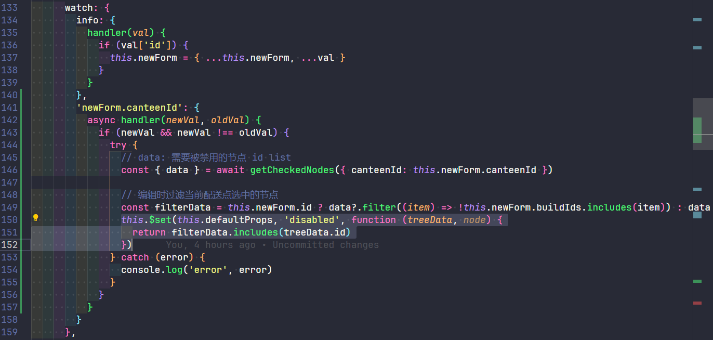
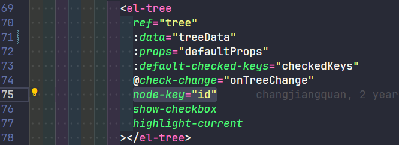
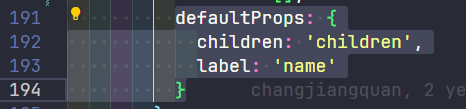

### 政务后勤
**食堂管理模块 PC 端：**
1. 食堂管理
- 食堂管理：关联食堂类型来适配工作流，每个食堂类型对应特定的工作流模版；食堂类型关联的工作流用于包厢预订
- 食堂表单关键点：
  - 可订餐时间：可配置为法定节假日及调休校准，以此来实现假期等特殊日子食堂不会被预订（避免脏数据）
  - 餐次分为中晚餐；两者时间段互不干涉并且覆盖 24 小时

2. 盒饭管理
- 关联食堂以此来匹配后续 app 根据食堂来点餐的需求
- 盒饭表单关键点：
  - 可预约时间：可配置为周一到周日；有限制份数的选项，是的话可自定义限制，否的话是无限份数

3. 自制品管理
- 关联食堂以此来匹配后续 app 根据食堂来点餐的需求
- 自制品表单关键点：
  - 可下单时段：可选不限、自定义（24 小时）、跟随食堂订餐时段（具体分为中餐、晚餐时段）
  - 可预约时间：可配置周一到周日；有限制份数的选项，是的话可自定义限制（最大为 99999 份，同时每人有最大限制份数小于 `Math.min(自定义限制份数, 999)`），否的话是无限份数（每人最大限制份数为 `Math.min(无限份数, 999)`）

4. 配送点管理
- 关联自制品（盒饭需要人工配送）
- 配送点具体到楼层（每个配送点间位置隔离，即点 1 选择了 A 栋 1 层，点 2 就无法选择该楼层）
  - 配送点间互不干涉实现（具体实现为新添加配送点时需禁用掉已添加过配送点的楼层
  - 
  - 
  - 

5. 包厢管理
- 关联食堂 -> 关联食堂类型 -> 关联工作流模版
- 包厢表单注意点：
  - 可预约时间：可配置为法定节假日及调休校准，以此来实现假期等特殊日子包厢不会被预订（避免脏数据）
  - 餐次：可以配置中晚餐的用餐时间段（互不干涉）；可以配置中晚餐的最晚取消时间，该时间前都可以取消包厢预订（最晚取消时间需小于等于该餐次时间段的结束时间）
  - 餐标类型：可选自定义与非自定义；非自定义的话接待类型、餐标名称、用餐标准都可以从配置模版中选择；自定义的话上述字段对应的值都是可动态配置的

**食堂管理模块 APP 端：**
1. 包厢预订
- 顶部有日期选择器（scroll bar）；展开显示月、合上显示周，左右滑动可以切换月或周，本周本月前的日期不可选择（避免出现脏数据）；已过的日期置灰显示且不可选择
- 列表展示所有可选包厢（分中晚餐）；已被预订的餐次置灰
- 表单填写完成后走预订逻辑，同时自动触发工作流（包厢与食堂绑定，每个食堂有对应的食堂类型，每个食堂类型对应单独的工作流流程，每个工作流流程对应固定角色的人员审批）

2. 点餐
- 盒饭、自制品点餐（两者不可以同时，在于盒饭需要人工配送）
- 配送地址设置（每个用户对于每个食堂可配置配送地址，由该用户组织部门、具体配送点「即具体的楼栋楼层」、具体房间、备注组成）
- 支付设置
  - 一卡通绑定：具体需要关联长沙银行的服务，绑定完成后向卡内添加余额
  - 一卡通支付：用户账户绑定一卡通后可以用里面的余额支付；需输入用户密码判断（六位，具体通过接口判断正确性）
    - 支付失败有 5 分钟的重试时间（定时器实现）；可重试订单在订餐页面置顶显示
- 自制品下单成功后需要人工去窗口取餐，所以会有取餐码、取餐时间等

3. 工作流
- 简单的配置模版自动提交
- 复杂的需要自己选模版、选具体工作流程、选工作流程中的人这样

**通知管理模块：**
1. 通知管理
- 通知关联到人；可添加通知附件

2. 通知查阅
- 指定到的人可以在后台、app 查看通知，查看后待阅通知数减 1（通过调用接口实现）
- 单独页面查看（符合现代网页新闻查看要求）
- 通知查看详情：可以针对每个通知查看其被查阅的人数（具体哪些人）、查看与未查看比例

3. app 首页有最新 5 条待阅通知，点击跳转按查看通知逻辑走

4. app 有专门的通知 tab 栏
- 可根据通知类型查看所有通知（scroll tab 实现）
- 可根据关键字搜索

5. app 我的页面可查看待阅、已阅通知
- 主要起到历史记录的效果

### 党务学习

### 招商引资小程序