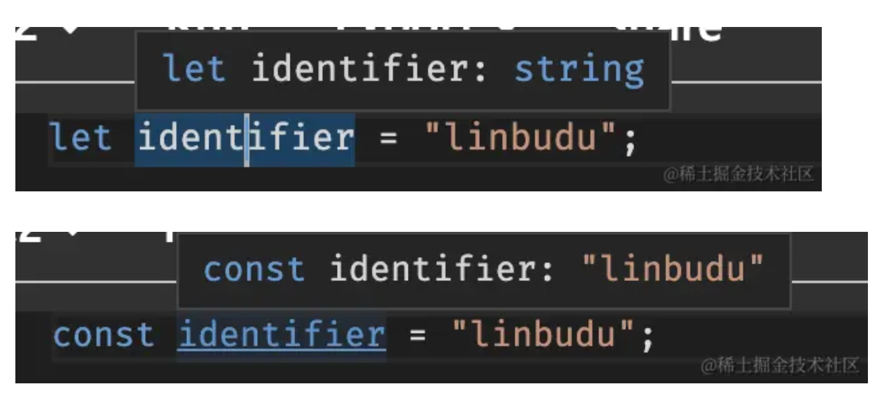
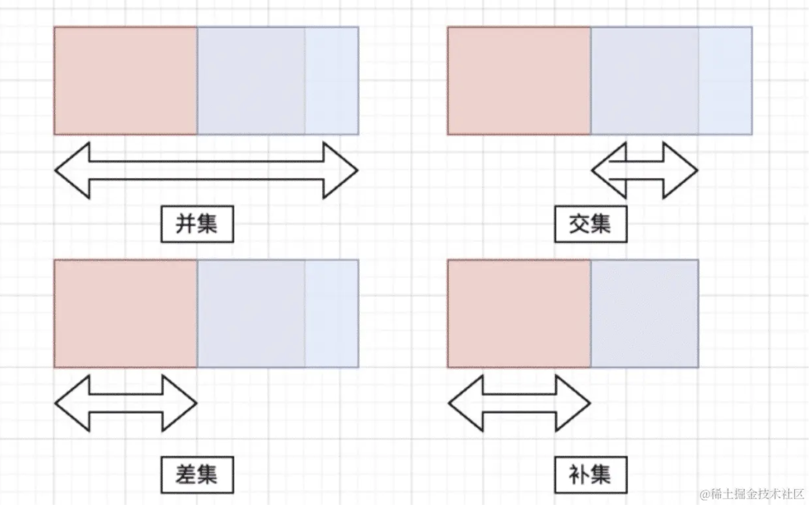

### 3 - 原始类型和对象类型
1. https://juejin.cn/book/7086408430491172901/section/7086435924392804388

2. void
- linbudu：'void 用于描述一个内部没有 return 语句，或者没有显式 return 一个值的函数的返回值'
```TypeScript
// func1 func2 的返回值默认被推导为 void
function func1(): void {}
function func2(): void {
  return;
}
function func3() {
  return undefined;
}
```

3. 元祖
```TypeScript
// 在数组越界时会有错误提示
const arr4: [string, string, string] = ['lin', 'bu', 'du'];
console.log(arr4[599]); // error

// 隐性的数组越界
const arr5: [string, number, boolean] = ['linbudu', 599, true];
// 长度为 "3" 的元组类型 "[string, number, boolean]" 在索引 "3" 处没有元素。
const [name, age, male, other] = arr5;

// 元祖的长度 1、2、3
const arr6: [string, number?, boolean?] = ['linbudu'];
```

4. 具名元组
```TypeScript
type PersonTuple = [name: string, age: number, male: boolean];
const personTuple: PersonTuple = ['linbudu', 599, true];
// 01 - 通过解构的方式取值
// 02 - 元素的取值是有顺序的，顺序乱了不会报错但数据会取错
const [name, age, male] = personTuple;
```

5. 数组可同时包括不同的类型，但是无法保证某个索引的类型
```TypeScript
// 对应具体实例的类型组合是不确定的
const mixedArray: (string | number | boolean)[] = ["Hello", 42, true];
```

6. 通用元组类型
- 长度不限、字段类型不限
```TypeScript
// 定义一个完全通用的变长元组类型
type AnyLengthTuple = [...any[]];

// 示例：创建一个完全通用的变长元组
const tuple1: AnyLengthTuple = ["Hello", 42, true, "World"];
const tuple2: AnyLengthTuple = [100, { key: "value" }, null];
const tuple3: AnyLengthTuple = [];

// 访问和打印元组中的元素
console.log(tuple1); // 输出: ["Hello", 42, true, "World"]
console.log(tuple2); // 输出: [100, { key: "value" }, null]
console.log(tuple3); // 输出: []
```

7. Object
- Object 包含了所有类型
- 还需要注意 String、Number、Boolean、Symbol 等几种装箱类型
```TypeScript
// 对于 undefined、null、void 0 ，需要关闭 strictNullChecks
const tmp1: Object = undefined;
const tmp2: Object = null;
const tmp3: Object = void 0;
const tmp4: Object = 'linbudu';
const tmp5: Object = 599;
const tmp6: Object = { name: 'linbudu' };
const tmp7: Object = () => {};
const tmp8: Object = [];
```

8. object 代表所有非原始类型的类型（如对象、数组、函数等，当然也包括 undefined、null、void 0 这种）
```TypeScript
const tmp17: object = undefined;
const tmp18: object = null;
const tmp19: object = void 0;

const tmp20: object = 'linbudu';  // X 不成立，值为原始类型
const tmp21: object = 599; // X 不成立，值为原始类型

const tmp22: object = { name: 'linbudu' };
const tmp23: object = () => {};
const tmp24: object = [];
```

9. Object、object、{} 的总结
- linbudu：'在任何时候都不要，不要，不要使用 Object 以及类似的装箱类型'
- linbudu：'当你不确定某个变量的具体类型，但能确定它不是原始类型，可以使用 object。但我更推荐进一步区分，也就是使用 Record<string, unknown> 或 Record<string, any> 表示对象，unknown[] 或 any[] 表示数组，(...args: any[]) => any表示函数这样'
- linbudu：'我们同样要避免使用{}。{}意味着任何非 null / undefined 的值，从这个层面上看，使用它和使用 any 一样恶劣'

### 4 - 字面量类型、枚举类型
1. 字面量类型
- linbudu：'主要包括字符串字面量类型、数字字面量类型、布尔字面量类型和对象字面量类型，可以直接作为类型标注'
```TypeScript
const str: "linbudu" = "linbudu";
const num: 599 = 599;
const bool: true = true;
```

2. 字面量类型和联合类型一起使用
```TypeScript
interface Tmp {
  bool: true | false;
  num: 1 | 2 | 3;
  str: "lin" | "bu" | "du"
}
```

3. 联合类型
- linbudu：'代表了一组类型的可用集合，只要最终赋值的类型属于联合类型的成员之一，就可以认为符合这个联合类型'
```TypeScript
interface Tmp {
  mixed: true | string | 599 | {} | (() => {}) | (1 | 2)
}
```

4. 多个对象类型的联合类型
- 多个对象类型的联合，来实现手动的互斥属性
```TypeScript
// 区分 vip 用户和非 vip 用户
interface Tmp {
  user:
    | {
        vip: true;
        expires: string;
      }
    | {
        vip: false;
        promotion: string;
      };
}

declare var tmp: Tmp;
if (tmp.user.vip) {
  console.log(tmp.user.expires);
}
```

5. 字面量类型在干嘛
- linbudu：'在需要更精确类型的情况下，我们可以使用字面量类型加上联合类型的方式，将类型从 string 这种宽泛的原始类型直接收窄到 "resolved" | "pending" | "rejected" 这种精确的字面量类型集合'
- linbudu：'需要注意的是，无论是原始类型还是对象类型的字面量类型，它们的本质都是类型而不是值'

6. 枚举类型
```TypeScript
enum PageUrl {
  Home_Page_Url = "url1",
  Setting_Page_Url = "url2",
  Share_Page_Url = "url3",
}
const home = PageUrl.Home_Page_Url;
```

7. const 的自动推导
- const 定义的变量（简单变量不是对象、数组对象这种复杂的）会从值推导出精确的字面量类型
- 
```TypeScript
const num = '1' // num 类型会自动推导为字面量类型 '1'
```

### 5 - 函数、Class
1. 函数的类型
- 描述函数入参、返回值类型
```TypeScript
// 函数表达式的类型声明
const foo = function (name: string): number {
  return name.length
}

const foo: (name: string) => number = function (name) {
  return name.length
}

const foo = (name: string): number => {
  return name.length
}

// 抽离函数类型声明
type FuncFoo = (name: string) => number
const foo: FuncFoo = (name) => {
  return name.length
}
```

2. 函数的 void 类型
- linbudu：'在 TypeScript 中，undefined 类型是一个实际的、有意义的类型值，而 void 才代表着空的、没有意义的类型值'
```TypeScript
// 调用了 return 语句，但没有返回值
function bar(): void {
  return;
}

function bar(): undefined {
  return;
}
```

3. 函数入参的可选参数
```TypeScript
// 入参个数不定，且除开第一个指定为 string 类型外其它的可以是任何类型
function foo(arg1: string, ...rest: any[]) { }

function foo(arg1: string, ...rest: [number, boolean]) { }
foo("linbudu", 18, true)
```

4. 异步函数
```TypeScript
async function asyncFunc(): Promise<void> {}
```

5. Class 声明和 Class 表达式
```TypeScript
// Class 声明
class Foo {
  prop: string;
  constructor(inputProp: string) {
    this.prop = inputProp;
  }
  print(addon: string): void {
    console.log(`${this.prop} and ${addon}`)
  }
  get propA(): string {
    return `${this.prop}+A`;
  }
  set propA(value: string) {
    this.prop = `${value}+A`
  }
}

// Class 表达式
const Foo = class {
  prop: string;
  constructor(inputProp: string) {
    this.prop = inputProp;
  }
  print(addon: string): void {
    console.log(`${this.prop} and ${addon}`)
  }
  // ...
}
```

6. ts Class 上的成员修饰符
- public、private、protected、readonly
- linbudu：'public：此类成员在类、类的实例、子类中都能被访问'
- linbudu：'private：此类成员仅能在类的内部被访问'
- linbudu：'protected：此类成员仅能在类与子类中被访问，你可以将类和类的实例当成两种概念，即一旦实例化完毕（出厂零件），那就和类（工厂）没关系了，即不允许再访问受保护的成员'
```TypeScript
class Foo {
  private prop: string;

  constructor(inputProp: string) {
    this.prop = inputProp;
  }

  protected print(addon: string): void {
    console.log(`${this.prop} and ${addon}`)
  }

  public get propA(): string {
    return `${this.prop}+A`;
  }

  public set propA(value: string) {
    this.propA = `${value}+A`
  }
}
```

7. Class 的静态成员
- 用 static 定义
- linbudu：'静态成员直接被挂载在函数体上，而实例成员挂载在原型上，这就是二者的最重要差异：静态成员不会被实例继承，它始终只属于当前定义的这个类（以及其子类）。而原型对象上的实例成员则会沿着原型链进行传递，也就是能够被继承'
```TypeScript
class Foo {
  static staticHandler() { }
  public instanceHandler() { }
}
```

8. override
- 用在子类覆盖父类的方法，可以确保子类覆盖的方法在父类中一定存在（不存在的话在编译过程中会报错）
```TypeScript
class Base {
  printWithLove() { }
}

class Derived extends Base {
  // print 在父类 Base 中不存在，此处通过 override 覆盖会出错
  override print() {
    // ...
  }
}
```

### 6 - 内置类型（any、unknoen、never）和类型断言
1. any
- linbudu：'any 类型的变量几乎无所不能，它可以在声明后再次接受任意类型的值，同时可以被赋值给任意其它类型的变量'
- linbudu：'能兼容所有类型，也能够被所有类型兼容'
- linbudu：'如果是类型不兼容报错导致你使用 any，考虑用类型断言替代，我们下面就会开始介绍类型断言的作用'
- linbudu：'如果是类型太复杂导致你不想全部声明而使用 any，考虑将这一处的类型去断言为你需要的最简类型。如你需要调用 foo.bar.baz()，就可以先将 foo 断言为一个具有 bar 方法的类型'
- linbudu：'如果你是想表达一个未知类型，更合理的方式是使用 unknown'

2. unknown
- linbudu：'一个 unknown 类型的变量可以再次赋值为任意其它类型，但只能赋值给 any 与 unknown 类型的变量'
```TypeScript
let unknownVar: unknown = "linbudu";

unknownVar = false;
unknownVar = "linbudu";
unknownVar = {
  site: "juejin"
};

unknownVar = () => { }

const val1: string = unknownVar; // Error
const val2: number = unknownVar; // Error
const val3: () => {} = unknownVar; // Error
const val4: {} = unknownVar; // Error

const val5: any = unknownVar;
const val6: unknown = unknownVar;

// unknown 会比 any 更加严格
let unknownVar: unknown;
unknownVar.foo(); // 报错：对象类型为 unknown
```

3. never
- linbudu：'never 类型被称为 Bottom Type，是整个类型系统层级中最底层的类型。和 null、undefined 一样，它是所有类型的子类型，但只有 never 类型的变量能够赋值给另一个 never 类型变量'
```TypeScript
// 使用 never 类型做兜底处理
declare const strOrNumOrBool: string | number | boolean;
if (typeof strOrNumOrBool === "string") {
    // 一定是字符串！
  strOrNumOrBool.charAt(1);
} else if (typeof strOrNumOrBool === "number") {
  strOrNumOrBool.toFixed();
} else if (typeof strOrNumOrBool === "boolean") {
  strOrNumOrBool === true;
} else {
  // 这里 strOrNumOrBool 只能是 never 类型，如果因为业务变化导致其为 function 等类型的这里兜底的判断会出错
  const _exhaustiveCheck: never = strOrNumOrBool;
  throw new Error(`Unknown input type: ${_exhaustiveCheck}`);
}
```

4. 断言
```TypeScript
// 中间媒介
// str 直接断言为对象跨度太大，可以通过 any 或 unknown 作为中间媒介
const str: string = "linbudu";
(str as unknown as { handler: () => {} }).handler();
```

5. 非空断言
- 排除了 null 和 undefined
```TypeScript
declare const foo: {
  func?: () => ({
    prop?: number | null;
  })
};
// func、prop 都是可选的，直接使用可能会报错
foo.func().prop.toFixed();
// 非空断言保证编译时不会报错，运行时可能还是会报错
// 类似于可选链操作符，但是可选链操作符在编译、运行时都不会报错
foo.func!().prop!.toFixed();
```

### 7 - ts 类型工具上
1. type 类型别名
- linbudu：'类型别名的作用主要是对一组类型或一个特定类型结构进行封装，以便于在其它地方进行复用'

2. type 和泛型的结合
```TypeScript
// MaybeNull
type MaybeNull<T> = T | null;
function process(input: MaybeNull<{ handler: () => {} }>) {
  input?.handler();
}

// MayerArray
type MaybeArray<T> = T | T[];
function ensureArray<T>(input: MaybeArray<T>): T[] {
  return Array.isArray(input) ? input : [input];
}
```

3. 交叉类型
- linbudu：'联合类型只需要符合成员之一即可（||），而交叉类型需要严格符合每一位成员（&&）'
```TypeScript
type Struct1 = {
  primitiveProp: string;
  objectProp: {
    name: string;
  }
}
type Struct2 = {
  primitiveProp: number;
  objectProp: {
    age: number;
  }
}

type Composed = Struct1 & Struct2;
type PrimitivePropType = Composed['primitiveProp']; // never
type ObjectPropType = Composed['objectProp']; // { name: string; age: number; }

// 联合类型的交叉类型
type UnionIntersection1 = (1 | 2 | 3) & (1 | 2); // 1 | 2
type UnionIntersection2 = (string | number | symbol) & string; // string
```

4. 索引签名类型
```TypeScript
interface AllStringTypes {
  [key: string]: string;
}
type AllStringTypes = {
  [key: string]: string;
}
type PropType1 = AllStringTypes['linbudu']; // string
type PropType2 = AllStringTypes['599']; // string
```

5. 索引类型查询
```TypeScript
interface Foo {
  linbudu: 1
  599: 2
}
// & {} vscode 鼠标 hover 的时候可以显示 keyof 取出的联合类型
type typeOne = keyof Foo & {}
```

6. 索引类型访问
```TypeScript
interface Foo {
  propA: number;
  propB: boolean;
}

type PropAType = Foo['propA']; // number
type PropBType = Foo['propB']; // boolean

// 如何取得 interface 的 key、value 对应的联合类型
interface Foo {
  propA: number
  propB: boolean
  propC: string
}
// 取 interface Foo 的 key
type PropTypeUnion1 = keyof Foo & {} // propA | propB | propC
// 取 interface Foo 的 value
type PropTypeUnion2 = Foo[keyof Foo] // number | boolean | string
const num1: PropTypeUnion1 = 'propA'
const num2: PropTypeUnion2 = 1
```

7. keyof 替换 interface key 的原有类型
```TypeScript
type Stringify<T> = {
  [K in keyof T]: string;
};

interface Foo {
  prop1: string;
  prop2: number;
  prop3: boolean;
  prop4: () => void;
}
type StringifiedFoo = Stringify<Foo>;
// 等价于
interface StringifiedFoo {
  prop1: string;
  prop2: string;
  prop3: string;
  prop4: string;
}
```

8. 映射类型
```TypeScript
interface Foo {
  propA: number
  propB: boolean
  propC: string
}
// type typeOne = "propA" | "propB" | "propC"
type typeOne = keyof Foo & {}
type Clone<T> = {
  [K in keyof T]: T[K];
};
// type typeTwo = {
//   propA: number;
//   propB: boolean;
//   propC: string;
// }
type typeTwo = Clone<Foo>
```

### 8 - ts 类型工具下
1. typeof（记得区分 js 中的 typeof）
```TypeScript
const str = "linbudu";
const obj = { name: "linbudu" };
const nullVar = null;
const undefinedVar = undefined;
const func = (input: string) => {
  return input.length > 10;
}

type Str = typeof str; // "linbudu"
type Obj = typeof obj; // { name: string; }
type Null = typeof nullVar; // null
type Undefined = typeof undefined; // undefined
type Func = typeof func; // (input: string) => boolean
```

2. 类型守卫
```TypeScript
// 添加 input is string 可以保证在 foo 函数 isString(input) 判断时传入 input 类型的正确性
function isString(input: unknown): input is string {
  return typeof input === "string";
}

function foo(input: string | number) {
  if (isString(input)) {
    // 正确了
    (input).replace("linbudu", "linbudu599")
  }
  if (typeof input === 'number') { }
  // ...
}
```

3. 常见的类型守卫
```TypeScript
export type Falsy = false | "" | 0 | null | undefined;
// true 表示是假值
export const isFalsy = (val: unknown): val is Falsy => !val;

// 不包括不常用的 symbol 和 bigint
export type Primitive = string | number | boolean | undefined;
export const isPrimitive = (val: unknown): val is Primitive => ['string', 'number', 'boolean' , 'undefined'].includes(typeof val);
```

4. 守卫方式 01
```TypeScript
function ensureArray(input: number | number[]): number[] {
  if (Array.isArray(input)) {
    return input;
  } else {
    return [input];
  }
}

interface Foo {
  kind: 'foo';
  diffType: string;
  fooOnly: boolean;
  shared: number;
}

interface Bar {
  kind: 'bar';
  diffType: number;
  barOnly: boolean;
  shared: number;
}

function handle1(input: Foo | Bar) {
  // 类型 Foo 中的 kind 对应的 value 才是 'foo'
  if (input.kind === 'foo') {
    input.fooOnly;
  } else {
    input.barOnly;
  }
}
```

5. 守卫方式 02 instanceof
```TypeScript
class FooBase {}

class BarBase {}

class Foo extends FooBase {
  fooOnly() {}
}
class Bar extends BarBase {
  barOnly() {}
}

function handle(input: Foo | Bar) {
  if (input instanceof FooBase) {
    input.fooOnly();
  } else {
    input.barOnly();
  }
}
```

6. interface 的继承
```TypeScript
interface Struct1 {
  primitiveProp: string;
  objectProp: {
    name: string;
  };
  unionProp: string | number;
}

// 接口“Struct2”错误扩展接口“Struct1”。
interface Struct2 extends Struct1 {
  // “primitiveProp”的类型不兼容。不能将类型“number”分配给类型“string”。
  primitiveProp: number;
  // 属性“objectProp”的类型不兼容。
  objectProp: {
    age: number;
  };
  // 属性“unionProp”的类型不兼容。
  // 不能将类型“boolean”分配给类型“string | number”。
  unionProp: boolean;
}
```

7. interface 和 type 的混合使用
```TypeScript
type Base = {
  name: string;
};
// 通过 extends 来实现
interface IDerived extends Base {
  // 报错！就像继承接口一样需要类型兼容
  name: number;
  age: number;
}

interface IBase {
  name: string;
}
// 只能通过 &、| 来实现
// 合并后的 name 同样是 never 类型
type Derived = IBase & {
  name: number;
};
```

### 9 - 泛型
1. 默认值
```TypeScript
// 此处泛型 T 默认是 boolean
type Factory<T = boolean> = T | number | string;
```

2. 泛型约束
- linbudu：'泛型约束。也就是说，你可以要求传入这个工具类型的泛型必须符合某些条件，否则你就拒绝进行后面的逻辑'
```TypeScript
type ResStatus<ResCode extends number> = ResCode extends 10000 | 10001 | 10002
  ? 'success'
  : 'failure';

type Res1 = ResStatus<10000>; // "success"
type Res2 = ResStatus<20000>; // "failure"

type Res3 = ResStatus<'10000'>; // 类型“string”不满足约束“number”。
```

3. 函数中的泛型
```TypeScript
// T 会自动地被填充为这个参数的类型。这也就意味着你不再需要预先确定参数的可能类型了，而在返回值与参数类型关联的情况下，也可以通过泛型参数来进行运算
function handle<T>(input: T): T {}

// 变量位置交换
function swap<T, U>([start, end]: [T, U]): [U, T] {
  return [end, start];
}
const swapped1 = swap(["linbudu", 599]);
const swapped2 = swap([null, 599]);
const swapped3 = swap([{ name: "linbudu" }, {}]);

// 指定只处理 number 类型的元组
function swap<T extends number, U extends number>([start, end]: [T, U]): [U, T] {
  return [end, start];
}
```

4. 箭头函数的泛型
```TypeScript
const handle = <T>(input: T): T => {}
```

5. 内置方法中的泛型
```TypeScript
function p() {
  return new Promise<boolean>((resolve, reject) => {
    resolve(true);
  });
}
```

### 10 - 结构化类型系统

### 11 - 类型系统层级
1. 通过条件类型来判断类型系统层级
```TypeScript
type Result1 = "linbudu" extends string ? 1 : 2; // 1
type Result2 = 1 extends number ? 1 : 2; // 1
type Result3 = true extends boolean ? 1 : 2; // 1
type Result4 = { name: string } extends object ? 1 : 2; // 1
type Result5 = { name: 'linbudu' } extends object ? 1 : 2; // 1
// object 可以是对象、数组、函数类型
type Result6 = [] extends object ? 1 : 2; // 1
```

2. 联合类型 extends
```TypeScript
// 可以看作 'lin' | 'bu' | 'budu' 同一时间只能取其中一个可能的值，而这个可能的值都 extends string 类型
type Result11 = 'lin' | 'bu' | 'budu' extends string ? 1 : 2; // 1
type Result12 = {} | (() => void) | [] extends object ? 1 : 2; // 1
```

3. any
```TypeScript
type Result24 = any extends Object ? 1 : 2; // 1 | 2
type Result25 = unknown extends Object ? 1 : 2; // 2

// any 可以看作是任何类型，既可以满足条件又可以不满足条件
type Result26 = any extends 'linbudu' ? 1 : 2; // 1 | 2
type Result27 = any extends string ? 1 : 2; // 1 | 2
type Result28 = any extends {} ? 1 : 2; // 1 | 2
type Result29 = any extends never ? 1 : 2; // 1 | 2

// any、unknown
type Result31 = any extends unknown ? 1 : 2;  // 1
type Result32 = unknown extends any ? 1 : 2;  // 1
```

4. 类型层级链
```TypeScript
type VerboseTypeChain = never extends 'linbudu'
  ? 'linbudu' extends 'linbudu' | 'budulin'
  ? 'linbudu' | 'budulin' extends string
  ? string extends {}
  ? string extends String
  ? String extends {}
  ? {} extends object
  ? object extends {}
  ? {} extends Object
  ? Object extends {}
  ? object extends Object
  ? Object extends object
  ? Object extends any
  ? Object extends unknown
  ? any extends unknown
  ? unknown extends any
  ? 8
  : 7
  : 6
  : 5
  : 4
  : 3
  : 2
  : 1
  : 0
  : -1
  : -2
  : -3
  : -4
  : -5
  : -6
  : -7
  : -8
```

5. 联合类型的判断
- linbudu：'只需要比较一个联合类型是否可被视为另一个联合类型的子集，即这个联合类型中所有成员在另一个联合类型中都能找到'
```TypeScript
type Result36 = 1 | 2 | 3 extends 1 | 2 | 3 | 4 ? 1 : 2; // 1
type Result37 = 2 | 4 extends 1 | 2 | 3 | 4 ? 1 : 2; // 1
// 5 不满足
type Result38 = 1 | 2 | 5 extends 1 | 2 | 3 | 4 ? 1 : 2; // 2
// 5 不满足
type Result39 = 1 | 5 extends 1 | 2 | 3 | 4 ? 1 : 2; // 2
```

6. 元组和数组的判断
```TypeScript
type Result40 = [number, number] extends number[] ? 1 : 2; // 1
type Result41 = [number, string] extends number[] ? 1 : 2; // 2
type Result42 = [number, string] extends (number | string)[] ? 1 : 2; // 1
type Result43 = [] extends number[] ? 1 : 2; // 1
type Result44 = [] extends unknown[] ? 1 : 2; // 1
type Result45 = number[] extends (number | string)[] ? 1 : 2; // 1
type Result46 = any[] extends number[] ? 1 : 2; // 1
type Result47 = unknown[] extends number[] ? 1 : 2; // 2
type Result48 = never[] extends number[] ? 1 : 2; // 1
```

7. 类型层级图解
- 

### 12 - 条件类型、infer
1. 条件类型和泛型的结合
```TypeScript
export type LiteralType<T> = T extends string
	? "string"
	: T extends number
	? "number"
	: T extends boolean
	? "boolean"
	: T extends null
	? "null"
	: T extends undefined
	? "undefined"
	: never;

type Res1 = LiteralType<"linbudu">; // "string"
type Res2 = LiteralType<599>; // "number"
type Res3 = LiteralType<true>; // "boolean"
```

2. infer 结合 rest 参数的使用（可用于处理任意长度的参数）
```TypeScript
// 提取首尾两个
type ExtractStartAndEnd<T extends any[]> = T extends [
  infer Start,
  ...any[],
  infer End
]
  ? [Start, End]
  : T;

// 调换首尾两个
type SwapStartAndEnd<T extends any[]> = T extends [
  infer Start,
  ...infer Left,
  infer End
]
  ? [End, ...Left, Start]
  : T;

// 调换开头两个
type SwapFirstTwo<T extends any[]> = T extends [
  infer Start1,
  infer Start2,
  ...infer Left
]
  ? [Start2, Start1, ...Left]
  : T;
```

3. infer 处理数组到联合类型
```TypeScript
type ArrayItemType<T> = T extends Array<infer ElementType> ? ElementType : never;

type ArrayItemTypeResult1 = ArrayItemType<[]>; // never
type ArrayItemTypeResult2 = ArrayItemType<string[]>; // string
type ArrayItemTypeResult3 = ArrayItemType<[string, number]>; // string | number
```

4. infer 用来反转键名和键值
```TypeScript
// 反转键名与键值
type ReverseKeyValue<T extends Record<string, unknown>> = T extends Record<infer K, infer V> ? Record<V & string, K> : never

type ReverseKeyValueResult1 = ReverseKeyValue<{ "key": "value" }>; // { "value": "key" }
```

5. infer 结合 Promise
```TypeScript
type PromiseValue<T> = T extends Promise<infer V> ? V : T;
type PromiseValueResult1 = PromiseValue<Promise<number>>; // number

// 01 - 通过添加判断层数处理参数
type PromiseValue<T> = T extends Promise<infer V>
  ? V extends Promise<infer N>
    ? N
    : V
  : T;

// 02 - 通过递归的方式处理参数
type PromiseValue<T> = T extends Promise<infer V> ? PromiseValue<V> : T;
```

6. 分布式条件类型
```TypeScript
type CompareUnion1<T, U> = T extends U ? true : false
type CompareUnion2<T, U> = [T] extends [U] ? true : false

type CompareRes1 = CompareUnion1<1 | 2, 1 | 2 | 3> // true
type CompareRes2 = CompareUnion1<1 | 2, 1> // boolean
// 下述两个 type 判断时经过了 [] 包裹；结果判断会更加的严格
type CompareRes3 = CompareUnion2<1 | 2, 1 | 2 | 3> // true
type CompareRes4 = CompareUnion2<1 | 2, 1> // false
```

7. isNever
```TypeScript
type IsNever<T> = [T] extends [never] ? true : false;

type IsNeverRes1 = IsNever<never>; // true
type IsNeverRes2 = IsNever<"linbudu">; // false
```

8. any
```TypeScript
// 直接使用，返回联合类型
type Tmp1 = any extends string ? 1 : 2;  // 1 | 2

type Tmp2<T> = T extends string ? 1 : 2;
// 通过泛型参数传入，同样返回联合类型
type Tmp2Res = Tmp2<any>; // 1 | 2

// 如果判断条件是 any，那么仍然会进行判断
type Special1 = any extends any ? 1 : 2; // 1
type Special2<T> = T extends any ? 1 : 2;
type Special2Res = Special2<any>; // 1
```

9. 联合类型分发
```TypeScript
type Intersection<A, B> = A extends B ? A : never;
type IntersectionRes = Intersection<1 | 2 | 3, 2 | 3 | 4>; // 2 | 3
```

### 13 - 内置工具类型基础
1. 属性修饰工具类型
```TypeScript
type Partial<T> = {
  // [P in keyof T]+?: T[P];
  [P in keyof T]?: T[P];
};

type Required<T> = {
  [P in keyof T]-?: T[P];
};

type Readonly<T> = {
  readonly [P in keyof T]: T[P];
  // +readonly [P in keyof T]: T[P];
  // -readonly [P in keyof T]: T[P];
};
```

2. Record
```TypeScript
type Record<K extends keyof any, T> = {
  [P in K]: T;
};

// Record<string, unknown> 和 record<string, any> 平常用得比较多
// 键名均为字符串，键值类型未知
type Record1 = Record<string, unknown>;
// 键名均为字符串，键值类型任意
type Record2 = Record<string, any>;
// 键名为字符串或数字，键值类型任意
type Record3 = Record<string | number, any>;
```

3. Pick、Omit
```TypeScript
type Pick<T, K extends keyof T> = {
    [P in K]: T[P];
};

type Omit<T, K extends keyof any> = Pick<T, Exclude<keyof T, K>>;
```

4. 并、交、差、补
```TypeScript
// 并集
export type Concurrence<A, B> = A | B;

// 交集
export type Intersection<A, B> = A extends B ? A : never;

// 差集
export type Difference<A, B> = A extends B ? never : A;

// 补集
export type Complement<A, B extends A> = Difference<A, B>;

// 排除了 null、undefined
type NonNullable<T> = T extends null | undefined ? never : T;
```

5. 函数的参数和返回值
```TypeScript
type FunctionType = (...args: any) => any;

type Parameters<T extends FunctionType> = T extends (...args: infer P) => any ? P : never;

type ReturnType<T extends FunctionType> = T extends (...args: any) => infer R ? R : any;
```

6. 提取数组的第一个成员且该成员需要是 string 类型
```TypeScript
type FirstArrayItemType<T extends any[]> = T extends [infer P, ...any[]]
  ? P extends string
    ? P
    : never
  : never;
type Tmp1 = FirstArrayItemType<[599, 'linbudu']>; // never
type Tmp2 = FirstArrayItemType<['linbudu', 599]>; // 'linbudu'
type Tmp3 = FirstArrayItemType<['linbudu']>; // 'linbudu'

// 减少判断条件
type FirstArrayItemType<T extends any[]> = T extends [infer P extends string, ...any[]]
  ? P
  : never;
```

### 15 - 函数类型：协变和逆变
1. 函数类型需要关注参数和返回值
```TypeScript
// 有下述类的父子孙结构
class Animal {
  asPet() {}
}
class Dog extends Animal {
  bark() {}
}
class Corgi extends Dog {
  cute() {}
}

// 存在的参数 -> 返回值的类型组合
Animal -> Animal
Animal -> Dog
Animal -> Corgi
Dog -> Dog
Dog -> Animal
Dog -> Corgi
Corgi -> Animal
Corgi -> Dog
Corgi -> Corgi

// 实际例子
function makeDogBark(dog: Dog) {
  dog.bark();
}
// 没问题：Corgi 是 Dog 的一种，它会继承 Dog 的 bark 方法
makeDogBark(new Corgi());
// 不行：Animal 是最近具有 bark 方法的 Dog 类的父类，所以传入的参数不一定是 Dog 类型，也有可能是 Cat 类型（Cat 类型上没有 bark 方法）
makeDogBark(new Animal());

// 传入 Animal 类型的参数最多只能调用 Animal 上的方法
// 传入 Corgi 类型的参数可以调用 Animal、Dog、Corgi 上的方法
```

### 16 - 类型编程和类型体操
1. 类型编程有什么作用
- linbudu：'提高代码的稳定性、代码质量、严谨性、可读性'
- linbudu：'能避免潜在的严重问题，比如白屏和塞满错误监控的 Cannot read property of undefined'

### **17 - 内置工具类型进阶**
0. 这章很精华，里面的一些例子在实际业务开发中业务会用到，值得反复看几遍
- link：https://juejin.cn/book/7086408430491172901/section/7100488803369877543#heading-0

1. 深层可选
```TypeScript
export type DeepPartial<T extends object> = {
  // 判断 object 的每个 key 对应的 value 是不是 extends object，是的话递归处理
  [K in keyof T]?: T[K] extends object ? DeepPartial<T[K]> : T[K];
};

// 深层必选
export type DeepRequired<T extends object> = {
  [K in keyof T]-?: T[K] extends object ? DeepRequired<T[K]> : T[K];
};

// 深层只读
export type DeepReadonly<T extends object> = {
  readonly [K in keyof T]: T[K] extends object ? DeepReadonly<T[K]> : T[K];
};

// 深层不只读
export type DeepMutable<T extends object> = {
  -readonly [K in keyof T]: T[K] extends object ? DeepMutable<T[K]> : T[K];
};
```

2. 递归剔除 null 和 undefined
```TypeScript
type NonNullable<T> = T extends null | undefined ? never : T;

export type DeepNonNullable<T extends object> = {
  [K in keyof T]: T[K] extends object
    ? DeepNonNullable<T[K]>
    : NonNullable<T[K]>;
};
```

3. 可选为泛型或 null
```TypeScript
export type Nullable<T> = T | null;

export type DeepNullable<T extends object> = {
  [K in keyof T]: T[K] extends object ? DeepNullable<T[K]> : Nullable<T[K]>;
};
```

4. 实现部分（根据传入的来定）的 key 对应的值可选
```TypeScript
export type MarkPropsAsOptional<
  T extends object,
  K extends keyof T = keyof T
> = Partial<Pick<T, K>> & Omit<T, K>;

// MarkPropsAsOptionalStruct 中 bar 变为可选
type MarkPropsAsOptionalStruct = MarkPropsAsOptional<
  {
    foo: string;
    bar: number;
    baz: boolean;
  },
  'bar'
>;

// 上述 bar 变为可选在 vscode 中 hover 效果看不出，可通过构造 & {} 的类型来使其 hover 时可看出
type Flatten<T> = {
  [KeyType in keyof T]: T[KeyType] extends object
    ? Flatten<T[KeyType]>
    : T[KeyType];
} & {};
// 下述 MarkPropsAsOptional type 再作用于具体的泛型参数 hover 时就可以看出
export type MarkPropsAsOptional<
  T extends object,
  K extends keyof T = keyof T
> = Flatten<Partial<Pick<T, K>> & Omit<T, K>>;
```

5. 深层处理和双泛型参数的结合使用
```TypeScript
// 下述是深层的效果，单层的话 & {} 即可
export type Flatten<T> = {
  [KeyType in keyof T]: T[KeyType] extends object
    ? Flatten<T[KeyType]>
    : T[KeyType];
} & {};

export type MarkPropsAsRequired<
  T extends object,
  K extends keyof T = keyof T
> = Flatten<Omit<T, K> & Required<Pick<T, K>>>;

export type MarkPropsAsReadonly<
  T extends object,
  K extends keyof T = keyof T
> = Flatten<Omit<T, K> & Readonly<Pick<T, K>>>;

// 对传入的泛型 K 深层不可读
export type MarkPropsAsMutable<
  T extends object,
  K extends keyof T = keyof T
> = Flatten<Omit<T, K> & Mutable<Pick<T, K>>>;

export type MarkPropsAsNullable<
  T extends object,
  K extends keyof T = keyof T
> = Flatten<Omit<T, K> & DeepNullable<Pick<T, K>>>;

export type MarkPropsAsNonNullable<
  T extends object,
  K extends keyof T = keyof T
> = Flatten<Omit<T, K> & DeepNonNullable<Pick<T, K>>>;
```

6. 简单的并、交、差、补集
- 
```TypeScript
// 并集
export type Concurrence<A, B> = A | B;
// 交集
export type Intersection<A, B> = A extends B ? A : never;
// 差集
export type Difference<A, B> = A extends B ? never : A;
// 补集
export type Complement<A, B extends A> = Difference<A, B>;
```

7. 获取函数的第一个参数的类型
```TypeScript

```

8. 获取函数的最后一个参数的类型
```TypeScript
// 提取函数的最后一个元素方法 1
type FunctionType = (...args: any) => any
type LastParameter1<T extends FunctionType> = T extends (arg: infer P) => any
  ? P
  // 多个传参的情况
  : T extends (...args: infer R) => any
  // 下面这步是提取元组的最后一个类型（可能有错误）
  ? R extends [...any, infer Q]
    ? Q
    : never
  : never

type FuncFoo = (arg: number) => void
type FuncBar = (...args: string[]) => void
type FuncBaz = (arg1: string, arg2: boolean) => void

type FooLastParameter = LastParameter1<FuncFoo> // number
type BarLastParameter = LastParameter1<FuncBar> // string
type BazLastParameter = LastParameter1<FuncBaz> // boolean

// 提取函数的最后一个元素方法 2
type FunctionType = (...args: any[]) => any;
type LastParameter<T extends FunctionType> = T extends (arg: infer P) => any
  ? P
  // 多个传参的情况
  : T extends (...args: infer R) => any
  ? R extends [...infer Rest, infer Q]
    ? Q
    : never
  : never;
```

9. ts 内置的提取 Promise 内部值类型的工具类型
```TypeScript
// 判断泛型 T 是不是 null | undefined
type Awaited<T> = T extends null | undefined
  ? T 
  // 判断 T 是不是兼容于对象且具备 then 方法
  : T extends object & { then(onfulfilled: infer F): any }
  // F 又是不是个函数
  ? F extends (value: infer V, ...args: any) => any
    // F 是函数的话递归调用求解
    ? Awaited<V>
    : never
  : T;
```

### 18 - 模版字符串入门
1. 模版字符串拼接
```TypeScript
// 可拼接的数据范围：string | number | boolean | null | undefined | bigint
type Greet<T extends string | number | boolean | null | undefined | bigint> = `Hello ${T}`;

type Greet1 = Greet<"linbudu">; // "Hello linbudu"
type Greet2 = Greet<599>; // "Hello 599"
type Greet3 = Greet<true>; // "Hello true"
type Greet4 = Greet<null>; // "Hello null"
type Greet5 = Greet<undefined>; // "Hello undefined"
type Greet6 = Greet<0x1fffffffffffff>; // "Hello 9007199254740991"

// 模版字符串的处理
type ReverseName<Str extends string> =
  Str extends `${infer First} ${infer Last}` ? `${Capitalize<Last>} ${First}` : Str;
type ReversedTomHardy = ReverseName<'Tom hardy'>; // "Hardy Tom"
type ReversedLinbudu = ReverseName<'Budu Lin'>; // "Lin Budu"
```

2. 模版字符串声明版本号
```TypeScript
type Version = `${number}.${number}.${number}`;

const v1: Version = '1.1.0';
// X 类型 "1.0" 不能赋值给类型 `${number}.${number}.${number}`
const v2: Version = '1.0';
```

3. 模版字符串的自动分发来减少工作量
```TypeScript
type Brand = 'iphone' | 'xiaomi' | 'honor';
type Memory = '16G' | '64G';
type ItemType = 'official' | 'second-hand';

type SKU = `${Brand}-${Memory}-${ItemType}`;
```

4. 模版字符串结合泛型的自动分发
```TypeScript
type SizeRecord<Size extends string> = `${Size}-Record`;

type Size = 'Small' | 'Middle' | 'Large';
// "Small-Record" | "Middle-Record" | "Huge-Record"
type UnionSizeRecord = SizeRecord<Size>;
```

5. 重映射修改键名
```TypeScript
type CopyWithRename<T extends object> = {
  // string & K 的原因在于去除掉 Symbol 类型的键（模版插值不支持 Symbol 类型）
  [K in keyof T as `modified_${string & K}`]: T[K];
};

interface Foo {
  name: string;
  age: number;
}

// {
//   modified_name: string;
//   modified_age: number;
// }
type CopiedFoo = CopyWithRename<Foo>;
```

6. 字符串内置工具类型
- linbudu：'这些工具类型专用于字符串字面量类型，包括 Uppercase、Lowercase、Capitalize 与 Uncapitalize，看名字就能知道它们的作用：字符串大写、字符串小写、首字母大写与首字母小写'
```TypeScript
// 全大写
type Heavy<T extends string> = `${Uppercase<T>}`;
type Respect<T extends string> = `${Capitalize<T>}`;
type HeavyName = Heavy<'linbudu'>; // "LINBUDU"
type RespectName = Respect<'linbudu'>; // "Linbudu"

// 驼峰命名
type CopyWithRename<T extends object> = {
  [K in keyof T as `modified${Capitalize<string & K>}`]: T[K];
};
// {
//   modifiedName: string;
//   modifiedAge: number;
// }
type CopiedFoo = CopyWithRename<Foo>;
```

7. 从对象类型（interface、type 中找值符合要求的项）
```TypeScript
type PickByValueType<T extends object, Type> = {
  // 拆分为：01 - K in keyof T as T[K]
  // 02 - T[K] extends Type ? K : never
  // 上述 K 是 key，T[K] 表示的是值
  [K in keyof T as T[K] extends Type ? K : never]: T[K]
}

interface Example {
  name: string;
  age: number;
  isActive: boolean;
}
type typeOne = {
  key1: string,
  key2: number,
  key3: boolean,
}
// Example、typeOne 均符合要求
type StringProperties = PickByValueType<Example, string>;
// 结果: { name: string }
type NumberProperties = PickByValueType<Example, number>;
// 结果: { age: number }
type BooleanProperties = PickByValueType<Example, boolean>;
// 结果: { isActive: boolean }
```

### 19 - 模版字符串进阶
1. 实现 includes
```TypeScript
type _Include<
  Str extends string,
  Search extends string
> = Str extends `${infer _R1}${Search}${infer _R2}` ? true : false;

// 专门处理 ''.includes('') 也应该返回 true 的情况
type Include<Str extends string, Search extends string> = Str extends ''
  ? Search extends ''
    ? true
    : false
  : _Include<Str, Search>;
```

2. 实现 trim、trimStart、trimEnd
```TypeScript
// 每次去掉一个空格，再通过递归去除剩下的
type TrimLeft<Str extends string> = Str extends ` ${infer R}` ? TrimLeft<R> : Str;
type TrimRight<Str extends string> = Str extends `${infer R} ` ? TrimRight<R> : Str;
// trim 即是 trimStart 和 trimEnd 的结合
type Trim<Str extends string> = TrimLeft<TrimRight<Str>>;
```

3. 实现 startsWith、endsWith
```TypeScript
type _StartsWith<
  Str extends string,
  Search extends string
> = Str extends `${Search}${infer _R}` ? true : false;

// 处理 ''.startsWith('') 的情况
type StartsWith<Str extends string, Search extends string> = Str extends ''
  ? Search extends ''
    ? true
    : _StartsWith<Str, Search>
  : _StartsWith<Str, Search>;

type StartsWithRes1 = StartsWith<'linbudu', 'lin'>; // true
type StartsWithRes2 = StartsWith<'linbudu', ''>; // true
type StartsWithRes3 = StartsWith<'linbudu', ' '>; // false
type StartsWithRes4 = StartsWith<'', ''>; // true
type StartsWithRes5 = StartsWith<' ', ''>; // true
```

4. 实现 replace
```TypeScript
export type Replace<
  Str extends string,
  Search extends string,
  Replacement extends string
> = Str extends `${infer Head}${Search}${infer Tail}`
  // 将 Search 用 Replacement 替换
  ? `${Head}${Replacement}${Tail}`
  : Str;

// "林不渡也不是不能渡"
type ReplaceRes1 = Replace<'林不渡', '不', '不渡也不是不能'>;
// 不发生替换，仍然是"林不渡"
type ReplaceRes2 = Replace<'林不渡', '？', '？？'>; //
```

5. replaceAll
```TypeScript
export type ReplaceAll<
  Str extends string,
  Search extends string,
  Replacement extends string
> = Str extends `${infer Head}${Search}${infer Tail}`
  // 递归实现即可
  ? ReplaceAll<`${Head}${Replacement}${Tail}`, Search, Replacement>
  : Str;
  
// "mmm.linbudu.top"
type ReplaceAllRes1 = ReplaceAll<'www.linbudu.top', 'w', 'm'>;
// "www-linbudu-top"
type ReplaceAllRes2 = ReplaceAll<'www.linbudu.top', '.', '-'>;
```

6. 结合 replace 和 replaceAll，通过标识符判断需要使用哪个
```TypeScript
export type Replace<
  Input extends string,
  Search extends string,
  Replacement extends string,
  // true - 替换所有；false - 不替换所有
  ShouldReplaceAll extends boolean = false
> = Input extends `${infer Head}${Search}${infer Tail}`
  ? ShouldReplaceAll extends true
    ? Replace<
        `${Head}${Replacement}${Tail}`,
        Search,
        Replacement,
        ShouldReplaceAll
      >
    : `${Head}${Replacement}${Tail}`
  : Input;
```

7. 获取字符串的长度
```TypeScript
// Trim<T>, ''：去掉空格
// Split<Trim<T>, ''>：得到 split 后的数组
// Split<Trim<T>, ''>['length']：得到长度
export type StrLength<T extends string> = Split<Trim<T>, ''>['length'];

type StrLengthRes1 = StrLength<'linbudu'>; // 7
type StrLengthRes2 = StrLength<'lin budu'>; // 8
type StrLengthRes3 = StrLength<''>; // 0
type StrLengthRes4 = StrLength<' '>; // 0
```

8. 实现 join
```TypeScript

export type Join<
  List extends Array<string | number>,
  Delimiter extends string
> = List extends []
  // 边界处理 01
  ? ''
  // 边界处理 02
  : List extends [string | number]
  ? `${List[0]}`
  : List extends [string | number, ...infer Rest]
  ? // @ts-expect-error
    `${List[0]}${Delimiter}${Join<Rest, Delimiter>}`
  : string;

// "lin-bu-du"
// 数组作用参数有三个，而 - 只作用了两次
type JoinRes3 = Join<['lin', 'bu', 'du'], '-'>;
```

9. **camcelCase**
- 'Foo-bar-baz'、'FOO-BAR-BAZ' to 'fooBarBaz'
```TypeScript
export type PlainObjectType = Record<string, any>;

export type WordSeparators = '-' | '_' | ' ';

export type Split<
  S extends string,
  Delimiter extends string
> = S extends `${infer Head}${Delimiter}${infer Tail}`
  ? [Head, ...Split<Tail, Delimiter>]
  : S extends Delimiter
  ? []
  : [S];

type CapitalizeStringArray<Words extends readonly any[], Prev> = Words extends [
  `${infer First}`,
  ...infer Rest
]
  ? First extends undefined
    ? ''
    : First extends ''
    ? CapitalizeStringArray<Rest, Prev>
    : `${Prev extends '' ? First : Capitalize<First>}${CapitalizeStringArray<
        Rest,
        First
      >}`
  : '';

type CamelCaseStringArray<Words extends readonly string[]> = Words extends [
  `${infer First}`,
  ...infer Rest
]
  ? Uncapitalize<`${First}${CapitalizeStringArray<Rest, First>}`>
  : never;

export type CamelCase<K extends string> = CamelCaseStringArray<
  Split<K extends Uppercase<K> ? Lowercase<K> : K, WordSeparators>
>;
```

10. 操作的结合
- trim 是 trimStart、trimEnd 的结合
- startsWith、endsWith 作用相反
- replace 是 includes 匹配后替换的处理
- replaceAll 是 replace 的递归处理（replaceAll 需要注意要替换的 str 中包含了匹配词的情况）

### 20 - 类型声明、类型指令、命名空间
1. 类型检查指令
```TypeScript
// 禁用 eslint 检查
// eslint-disable-next-lint

// 禁用 prettier 检查
// prettier-ignore

// 忽视对下一行的 ts 检查
// @ts-ignore
const name: string = 599;

// 禁用对下一行的检查（如果下一行本来没问题但使用了的话会报错）
// @ts-expect-error
const name: string = 599;
// @ts-expect-error 错误使用此指令，报错
const age: number = 599;

// ts-check、ts-nocheck 禁用掉对整个文件的检查
```

2. 类型声明
- declare
- linbudu：'为缺失类型的模块声明类型'
- linbudu：'declare module 通常用于为没有提供类型定义的库进行类型的补全，以及为非代码文件提供基本类型定义'


3. 值导入和类型导入
```TypeScript
import { Foo } from "./foo";
import type { FooType } from "./foo";

or

import { Foo, type FooType } from "./foo";
```

4. 现代前端开发模块导入规范
```TypeScript
// React
import { useEffect } from 'react';

// 组件
import { Button, Dialog } from 'ui';
import { ChildComp } from './child';

// utils、hooks 等
import { store } from '@/store'
import { useCookie } from '@/hooks/useCookie';
import { SOME_CONSTANTS } from '@/utils/constants';

// type
import type { FC } from 'react';
import type { Foo } from '@/typings/foo';
import type { Shared } from '@/typings/shared';

// css
import styles from './index.module.scss';
```

### 99 - others
1. readonly
- linbudu：'只能将整个数组、元组标记为只读，而不能像对象那样标记某个属性为只读；一旦被标记为只读，那这个只读数组、元组的类型上，将不再具有 push、pop 等方法（即会修改原数组的方法），因此报错信息也将是类型 xxx 上不存在属性 push 这种。这一实现的本质是只读数组与只读元组的类型实际上变成了 ReadonlyArray，而不再是 Array'

2. 如何定义一个空对象
```TypeScript
// key 可以是任何 string 类型，value 是任何 unknown 类型
const obj: Record<string, unknown> = {};

// 你可以给这个对象添加任意键值对
obj["name"] = "Alice";
obj["age"] = 30;
obj["isAdmin"] = true;

console.log(obj);
// 输出: { name: "Alice", age: 30, isAdmin: true }
```

3. 面向对象的基本原则
- linbudu：'单一功能原则，一个类应该仅具有一种职责'
- linbudu：'开放封闭原则，一个类应该是可扩展但不可修改的'
- linbudu：'里式替换原则，一个派生类可以在程序的任何一处对其基类进行替换，可以理解为对基类的 override'
- linbudu：'接口分离原则，类的实现方应当只需要实现自己需要的那部分接口'
- linbudu：'依赖倒置原则，这是实现开闭原则的基础，它的核心思想即是对功能的实现应该依赖于抽象层，即不同的逻辑通过实现不同的抽象类。还是登录的例子，我们的登录提供方法应该基于共同的登录抽象类实现（LoginHandler），最终调用方法也基于这个抽象类，而不是在一个高阶登录方法中去依赖多个低阶登录提供方'

4. 类型层级
- linbudu：'any、unknown -> 原始类型、对象类型 -> 字面量类型 -> never'
- 顶层类型：any、unknown；底层类型：never
- linbudu：'最顶级的类型，any 与 unknown'
- linbudu：'特殊的 Object ，它也包含了所有的类型，但和 Top Type 比还是差了一层'
- linbudu：'String、Boolean、Number 这些装箱类型'
- linbudu：'原始类型与对象类型'
- linbudu：'字面量类型，即更精确的原始类型与对象类型嘛，需要注意的是 null 和 undefined 并不是字面量类型的子类型'
- linbudu：'最底层的 never'

5. null、undefined 可以属于的类型层级
```TypeScript
// 01 - 自身类型
let a: null = null;
let b: undefined = undefined;

// 02 - 联合类型
let c: string | null = null;
let d: number | undefined = undefined;

// 03 - any、unknown
let e: any = null;
let f: unknown = undefined;

// 04 - 可选属性和参数（针对 undefined 而言）
interface User {
  name: string;
  age?: number; // 实际上是 number | undefined
}
function greet(name: string, age?: number) {
  console.log(`Hello, ${name}`);
}
```

6. 类型、类型系统、类型检查
- linbudu：'类型：限制了数据的可用操作、意义、允许的值的集合，总的来说就是访问限制与赋值限制。在 TypeScript 中即是原始类型、对象类型、函数类型、字面量类型等基础类型，以及类型别名、联合类型等经过类型编程后得到的类型'
- linbudu：'类型系统：一组为变量、函数等结构分配、实施类型的规则，通过显式地指定或类型推导来分配类型。同时类型系统也定义了如何判断类型之间的兼容性：在 TypeScript 中即是结构化类型系统'
- linbudu：'类型检查：确保类型遵循类型系统下的类型兼容性，对于静态类型语言，在编译时进行，而对于动态语言，则在运行时进行。TypeScript 就是在编译时进行类型检查的'
- 可以理解在 js 为动态类型语言，在运行时检查错误，ts 为静态类型语言，在编译时检查错误

7. IsAny
```TypeScript
type IsAny<T> = 0 extends 1 & T ? true : false;
```

8. IsUnknown
```TypeScript
type IsUnknown<T> = IsNever<T> extends false
  ? T extends unknown
    ? unknown extends T
      ? IsAny<T> extends false
        ? true
        : false
      : false
    : false
  : false;

// unknown extends T 时 T 只能是 unknown、any
type IsUnknown<T> = unknown extends T
  // 通过 IsAny 来去除掉 any
  ? IsAny<T> extends true
    ? false
    : true
  : false;
```

9. type 和 interface 的区别
- linbudu：'interface 就是描述对象对外暴露的接口，其不应该具有过于复杂的类型逻辑，最多局限于泛型约束与索引类型这个层面。而 type alias 就是用于将一组类型的重命名，或是对类型进行复杂编程'

10. 为什么需要 top type（any、unknown）和 bottom type（never）？
- linbudu：'在实际开发中，我们不可能确保对所有地方的类型都进行精确的描述，因此就需要 Top Type 来表示一个包含任意类型的类型。而在类型编程中，如果对两个不存在交集的类型强行进行交集运算，也需要一个类型表示这个不存在的类型。这就是 Top Type 与 Bottom Type 的存在意义'