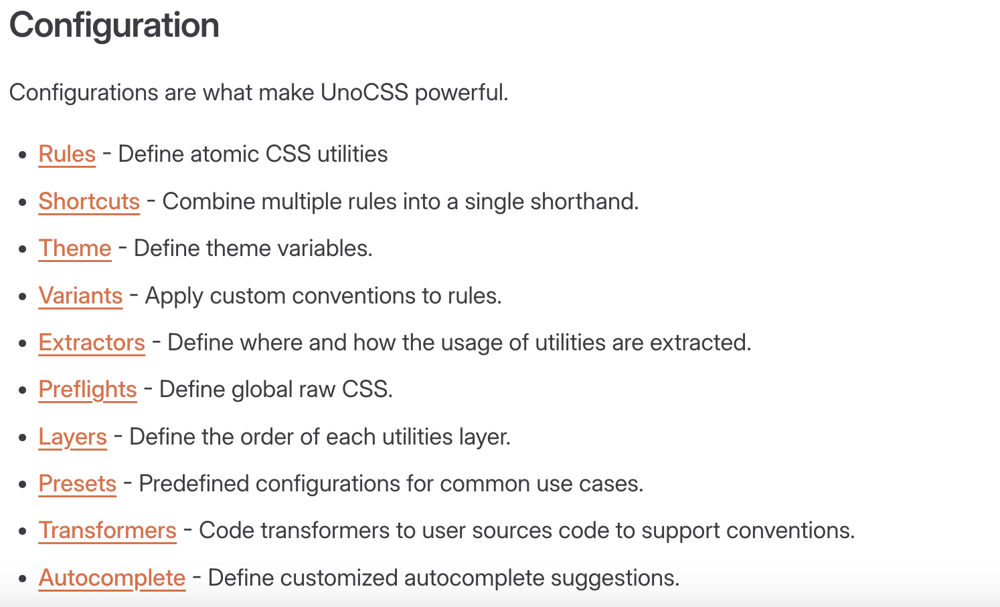

### unocss 的组成
1. rules（可以看作是一些自定义的 calss 配置

2. presets（本地自定义的 rules 配置；社区或者官方定义的 rules 配置

3. shortcuts（可以看作通过组合 rule or presets 得到的类似 Object 中键值对的自定义配置

4. 上述配置可参考
- https://unocss.dev/guide/config-file
- 

### unocss 单独文件配置
1. 建议使用 uno.config.js 或者 uno.config.ts 来创建一个单独的配置文件使用

2. 例子
```JavaScript
// uno.config.ts
import {
  defineConfig,
  presetAttributify,
  presetIcons,
  presetTypography,
  presetUno,
  presetWebFonts,
  transformerDirectives,
  transformerVariantGroup
} from 'unocss'

export default defineConfig({
  shortcuts: [
    // ...
  ],
  theme: {
    colors: {
      // ...
    }
  },
  presets: [
    presetUno(),
    presetAttributify(),
    presetIcons(),
    presetTypography(),
    presetWebFonts({
      fonts: {
        // ...
      },
    }),
  ],
  transformers: [
    transformerDirectives(),
    transformerVariantGroup(),
  ],
})
```

### unocss shortcuts
```JavaScript
// 静态配置
shortcuts: {
  // shortcuts to multiple utilities
  'btn': 'py-2 px-4 font-semibold rounded-lg shadow-md',
  'btn-green': 'text-white bg-green-500 hover:bg-green-700',
  // single utility alias
  'red': 'text-red-100',
}

// 动态配置
shortcuts: [
  // you could still have object style
  {
    btn: 'py-2 px-4 font-semibold rounded-lg shadow-md',
  },
  // dynamic shortcuts
  [/^btn-(.*)$/, ([, c]) => `bg-${c}-400 text-${c}-100 py-2 px-4 rounded-lg`],
]
```

### unocss theme
```JavaScript
// theme 配置
theme: {
  // ...
  colors: {
    'veryCool': '#0000ff', // class="text-very-cool"
    'brand': {
      'primary': 'hsl(var(--hue, 217) 78% 51%)', //class="bg-brand-primary"
    },
  },
}

// rules 中使用
rules: [
  [/^text-(.*)$/, ([, c], { theme }) => {
    if (theme.colors[c])
      return { color: theme.colors[c] }
  }],
]

// shortcus 中使用
shortcuts: [
  [/^badge-(.*)$/, ([, c], { theme }) => {
    if (Object.keys(theme.colors).includes(c))
      return `bg-${c}4:10 text-${c}5 rounded`
  }],
]
```

### unocss presets 的配置及使用
```JavaScript
// export
// my-preset.ts
import { Preset, definePreset } from 'unocss'

export default definePreset((options?: MyPresetOptions) => {
  return {
    name: 'my-preset',
    rules: [
      // ...
    ],
    variants: [
      // ...
    ],
    // it supports most of the configuration you could have in the root config
  }
})

// import
// uno.config.ts
import { defineConfig } from 'unocss'
import myPreset from './my-preset'

export default defineConfig({
  presets: [
    myPreset({ /* preset options */ }),
  ],
})
```

### @unocss/preset-uno 中常见 class 短语
1. 布局（Layout）
- flex - 应用 display: flex;
- inline-flex - 应用 display: inline-flex;
- block - 应用 display: block;
- inline-block - 应用 display: inline-block;
- grid - 应用 display: grid;
- hidden - 应用 display: none;

2. 尺寸（Sizing）
- w-{size} - 设置宽度，例如 w-10（宽度为 2.5rem），w-full（宽度为 100%）
- h-{size} - 设置高度，例如 h-10（高度为 2.5rem），h-full（高度为 100%）
- min-w-{size} - 设置最小宽度
- min-h-{size} - 设置最小高度
- max-w-{size} - 设置最大宽度
- max-h-{size} - 设置最大高度

3. 间距（Spacing）
- m-{size} - 设置外边距，例如 m-4（所有方向外边距 1rem）
- mt-{size} - 设置上外边距
- mb-{size} - 设置下外边距
- ml-{size} - 设置左外边距
- mr-{size} - 设置右外边距
- p-{size} - 设置内边距，例如 p-4（所有方向内边距 1rem）
- pt-{size} - 设置上内边距
- pb-{size} - 设置下内边距
- pl-{size} - 设置左内边距
- pr-{size} - 设置右内边距

4. 排版（Typography）
- text-{size} - 设置文字大小，例如 text-sm（字体大小为 0.875rem），text-lg（字体大小为 1.125rem）
- font-{weight} - 设置字体粗细，例如 font-bold（字体加粗），font-light（字体较细）
- leading-{size} - 设置行高，例如 leading-tight（行高为 1.25），leading-loose（行高为 1.75）
- tracking-{size} - 设置字间距，例如 tracking-tight（字间距 -0.05em），tracking-wide（字间距 0.1em）

5. 背景（Background）
- bg-{color} - 设置背景颜色，例如 bg-red-500（红色背景），bg-blue-500（蓝色背景）
- bg-opacity-{value} - 设置背景不透明度，例如 bg-opacity-50（背景不透明度 50%）

6. 边框（Border）
- border - 应用 border: 1px solid currentColor;
- border-{size} - 设置边框宽度，例如 border-2（边框宽度 2px）
- border-{color} - 设置边框颜色，例如 border-red-500（红色边框）
- rounded-{size} - 设置边框圆角，例如 rounded（边框圆角 0.25rem），rounded-full（边框圆角 9999px）

7. 阴影（Shadow）
- shadow - 应用默认阴影
- shadow-{size} - 设置阴影大小，例如 shadow-sm（小阴影），shadow-lg（大阴影）

8. 透明度（Opacity）
- opacity-{value} - 设置透明度，例如 opacity-50（透明度 50%），opacity-100（透明度 100%）
