### 事件处理、v-on、@click
1. 访问绑定的原生 DOM 事件
- <button @click="(event) => onClick(event)"></button>

2. 事件修饰符
- .stop（阻止事件冒泡
```VUE
<div @click="clearChange">
  // 触发两次 clear
  <el-button plain @click="clearChange">清空 1</el-button>
  // 触发一次 clear
  <el-button plain @click.stop="clearChange">清空 2</el-button>
</div>
```

- .prevent
- .once（只触发一次

### 事件绑定、v-bind、:
1. 绑定 class
- :class="{ firstClass: isFirstClass, secondClass: isSecondClass }"

- class 绑定 computed（可写相对复杂的逻辑
```JavaScript
:class="{ classObj }"

const classObj = computed(() => ({
  firstClass: isFirstClass,
  secondClass: isSecondClass,
}))
```

- array binding
:class="[activeClass, errorClass]"
:class="[ isActive ? activeClass : '', errorClass]"（三元
:class="[ { activeClass: isActive }, errorClass ]"（obj

2. 绑定 style
- css property 名推荐使用 camelCase，即 backgroundColor，fontSize
- <div :style="{ color: activeColor, fontSize: fontSize + 'px' }"></div>

### 列表渲染、v-for
1. 解构
```VUE
<!-- 有 index 索引时 -->
<li v-for="({ message }, index) in items">
  {{ message }} {{ index }}
</li>
```

2. v-if、v-for 作用于统一节点时，v-if 优先级更高

3. toReversed and toSorted
[3, 2, 1].toSorted()
[3, 2, 1].toReversed()
- 不会改变原有数据的值

### 双向绑定、v-model
1. v-model.trim

2. true-value、false-value 的设置
- 适用于 v-model 绑定的值在两个状态间选择的情况
```JavaScript
// checkbox
<input
  type="checkbox"
  v-model="toggle"
  true-value="yes"
  false-value="no" />

// radio（只存在两个可选的情况）
<input
  type="radio"
  v-model="selectedOption"
  :true-value="'option1'"
  :false-value="'option2'"
  name="option"
/>
```

3. 组件上的 v-model
```JavaScript
// 01 - v-model 上的参数
// 01 - App.vue
<script>
import MyComponent from './MyComponent.vue'

export default {
  components: { MyComponent },
  data() {
    return {
      // v-model 默认绑定的值（即在父组件默认设置的值双向绑定了子组件的 title 展示）
      bookTitle: 'v-model argument example'
    }
  }
}
</script>

<template>
  <h1>{{ bookTitle }}</h1>
  <MyComponent v-model:title="bookTitle" />
</template>

// 01 - MyComponent.vue
<script>
export default {
  props: ['title'],
  emits: ['update:title']
}
</script>

<template>
  // 子组件 emit update:title 来更新绑定的值（更新时父子组件对应的 title 会同步更新）
  <input
    type="text"
    :value="title"
    @input="$emit('update:title', $event.target.value)"
  />
</template>

// 02 - 多个 v-model 绑定
// 02 - 父组件
<UserName
  v-model:first-name="first"
  v-model:last-name="last"
/>

// 02 - 子组件
<script setup>
const firstName = defineModel('firstName')
const lastName = defineModel('lastName')
</script>

<template>
  // 子组件 firstName、lastName 的改变父子组件都会自动更新
  <input type="text" v-model="firstName" />
  <input type="text" v-model="lastName" />
</template>
```

4. v-model 的拆分
```JavaScript
<script setup>
const props = defineProps(['modelValue'])
const emit = defineEmits(['update:modelValue'])
</script>

<template>
  // 下述 emit 事件在父组件中不需要手动监听，会自动更新
  <input
    :value="props.modelValue"
    @input="emit('update:modelValue', $event.target.value)"
  />
</template>

// 01 - 父组件 v-model 绑定了 v-model:paramFirst 和 v-model:paramSecond
// 02 - 子组件可以自动更新 defineModel 的方式
// 03 - 子组件也可以通过 defineProps 的方式接收，然后通过 defineEmits 的方式触发 emit('update:paramFirst', '具体值 first') 和 ('update:paramSecond', '具体值 second') 的方式来同步更新
```

5. defineModel 的使用
```JavaScript
const title = defineModel('title', {
  required: true,
  default: 'yo',
  // 校验
  validator: value => typeof value === 'string' && value.length > 0,
  // 数据类型
  type: String,
});
```

6. v-model 的自定义修饰符
```JavaScript
// 父组件
<template>
  // capitalize 自定义修饰符
  <MyComponent v-model.capitalize="parentText" />
  <p>Parent Text: {{ parentText }}</p>
</template>

<script setup>
import { ref } from 'vue';
import MyComponent from './MyComponent.vue';

const parentText = ref('example');
</script>

// 子组件
<template>
  <div>
    <input type="text" v-model="modelValue" />
  </div>
</template>

<script setup>
import { ref, watch, defineProps, defineEmits } from 'vue';

// 定义接收的属性和事件
const props = defineProps(['modelValue']);
const emit = defineEmits(['update:modelValue']);

// 创建内部的 model 和修饰符
const model = ref(props.modelValue);

// 初始化时对传入的数据进行转换
if (modifiers.capitalize) {
  model.value = model.value.charAt(0).toUpperCase() + model.value.slice(1);
}

// 监听 model 的变化，并同步更新父组件的数据
watch(model, (newValue) => {
  emit('update:modelValue', newValue);
});

// 监听传入的 modelValue 的变化，并同步更新内部的 model
watch(() => props.modelValue, (newValue) => {
  model.value = newValue;
});
</script>

// modifiers 能拿到所有的自定义修饰符
<script setup>
const [model, modifiers] = defineModel({
  set(value) {
    if (modifiers.capitalize) {
      return value.charAt(0).toUpperCase() + value.slice(1)
    }
    return value
  }
})
</script>
<template>
  <input type="text" v-model="model" />
</template>
```

7. 多个 v-model 添加修饰符
```JavaScript
<UserName
  v-model:first-name.capitalize="first"
  v-model:last-name.uppercase="last"
/>

<script setup>
const [firstName, firstNameModifiers] = defineModel('firstName', {
  set(value) {
    return firstNameModifiers.capitalize
      ? value.charAt(0).toUpperCase() + value.slice(1)
      : value;
  }
});

const [lastName, lastNameModifiers] = defineModel('lastName', {
  set(value) {
    return lastNameModifiers.uppercase ? value.toUpperCase() : value;
  }
});
console.log(firstNameModifiers) //  { capitalize: true }
console.log(lastNameModifiers) // { uppercase: true }
</script>
```

### life cycle
- mounted / onMounted

### 侦听器、watch
1. 侦听对象
```JavaScript
const x = ref(0)
const y = ref(0)

// 单个 ref
watch(x, (newX) => {
  console.log(`x is ${newX}`)
})

// getter 函数
watch(
  () => x.value + y.value,
  (sum) => {
    console.log(`sum of x + y is: ${sum}`)
  }
)

// 多个来源组成的数组
watch([x, () => y.value], ([newX, newY]) => {
  console.log(`x is ${newX} and y is ${newY}`)
})
```

2. 侦听对象属性值（需用到 getter 函数
```JavaScript
const obj = reactive({ count: 0 })

watch(
  () => obj.count,
  (count) => {
    console.log('count', count)
  },
  // 深度
  { deep: true },
  // 立即监听一次
  { immediate: true },
  // 仅侦听一次
  { once: true }
)
```

3. immediate: true
- 官方文档：'watch 默认是懒执行的：仅当数据源变化时，才会执行回调。但在某些场景中，我们希望在创建侦听器时，立即执行一遍回调，设置 immediate 为 true 即可'

4. watch vs watchEffect
- 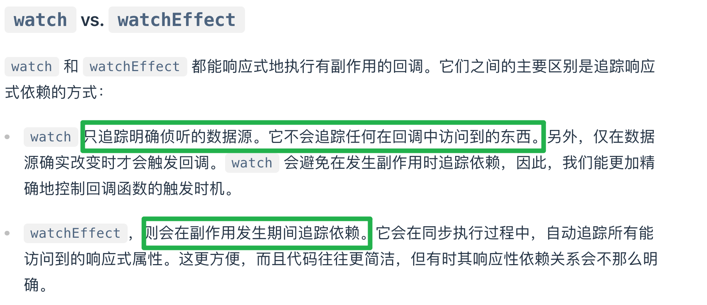

5. flush: 'post'
- 官方文档：'如果想在侦听器回调中能访问被 Vue 更新之后的所属组件的 DOM，你需要指明 flush: 'post' 选项'
- GPT：'通常，flush: 'post' 选项用于确保回调函数在 DOM 完成更新后才执行。这在需要确保回调函数中访问的是最新的 DOM 状态时非常有用。例如，当你需要在响应式数据变化后立即进行 DOM 操作或依赖最新的 DOM 状态时，可以使用 flush: 'post''
```JavaScript
watch(source, callback, {
  flush: 'post'
})

watchEffect(callback, {
  flush: 'post'
})
```

6. 同步监听器
- 官方文档：'你还可以创建一个同步触发的侦听器，它会在 Vue 进行任何更新之前触发'
- GPT：'当你需要立即响应数据变化，而不等待 DOM 更新'
```JavaScript
watch(source, callback, {
  flush: 'sync'
})

watchEffect(callback, {
  flush: 'sync'
})
```

7. 取消监听器
- 调用 watch、watchEffect 的返回值函数即可
```JavaScript
const unwatch = watchEffect(() => {})
// ...当该侦听器不再需要时
unwatch()
```

8. 异步监听器
- 官方文档：'注意，需要异步创建侦听器的情况很少，请尽可能选择同步创建。如果需要等待一些异步数据，你可以使用条件式的侦听逻辑'
```JavaScript
// 条件式的监听逻辑
// 需要异步请求得到的数据
const data = ref(null)

watchEffect(() => {
  if (data.value) {
    // 数据加载后执行某些操作...
  }
})
watch(
  () => data.value,
  () => {
    if (data.value) {
      ...
    }
  }
)
```


### 模板引用、ref
1. 组件挂载后才能访问到 ref 绑定的组件值，业务处理时需考虑为 null 的情况；watch 中也是

### defineProps and defineEmits
1. 两者均是在子组件中声明
```JavaScript
const props = defineProps({
  status: {
    // 类型
    type: String,
    type: [Number, String],
    // 必须
    required: true,
    // 默认值
    default: 'default',
    // type 为 Object 的默认值
    default: () => {
      return { }
    },
  }
})

// 父组件通过 @change、@delete 方式接收
const emits = defineEmits([ 'change', 'delete' ])
```

2. props
- 子组件命名使用 camelCase，父组件传入使用 kebab-case

- props 作为局部数据属性使用
```JavaScript
const props = defineProps(['initialCounter'])
// 初始化通过 props 赋值，不需要在 life cycle 中赋值了
// 适用于父组件传入的 props 子组件使用时不需要在生命周期中注册，直接将其作为参数设置给子组件的属性
const counter = ref(props.initialCounter)
```

- 会更改 props 的值（保留原始 props 不变，创建 computed 来实现符合我们要求的格式）
```JavaScript
const props = defineProps(['size'])
const normalizedSize = computed(() => props.size.trim().toLowerCase())
```

- 官方文档：'除 Boolean 外的未传递的可选 prop 将会有一个默认值 undefined；boolean 是 false'

```JavaScript
defineProps({
  propsA: {
    // 类型
    type: String,
    // 是否必须
    required: true;
    // 默认值
    default: 'success',
    // 校验函数
    validator: (value) => {
      return ['success', 'warning', 'danger'].includes(value)
    }
  }
})
```

3. emits
- 子组件触发使用 camcelCase，父组件接收使用 kebab-case

- emit('create', item1, item2, item3)

- emit 校验
```JavaScript
<script setup>
const emit = defineEmits({
  // 没有校验
  click: null,

  // 校验 submit 事件
  submit: ({ email, password }) => {
    if (email && password) {
      // 通过返回 boolean 值来判断是否合法，true 表示合法，false 反之
      return true
    } else {
      console.warn('Invalid submit event payload!')
      return false
    }
  }
})

function submitForm(email, password) {
  emit('submit', { email, password })
}
</script>
```

- emit 调用需在 emit 声明之后
```JavaScript
<script setup>
const emit = defineEmits(['inFocus', 'submit'])

function buttonClick() {
  emit('submit')
}
</script>
```

### 项目搭建
1. 文档入手
- https://cn.vuejs.org/guide/quick-start

2. 引入 sass、sass-loader
- npm install sass sass-loader --save-dev

3. 引入 elementPlus
- npm install element-plus --save-dev

### defineExpose
1. 父组件如何拿到子组件 expose 的数据
```JavaScript
<template>
  <div>
    <ChildComponent ref="childRef"></ChildComponent>
    <button @click="accessChildData">Access Child Data</button>
  </div>
</template>

<script setup>
import { ref } from 'vue';
import ChildComponent from './ChildComponent.vue';

const childRef = ref(null);

// 通过 ref 的方式
const accessChildData = () => {
  if (childRef.value) {
    console.log(childRef.value.a); // 1
    console.log(childRef.value.b.value); // 2
  }
};
</script>
```

2. defineExpose 写在哪里
```JavaScript
<template>
  <div>{{ b }}</div>
</template>

<script setup>
import { ref } from 'vue';

// 定义要暴露的数据
const a = 1;
const b = ref(2);

// 使用 defineExpose 暴露数据
// 写在所有需要暴露出去的变量、方法前
defineExpose({
  a,
  b
});
</script>
```

3. expose 变量、computed、function
```JavaScript
// 父组件
<template>
  <div>
    <ChildComponent ref="childRef"></ChildComponent>
    <button @click="callChildMethod">Call Child Method</button>
    <p>Computed Property from Child: {{ childComputed }}</p>
  </div>
</template>

<script setup>
import { ref, computed } from 'vue';
import ChildComponent from './ChildComponent.vue';

const childRef = ref(null);

const callChildMethod = () => {
  if (childRef.value) {
    childRef.value.childMethod();
  }
};

const childComputed = computed(() => {
  return childRef.value ? childRef.value.computedValue : '';
});
</script>

// 子组件
<template>
  <div>{{ b }}</div>
</template>

<script setup>
import { ref, computed } from 'vue';

const a = 1;
const b = ref(2);

const childMethod = () => {
  console.log('Child method called');
};

const computedValue = computed(() => {
  return `Computed: ${b.value}`;
});

defineExpose({
  a,
  b,
  childMethod,
  computedValue
});
</script>
```

4. defineExpose 适用于不需要触发事件就可以将内部属性（数据、方法等）暴露给外部适用的情况
```JavaScript
// 子组件暴露表单验证方法
// 父组件
<template>
  <div>
    <FormComponent ref="formRef"></FormComponent>
    <button @click="submitForm">Submit</button>
  </div>
</template>

<script setup>
import { ref } from 'vue';
import FormComponent from './FormComponent.vue';

const formRef = ref(null);

const submitForm = () => {
  if (formRef.value) {
    const isValid = formRef.value.validateForm();
    if (isValid) {
      console.log('Form is valid, submit the form');
    } else {
      console.log('Form is invalid, show errors');
    }
  }
};
</script>

// 子组件
<template>
  <form>
    <input v-model="formData.name" placeholder="Name">
    <input v-model="formData.email" placeholder="Email">
  </form>
</template>

<script setup>
import { ref } from 'vue';

const formData = ref({
  name: '',
  email: ''
});

const validateForm = () => {
  return formData.value.name && formData.value.email;
};

defineExpose({
  validateForm
});
</script>
```

5. expose 的好处
- GPT：'默认情况下，当通过 $parent、$root 或模板引用访问时，组件实例将向父组件暴露所有的实例属性。这可能不是我们希望看到的，因为组件很可能拥有一些应保持私有的内部状态或方法，以避免紧耦合（简单来说不想将子组件的所有东西都暴露出去，而只暴露我们允许的）'

### hooks 封装
1. useMouse hook 封装（最简单的情况这是
```JavaScript
// hook
import { onMounted, onUnmounted, ref } from 'vue'

export function useMouse() {
  const x = ref(0)
  const y = ref(0)

  // 节流函数
  function throttle(func, wait) {
    let timeout = null
    return function (...args) {
      if (!timeout) {
        timeout = setTimeout(() => {
          func.apply(this, args)
          timeout = null
        }, wait)
      }
    }
  }

  const updateMouse = (e) => {
    x.value = e.pageX
    y.value = e.pageY
  }

  // 使用节流函数包裹 updateMouse
  const throttledUpdateMouse = throttle(updateMouse, 100) // 100ms 的节流时间

  onMounted(() => {
    window.addEventListener('mousemove', throttledUpdateMouse)
  })
  onUnmounted(() => {
    window.removeEventListener('mousemove', throttledUpdateMouse)
  })

  return { x, y }
}

// 使用
import { useMouse } from '../hooks/useMouse.js'
const { x, y } = useMouse()

<div class="mouse">{{ x }} - {{ y }}</div>
```

### ref 相关
1. isRef
```JavaScript
const refOne = ref(1)
const notRefTwo = 2
const reactiveThree = reactive({ value: 3 })
console.log('1', isRef(refOne)) // true
console.log('2', isRef(notRefTwo)) // false
console.log('3', unref(refOne)) // 1
console.log('4', unref(notRefTwo)) // 2
console.log('5', isRef(reactiveThree)) // false
console.log('6', unref(reactiveThree)) // { value: 3 }

// isProxy：检查一个对象是否是由 reactive()、readonly()、shallowReactive() 或 shallowReadonly() 创建的代理
console.log('7', isProxy(refOne.value)) // false
console.log('8', isProxy(notRefTwo)) // false
console.log('9', isProxy(reactiveThree)) // true
```

2. unRef
```JavaScript
// 可以看作如下实现（兼容 ref 数据和不是 ref 的数据
val = isRef(val) ? val.value : val
```

3. toRefs
```JavaScript
function useFeatureX() {
  const state = reactive({
    foo: 1,
    bar: 2
  })

  // ...基于状态的操作逻辑

  // 在返回时都转为 ref
  return toRefs(state)
}

// 可以解构而不会失去响应性
// 不通过解构获取通过 . 操作符获取的话不会丢失响应式
const { foo, bar } = useFeatureX()
```

4. 其它响应式工具
- 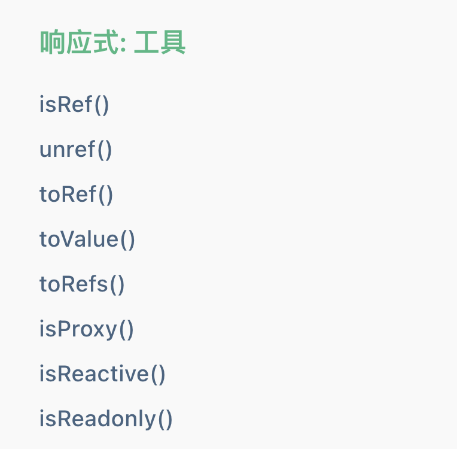

5.  为什么通过解构赋值获取响应式的数据会存在丢失响应式的情况？
- GPT：'在 Vue 3 中，reactive 创建的响应式对象是一个 Proxy 对象，它拦截对其属性的访问和修改，以实现响应式的效果。当你对 reactive 对象进行解构赋值时，实际上只是复制了这些属性的值，而不是保持对 Proxy 对象的引用。这样，解构后的值不再受到 Proxy 的拦截，自然就失去了响应式的能力'
- GPT：'无论是数组解构还是对象解构，在涉及 reactive 对象时都会丢失响应性。这是因为解构赋值的本质是将值从原对象中复制到新的变量中，而不是保留对原对象的引用'
```JavaScript
// 对象解构
import { reactive } from 'vue';
function useFeatureX() {
  const state = reactive({
    foo: 1,
    bar: 2
  });

  return state;
}
const state = useFeatureX();

const { foo, bar } = state;
console.log(foo); // 1
state.foo = 10;
console.log(foo); // 仍然是 1，不会响应变化

// 数组解构
import { reactive } from 'vue';
function useFeatureY() {
  const state = reactive([1, 2, 3]);

  return state;
}

const state = useFeatureY();
const [first, second, third] = state;
console.log(first); // 1
state[0] = 10;
console.log(first); // 仍然是 1，不会响应变化
```

6. 为什么要使用 ref
- 官方文档：'通过一个基于依赖追踪的响应式系统实现的。当一个组件首次渲染时，Vue 会追踪在渲染过程中使用的每一个 ref。然后，当一个 ref 被修改时，它会触发追踪它的组件的一次重新渲染'
- 官方文档：'在其内部，Vue 在它的 getter 中执行追踪，在它的 setter 中执行触发'
```JavaScript
// ref 可以看作是下述代码实现
// 伪代码，不是真正的实现
const myRef = {
  _value: 0,
  get value() {
    track()
    return this._value
  },
  set value(newValue) {
    this._value = newValue
    trigger()
  }
}
```

7. reactive
- 官方文档：'响应式对象是 JavaScript 代理（Proxy），其行为就和普通对象一样。不同的是，Vue 能够拦截对响应式对象所有属性的访问和修改，以便进行依赖追踪和触发更新'
```JavaScript
const raw = {}
const proxy = reactive(raw)

// 代理对象和原始对象不是全等的
console.log(proxy === raw) // false

// 在同一个对象上调用 reactive() 会返回相同的代理
console.log(reactive(raw) === proxy) // true
// 在一个代理上调用 reactive() 会返回它自己
console.log(reactive(proxy) === proxy) // true
```

8. ref 解包失败
```JavaScript
const count = ref(0)
const object = { id: ref(1) }

// 下述模版插值语法会解析失败，显示 [object Object]1
<div>{{ object.id + 1 }}</div>
// 这个不会解析失败，显示 2
<div>{{ object.id }}</div>
```

9. shallowRef 和 shallowReactive
- 官方文档：'Vue 确实也为此提供了一种解决方案，通过使用 shallowRef() 和 shallowReactive() 来绕开深度响应。浅层式 API 创建的状态只在其顶层是响应式的，对所有深层的对象不会做任何处理。这使得对深层级属性的访问变得更快，但代价是，我们现在必须将所有深层级对象视为不可变的，并且只能通过替换整个根状态来触发更新'

- shallowRef 触发响应式在于改变其顶层数据结构（即重置自身等操作）
```JavaScript
// 顶层数据结构是整个对象 { count: 1 }
const state = shallowRef({ count: 1 });

// 替换整个对象，触发响应
state.value = { count: 2 }; // 触发响应

// 修改对象内部的属性，不触发响应
state.value.count = 2; // 不触发响应
```

- shallowReactive 触发响应在于改变其顶层数据结构（自身）或者改变顶层数据结构包裹的东西
```JavaScript
const state = shallowReactive([
  { id: 1, value: 'a' },
  { id: 2, value: 'b' }
]);

// 改变顶层数据结构自身
// 替换整个数组，触发响应
state = [ { id: 3, value: 'c' } ]; // 触发响应

// 改变顶层数据结构包裹的东西
// 修改数组顶层元素，触发响应
state[0] = { id: 4, value: 'd' }; // 触发响应

// 修改数组顶层的属性，触发响应
state.length = 1; // 触发响应

// state[0].value 不是顶层了
// 修改数组内部对象的属性，不触发响应
state[0].value = 'e'; // 不触发响应

// 对数组进行 push 操作，触发响应
state.push({ id: 5, value: 'f' }); // 触发响应

// 对数组进行 pop 操作，触发响应
state.pop(); // 触发响应

// 对数组进行 splice 操作，触发响应
state.splice(1, 1); // 触发响应
```

10. reactive 的局限性
- 官方文档：'有限的值类型：它只能用于对象类型 (对象、数组和如 Map、Set 这样的集合类型)。它不能持有如 string、number 或 boolean 这样的原始类型；如果要应用于原始类型的话需要通过 {} 包一层'
- 官方文档：'对解构操作不友好：当我们将响应式对象的原始类型属性解构为本地变量时，或者将该属性传递给函数时，我们将丢失响应性连接'
```JavaScript
// 下述这种情况 ref 或者 reactive 定义都会导致解构出来的变量失去响应式
const state = reactive({ count: 0 })

// 当解构时，count 已经与 state.count 断开连接
let { count } = state
// 不会影响原始的 state
count++

// 该函数接收到的是一个普通的数字
// 并且无法追踪 state.count 的变化
// 我们必须传入整个对象以保持响应性
callSomeFunction(state.count)
```

### v-bind
1. 动态绑定多个值（绑定对象）
```JavaScript
const objectOfAttrs = {
  id: 'container',
  class: 'wrapper',
  style: 'background-color:green'
}

<div v-bind="objectOfAttrs"></div>
```

2. 完整的指令语法
- 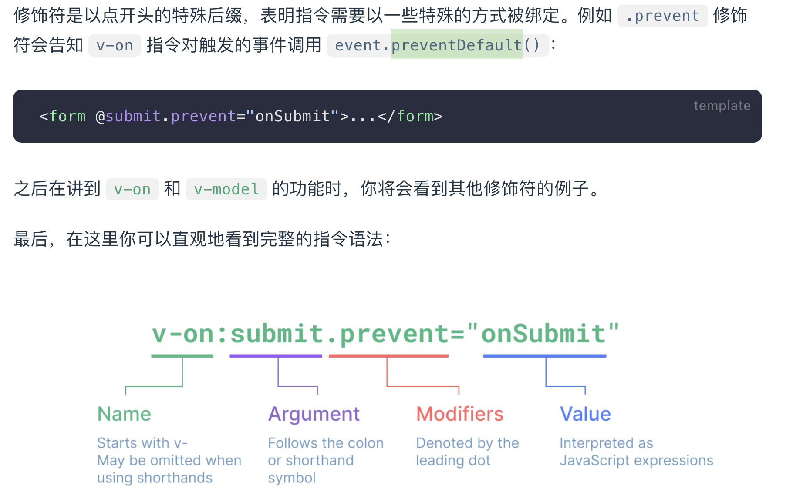

### 计算属性
1. 计算属性缓存 vs 方法
- 官方文档：'不同之处在于计算属性值会基于其响应式依赖被缓存，一个计算属性仅会在其响应式依赖更新时（且被调用时）才重新计算；方法调用总是会在重渲染发生时再次执行函数'

2. 可写计算属性
```JavaScript
<script setup>
import { ref, computed } from 'vue'

const firstName = ref('John')
const lastName = ref('Doe')

const fullName = computed({
  // getter
  get() {
    return firstName.value + ' ' + lastName.value
  },
  // setter
  set(newValue) {
    // 注意：我们这里使用的是解构赋值语法
    // 根据传入的值解构
    [firstName.value, lastName.value] = newValue.split(' ')
  }
})
</script>

// @click 会走 fullName 的 set 方法
<div class="counter" @click="fullName = `${Date.now()} ${Date.now()}`">
  {{ fullName }}
</div>
```

### 类与样式绑定
1. 绑定 computed
```JavaScript
const isActive = ref(true)
const error = ref(null)

const classObject = computed(() => ({
  active: isActive.value && !error.value,
  'text-danger': error.value && error.value.type === 'fatal'
}))

<div :class="classObject"></div>
```

2. 绑定数组
```JavaScript
const activeClass = ref('active')
const errorClass = ref('text-danger')

<div :class="[activeClass, errorClass]"></div>
// 渲染结果
<div class="active text-danger"></div>

// 数组中嵌套对象，下述两种写法相同，第一种个人感觉会好一些
<div :class="[{ activeClass: isActive }, errorClass]"></div>
<div :class="{ activeClass: isActive, errorClass: true }"></div>
```

3. 组件绑定 class 且组件存在多个根节点时需指定绑定的根节点
```JavaScript
// MyComponent 模板使用 $attrs 时，指定 p 标签对绑定 class
<p :class="$attrs.class">Hi!</p>
<span>This is a child component</span>

<MyComponent class="baz" />

// 下述为实际渲染结果
<p class="baz">Hi!</p>
<span>This is a child component</span>
```

### 条件渲染
1. v-if 和 v-show
- 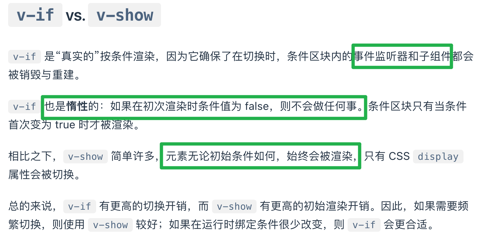

### 列表渲染
1. v-for 添加 key 的作用
- 官方文档：'以便它可以跟踪每个节点的标识，从而重用和重新排序现有的元素，你需要为每个元素对应的块提供一个唯一的 key attribute'

2. v-for 遍历 Array 和 Object
```JavaScript
<ul>
  <li v-for="(value, key, index) in myObject" :key="value">
    {{ key }} - {{ value }} - {{ index }}
  </li>
</ul>
<hr />
<ul>
  <li v-for="({ key, value }, index) in list" :key="key">
    {{ key }} - {{ value }} - {{ index }}
  </li>
</ul>

const list = reactive([
  { key: 1, value: '111' },
  { key: 2, value: '222' },
  { key: 3, value: '333' },
])
const myObject = reactive({
  title: 'How to do lists in Vue',
  author: 'Jane Doe',
  publishedAt: '2016-04-10',
})
```

3. 数组变化方法，如 v-for 绑定的是 Array 的话会有影响
- pop、push、shift、unshift、sort、reverse、splice
- 计算属性或其他引用原始数据的时候不应该改变原始数组，简单的数据可以通过 ... 拷贝一份
```JavaScript
return numbers.reverse() // 不推荐
return [...numbers].reverse() // 推荐
```

### 事件处理
1. 在内联事件中处理器中访问原生 DOM 事件
```JavaScript
// 使用特殊的 $event 变量
<button @click="warn('Form cannot be submitted yet.', $event)">
  Submit
</button>

// 使用内联箭头函数
<button @click="(event) => warn('Form cannot be submitted yet.', event)">
  Submit
</button>

function warn(message, event) {
  // 这里可以访问原生事件
  if (event) {
    event.preventDefault()
  }
  alert(message)
}
```

### 模版引用
1. 可以通过 DOM 上绑定的 ref 获取到 DOM 的一些属性、方法或者对 DOM 进行一些操作
- 官方文档：'注意，你只可以在组件挂载后才能访问模板引用（即 onMounted 生命周期中访问或者在 onBeforeMount 中通过 nextTick 来访问）'

2. v-for 上的模版引用
- 官方文档：'当在 v-for 中使用模板引用时，对应的 ref 中包含的值是一个数组，它将在元素被挂载后包含对应整个列表的所有元素；ref 数组并不保证与源数组相同的顺序；需要注意 v-for 渲染的项有没有通过 v-if 或者 v-show 隐藏的情况'

### 组件注册
1. 全局注册
- 全局注册的组件不需要在具体业务中引用
- 全局注册的问题
  - 官方文档：'全局注册，但并没有被使用的组件无法在生产打包时被自动移除 (也叫“tree-shaking”)。如果你全局注册了一个组件，即使它并没有被实际使用，它仍然会出现在打包后的 JS 文件中'
  - 官方文档：'全局注册在大型项目中使项目的依赖关系变得不那么明确。在父组件中使用子组件时，不太容易定位子组件的实现。和使用过多的全局变量一样，这可能会影响应用长期的可维护性'
  - 与上述相反局部注册的优点就是 tree-shaking 更加友好，依赖关系更加明确
```JavaScript
// 01 - 直接写 template 模版
import { createApp } from 'vue'
const app = createApp({})
app.component(
  // 注册的名字
  'MyComponent',
  // 组件的实现
  {
    /* ... */
  }
)

// 02 - import 导入的方式注册
import MyComponent from './App.vue'
app.component('MyComponent', MyComponent)

// 03 - 链式注册
app
  .component('ComponentA', ComponentA)
  .component('ComponentB', ComponentB)
  .component('ComponentC', ComponentC)
```

2. 局部注册
```JavaScript
// 01 - setup 的方式
<script setup>
import ComponentA from './ComponentA.vue'
</script>

<template>
  <ComponentA />
</template>

// 02 - setup return 的方式，需要手动注册
import ComponentA from './ComponentA.js'
export default {
  components: {
    ComponentA
  },
  setup() {
    // ...
  }
}
```

### props
1. 命名规范
```JavaScript
// 父传子使用 kebab-case
<MyComponent greeting-message="hello" />

// 子注册、使用 camelCase
defineProps({
  greetingMessage: String
})
<span>{{ greetingMessage }}</span>
```

### 异步组件
1. 异步组件的注册
```JavaScript
// 01 - 全局注册
app.component('MyComponent', defineAsyncComponent(() =>
  import('./components/MyComponent.vue')
))

// 02 - 局部注册
<script setup>
import { defineAsyncComponent } from 'vue'
// 官方文档：'AdminPage 是一个外层包装过的组件，仅在页面需要它渲染时才会调用加载内部实际组件的函数。它会将接收到的 props 和插槽传给内部组件，所以你可以使用这个异步的包装组件无缝地替换原始组件，同时实现延迟加载'
const AdminPage = defineAsyncComponent(() =>
  import('./components/AdminPageComponent.vue')
)
</script>
<template>
  <AdminPage />
</template>
```

2. 错误处理
```JavaScript
const AsyncComp = defineAsyncComponent({
  // 加载函数
  loader: () => import('./Foo.vue'),

  // 加载异步组件时使用的组件
  loadingComponent: LoadingComponent,
  // 展示加载组件前的延迟时间，默认为 200ms
  delay: 200,

  // 加载失败后展示的组件
  errorComponent: ErrorComponent,
  // 如果提供了一个 timeout 时间限制，并超时了
  // 也会显示这里配置的报错组件，默认值是：Infinity
  timeout: 3000
})
```

### 组合式函数
1. 不同 hooks 之间的组合
```JavaScript
// event.js
import { onMounted, onUnmounted } from 'vue'
export function useEventListener(target, event, callback) {
  // 如果你想的话，
  // 也可以用字符串形式的 CSS 选择器来寻找目标 DOM 元素
  onMounted(() => target.addEventListener(event, callback))
  onUnmounted(() => target.removeEventListener(event, callback))
}

// mouse.js
import { ref } from 'vue'
import { useEventListener } from './event'
export function useMouse() {
  const x = ref(0)
  const y = ref(0)
  useEventListener(window, 'mousemove', (event) => {
    x.value = event.pageX
    y.value = event.pageY
  })
  return { x, y }
}
```

2. 响应式 hook
```JavaScript
// fetch.js
import { ref } from 'vue'
export function useFetch(url) {
  const data = ref(null)
  const error = ref(null)

  fetch(url)
    .then((res) => res.json())
    .then((json) => (data.value = json))
    .catch((err) => (error.value = err))

  return { data, error }
}

const url = ref('/initial-url')
const { data, error } = useFetch(url)
// 这将会重新触发 fetch
url.value = '/new-url'
```

3. option api 中使用 hook
```JavaScript
import { useMouse } from './mouse.js'
import { useFetch } from './fetch.js'

export default {
  setup() {
    const { x, y } = useMouse()
    const { data, error } = useFetch('...')
    return { x, y, data, error }
  },
  mounted() {
    // setup() 暴露的属性可以在通过 `this` 访问到
    console.log(this.x)
  }
  // ...其他选项
}
```

### 内置组件 - Transition
1. 官方文档：'<Transition> 仅支持单个元素或组件作为其插槽内容。如果内容是一个组件，这个组件必须仅有一个根元素'

2. 为过渡效果命名
```JavaScript
<Transition name="fade">
  ...
</Transition>

// fade 开头
.fade-enter-active,
.fade-leave-active {
  transition: opacity 0.5s ease;
}
.fade-enter-from,
.fade-leave-to {
  opacity: 0;
}
```

3. transform 和 opacity 的好处
- 官方文档：'他们在动画过程中不会影响到 DOM 结构，因此不会每一帧都触发昂贵的 CSS 布局重新计算'
- 官方文档：'大多数的现代浏览器都可以在执行 transform 动画时利用 GPU 进行硬件加速'
- 官方文档：'相比之下，像 height 或者 margin 这样的属性会触发 CSS 布局变动，因此执行它们的动画效果更昂贵，需要谨慎使用'

4. 初次渲染时添加过渡效果
```JavaScript
// 添加 appear 属性
<Transition appear>
  ...
</Transition>
```

5. 组件间的过渡
```JavaScript
// mode 设置为 out-in 可以理解为过渡效果为原有的先 out（消失）新加的在 in（添加）
<Transition name="fade" mode="out-in">
  <component :is="activeComponent"></component>
</Transition>
```

6. 计数器自动增加过渡效果
```JavaScript
<script setup>
import { ref } from 'vue';

const count = ref(0);

// 每 1000ms 变化一次
setInterval(() => {
  count.value++;
}, 1000);
</script>

<template>
  <div class="wrapper">
  // out-in：先 out 在 in，默认是 out、in 效果同时触发
  <Transition mode="out-in">
    // 为需要应用过渡效果的 DOM 绑定 key，当 key 变化时会自动触发过渡效果
    <span :key="count">{{ count }}</span>
  </Transition>
  </div>
</template>

<style scoped>
span{
  font-size: 4rem;
}
.wrapper{
  position:relative;
}

.v-enter-active,
.v-leave-active {
  transition: opacity 0.5s ease;
  position: absolute;
}

.v-enter-from,
.v-leave-to {
  opacity: 0;
}
</style>
```

7. 什么条件下会触发过渡效果
- 官方文档：'v-if、v-show、Component 上绑定的 is 改变时、DOM 元素绑定的 key 变化时'

### 内置组件 - TransitionGroup
1. 官方文档：'<TransitionGroup> 是一个内置组件，用于对 v-for 列表中的元素或组件的插入、移除和顺序改变添加动画效果'

2. 和 Transition 的区别
- 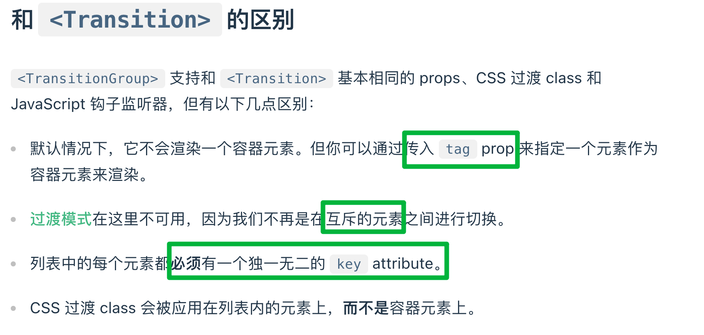

### 内置组件 - KeepAlive
1. 最大缓存组件数
```JavaScript
// 设置 max
<KeepAlive :max="10">
  <component :is="activeComponent" />
</KeepAlive>
```

2. 缓存实例的生命周期
- 官方文档：'当一个组件实例从 DOM 上移除但因为被 <KeepAlive> 缓存而仍作为组件树的一部分时，它将变为不活跃状态而不是被卸载。当一个组件实例作为缓存树的一部分插入到 DOM 中时，它将重新被激活；可通过 onActivated 和 onDeactivated 这两个生命周期来触发一些副作用'
- 官方文档：'onActivated 在组件挂载时也会调用，并且 onDeactivated 在组件卸载时也会调用'
```JavaScript
// 注意下述两者生命周期钩子的触发时机
<script setup>
import { onActivated, onDeactivated } from 'vue'

onActivated(() => {
  // 调用时机为首次挂载
  // 以及每次从缓存中被重新插入时
})

onDeactivated(() => {
  // 在从 DOM 上移除、进入缓存
  // 以及组件卸载时调用
})
</script>
```

3. exclude、include 显性指定哪些组件该被缓存或者不该被缓存
- 取值为数组、逗号分开的字符串、正则表达式
```JavaScript
<template>
  <div>
    <button @click="currentComponent = 'ComponentA'">Show Component A</button>
    <button @click="currentComponent = 'ComponentB'">Show Component B</button>
    <button @click="currentComponent = 'ComponentC'">Show Component C</button>
    <keep-alive :exclude="['ComponentC']">
    {/* <keep-alive :include="['ComponentC']"> */}
      <component :is="currentComponent"></component>
    </keep-alive>
  </div>
</template>

<script>
import ComponentA from './ComponentA.vue';
import ComponentB from './ComponentB.vue';
import ComponentC from './ComponentC.vue';

export default {
  components: {
    ComponentA,
    ComponentB,
    ComponentC
  },
  data() {
    return {
      currentComponent: 'ComponentA'
    };
  }
};
</script>
```

### 内置组件 - teleport
1. teleport 类似于 elementUI 中的 el-dialog 组件
- 官方文档：'<Teleport> 接收一个 to prop 来指定传送的目标。to 的值可以是一个 CSS 选择器字符串，也可以是一个 DOM 元素对象。这段代码的作用就是告诉 Vue“把以下模板片段传送到 body 标签下”'
- 注意 to 的赋值使用
```JavaScript
<button @click="open = true">Open Modal</button>

<Teleport to="body">
  // 通过 Teleport 将需要应用的 DOM 包裹，不需要用户自己考虑 DOM 的位置、z-index 这种
  <div v-if="open" class="modal">
    <p>Hello from the modal!</p>
    <button @click="open = false">Close</button>
  </div>
</Teleport>
```

### 内置组件 - Suspense（实验性阶段）
1. async setup
```JavaScript
// 01 - setup 手动 return 的方式
export default {
  // setup 函数可以是异步的
  async setup() {
    const res = await fetch(...)
    const posts = await res.json()
    return {
      posts
    }
  }
}

// 02 - setup 语法糖的方式
<script setup>
const res = await fetch(...)
const posts = await res.json()
</script>

<template>
  {{ posts }}
</template>
```

2. 自带的插槽
- 官方文档：'<Suspense> 组件有两个插槽：#default 和 #fallback。两个插槽都只允许一个直接子节点。在可能的时候都将显示默认槽中的节点。否则将显示后备槽中的节点'

### 单文件组件
1. 为什么要使用 sfc
- 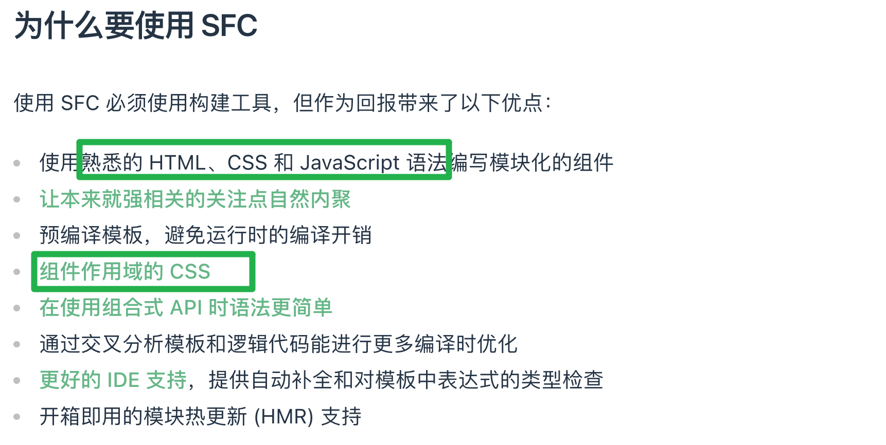

2. vue3 props
```JavaScript
const props = defineProps({
  status: {
    // 类型
    type: String,
    // 必须
    required: true,
    // 默认值
    default: 'default'
  }
})
```

3. sfc 中可同时包含非作用域样式和作用域样式
<style>
/* 全局样式 */
</style>

<style scoped>
/* 局部样式 */
</style>

### 状态管理
1. 用响应式 API 做简单状态管理
```JavaScript
// store.js
import { reactive } from 'vue'
// 导出全局 store
export const store = reactive({
  count: 0,
  // 状态改变的方法也全局导出
  increment() {
    this.count++
  }
})

// ComponentA.vue
<script setup>
import { store } from './store.js'
</script>
<template>From A: {{ store.count }}</template>

// ComponentB.vue
<script setup>
import { store } from './store.js'
</script>
<template @click="store.increment()">From B: {{ store.count }}</template>
```

2. vue 中现代状态管理一般用 pinia 来实现

### 服务端渲染 ssr
1. 什么是服务端渲染
- 官方文档：'Vue.js 是一个用于构建客户端应用的框架。默认情况下，Vue 组件的职责是在浏览器中生成和操作 DOM。然而，Vue 也支持将组件在服务端直接渲染成 HTML 字符串，作为服务端响应返回给浏览器，最后在浏览器端将静态的 HTML“激活”(hydrate) 为能够交互的客户端应用'

2. 为什么要用 ssr 以及需要考虑的地方
- 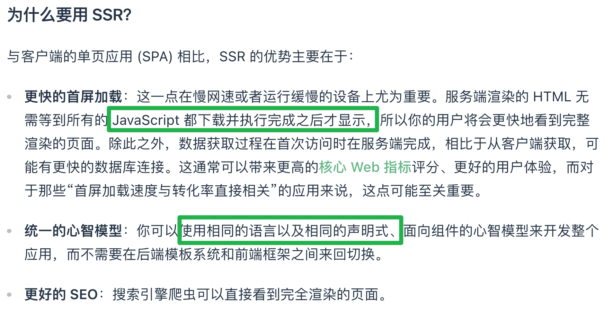
- 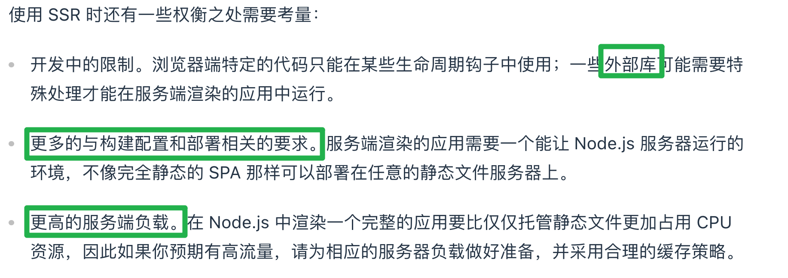

### 最佳实践 - 性能优化
1. 与 web 应用性能相关的两个方面
- 官方文档：'页面加载性能：首次访问时，应用展示出内容与达到可交互状态的速度。这通常会用 Google 所定义的一系列 Web 指标 (Web Vitals) 来进行衡量，如最大内容绘制 (Largest Contentful Paint，缩写为 LCP) 和首次输入延迟 (First Input Delay，缩写为 FID)'
- 官方文档：'更新性能：应用响应用户输入更新的速度。比如当用户在搜索框中输入时结果列表的更新速度，或者用户在一个单页面应用 (SPA) 中点击链接跳转页面时的切换速度'

2. 如何减小打包产物体积
- 包体积与 tree-shaking 优化
- 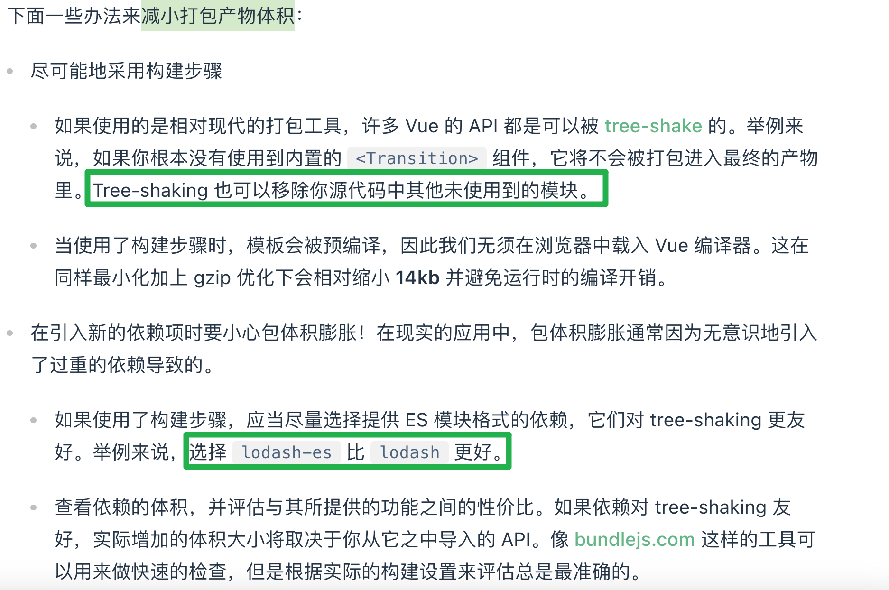

3. 代码分割
- 官方文档：'代码分割是指构建工具将构建后的 JavaScript 包拆分为多个较小的，可以按需或并行加载的文件。通过适当的代码分割，页面加载时需要的功能可以立即下载，而额外的块只在需要时才加载，从而提高性能'
- 将包拆分为较小的、按需引入的、并行加载的文件

4. 更新优化
```JavaScript
// props 稳定性的优化
<ListItem
  v-for="item in list"
  :id="item.id"
  :active-id="activeId" />

// 只有 item.id === activeId 时对应项才会更新
<ListItem
  v-for="item in list"
  :id="item.id"
  :active="item.id === activeId" />

// 计算属性的稳定性
const count = ref(0)
const isEven = computed(() => count.value % 2 === 0)
watchEffect(() => console.log(isEven.value)) // true
// 这将不会触发新的输出，因为计算属性的值依然为 `true`
count.value = 2
count.value = 4

// 计算属性需要返回对象的情况，因为对象是引用类型所以在实际使用值 isEven 没变化的时候可以返回 oldValue 即旧对象
const computedObj = computed((oldValue) => {
  const newValue = {
    isEven: count.value % 2 === 0
  }
  if (oldValue && oldValue.isEven === newValue.isEven) {
    return oldValue
  }
  return newValue
})
```

5. 大型虚拟列表
- 可以通过虚拟滚动来优化，如开源库：https://github.com/Akryum/vue-virtual-scroller

### 最佳实践 - 无障碍访问
1. 什么是无障碍访问
- 官方文档：'Web 无障碍访问 (也称为 a11y) 是指创建可供任何人使用的网站的做法——无论是身患某种障碍、通过慢速的网络连接访问、使用老旧或损坏的硬件，还是仅处于某种不方便的环境。例如，在视频中添加字幕可以帮助失聪、有听力障碍或身处嘈杂环境而听不到手机的用户。同样地，确保文字样式没有处于太低的对比度，可以对低视力用户和在明亮的强光下使用手机的用户都有所帮助'

2. 按级别顺序嵌套标题：<h1> - <h6>
```JavaScript
<main role="main" aria-labelledby="main-title">
  <h1 id="main-title">Main title</h1>
  <section aria-labelledby="section-title-1">
    <h2 id="section-title-1"> Section Title </h2>
    <h3>Section Subtitle</h3>
    <!-- 内容 -->
  </section>
  <section aria-labelledby="section-title-2">
    <h2 id="section-title-2"> Section Title </h2>
    <h3>Section Subtitle</h3>
    <!-- 内容 -->
    <h3>Section Subtitle</h3>
    <!-- 内容 -->
  </section>
</main>
```

### ts 和组合式 api
1. lang='ts'
```TypeScript
// 内置 type
<script setup lang="ts">
interface Props {
  foo: string
  bar?: number
}

const props = defineProps<Props>()
</script>

// import type
<script setup lang="ts">
import type { Props } from './foo'

const props = defineProps<Props>()
</script>
```

2. props 解构默认值
```TypeScript
export interface Props {
  msg?: string
  labels?: string[]
}

// 通过 withDefaults 可以为 props 指定类型的同时赋予默认值
const props = withDefaults(defineProps<Props>(), {
  // 下述默认值中可以只指定 msg 或者 labels
  msg: 'hello',
  labels: () => ['one', 'two']
})
```

3. 为 ref 标注类型
```TypeScript
import { ref } from 'vue'
// import Ref type
import type { Ref } from 'vue'
const year: Ref<string | number> = ref('2020')
year.value = 2020 // 成功！
```

4. 为 reactive 标注类型
```TypeScript
import { reactive } from 'vue'

interface Book {
  title: string
  year?: number
}

const book: Book = reactive({ title: 'Vue 3 指引' })
```

5. 为 computed 标注类型
```TypeScript
const double = computed<number>(() => {
  // 若返回值不是 number 类型则会报错
})
```

6. 为事件处理函数标注类型
```TypeScript
function handleChange(event: Event) {
  console.log((event.target as HTMLInputElement).value)
}
```

7. 为 provide、inject 标注类型
```TypeScript
import { provide, inject } from 'vue'
import type { InjectionKey } from 'vue'

const key = Symbol() as InjectionKey<string>

provide(key, 'foo') // 若提供的是非字符串值会导致错误

// 显性声明类型为 string
const foo = inject<string>('foo') // 类型：string | undefined
```

8. 为模版引用标注类型
```TypeScript
<script setup lang="ts">
import { ref, onMounted } from 'vue'

// type：HTMLInputElement | null
// 默认是 null
const el = ref<HTMLInputElement | null>(null)

onMounted(() => {
  el.value?.focus()
})
</script>

<template>
  <input ref="el" />
</template>
```

9. 为组件模板引用标注类型
```TypeScript
// 子组件：MyModal.vue
<script setup lang="ts">
import { ref } from 'vue'

const isContentShown = ref(false)
const open = () => (isContentShown.value = true)

defineExpose({
  open
})
</script>

// 父组件 App.vue
<script setup lang="ts">
import MyModal from './MyModal.vue'

// 对子组件 ref 标注类型
const modal = ref<InstanceType<typeof MyModal> | null>(null)

const openModal = () => {
  // 利用可选链防止出错
  modal.value?.open()
}
</script>
```

### 进阶主题 - 组合式 api（composition api）
1. 为什么要有组合式 api
- 官方文档：'更好的逻辑复用通过 hooks 等方式；如开源库 vueuse（https://vueuse.org/）'
- 官方文档：'更灵活的代码组织（通过按需引入的方式）'
- 官方文档：'更好的类型推导（对 ts 的支持程度更好）'

### 进阶主题 - 深入响应式系统
1. ref 和 reactive 的简单实现
- 官网文档可以多看看：https://cn.vuejs.org/guide/extras/reactivity-in-depth.html
- ref 是通过 getter、setter 实现的；reactive 是通过 proxy 来实现的
```JavaScript
// track 函数用于追踪依赖
// 01 - 当在 reactive 或 ref 对象上访问某个属性时（即调用 get 时），会调用 track 函数。
// 02 - track 函数记录当前的依赖关系，即哪个对象的哪个属性被哪个副作用（比如计算属性或渲染函数）使用。这是为了在属性变化时能通知到正确的副作用

// trigger 函数用于通知变更
// 01 - 当在 reactive 或 ref 对象上设置某个属性时（即调用 set 时），会调用 trigger 函数。
// 02 - trigger 函数通知所有依赖于这个属性的副作用，让这些副作用重新运行。这是为了确保数据变化时界面或其他依赖数据的地方能够及时更新

function reactive(obj) {
  return new Proxy(obj, {
    get(target, key) {
      track(target, key)
      return target[key]
    },
    set(target, key, value) {
      target[key] = value
      trigger(target, key)
    }
  })
}

function ref(value) {
  const refObject = {
    get value() {
      track(refObject, 'value')
      return value
    },
    set value(newValue) {
      value = newValue
      trigger(refObject, 'value')
    }
  }
  return refObject
}
```

2. getter、setter 和 proxy 的区别
- 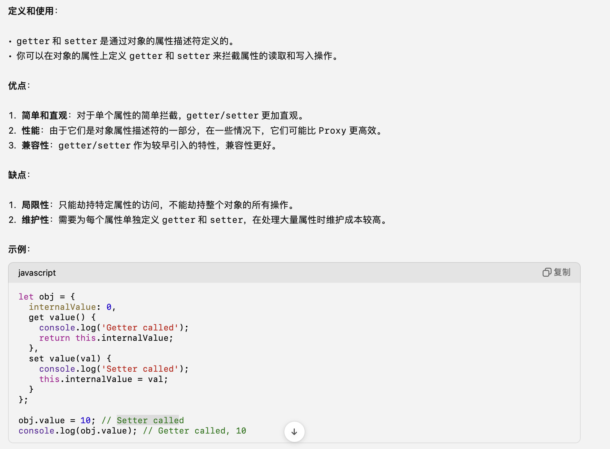
- 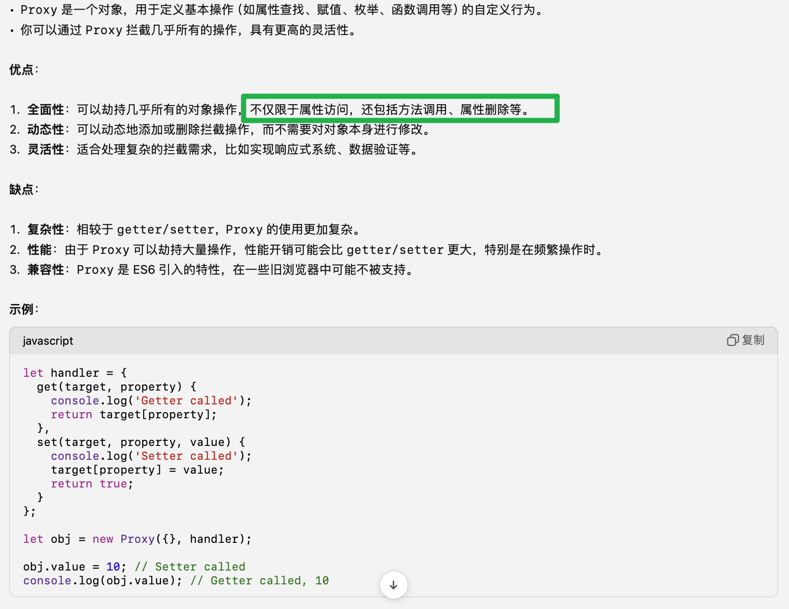

3. proxy 的更多功能
```JavaScript
// 01 - 拦截属性删除操作
const handler = {
  deleteProperty(target, prop) {
    console.log(`Property ${prop} deleted`);
    return delete target[prop];
  }
};

const obj = new Proxy({}, handler);

obj.a = 10;
delete obj.a; // Property a deleted

// 02 - 拦截方法调用
const handler = {
  apply(target, thisArg, argumentsList) {
    console.log(`Called with arguments: ${argumentsList}`);
    return target(...argumentsList);
  }
};

const sum = new Proxy(function(a, b) {
  return a + b;
}, handler);

console.log(sum(1, 2)); // Called with arguments: 1,2
                        // 3

// 03 - 拦截属性定义操作
const handler = {
  defineProperty(target, prop, descriptor) {
    console.log(`Defining property ${prop}`);
    return Reflect.defineProperty(target, prop, descriptor);
  }
};

const obj = new Proxy({}, handler);

Object.defineProperty(obj, 'a', {
  value: 10,
  writable: true
}); // Defining property a

// 04 - 拦截对象的原型操作
const handler = {
  getPrototypeOf(target) {
    console.log('Getting prototype');
    return Object.getPrototypeOf(target);
  }
};

const obj = new Proxy({}, handler);

Object.getPrototypeOf(obj); // Getting prototype
```

4. 计算属性调试
- 官方文档：'onTrack 将在响应属性或引用作为依赖项被跟踪时被调用'
- 官方文档：'onTrigger 将在侦听器回调被依赖项的变更触发时被调用'
```JavaScript
let count = ref(0)
const doubleCount = computed(() => count.value * 2, {
  // count、doubleCount 访问时触发
  onTrack(e) {
    console.log('1')
    console.log(e)
  },
  // count 改变时触发
  onTrigger(e) {
    console.log('2')
    console.log(e)
  }
})
const onCountClick = (event) => {
  count.value++
}

onMounted(() => {
  console.log('doubleCount', doubleCount.value)
})
```

### 进阶主题 - 渲染机制
1. 提升虚拟 DOM 性能的方法之一静态提升
- 官方文档：'静态提升：foo 和 bar 这两个 div 是完全静态的，没有必要在重新渲染时再次创建和比对它们。Vue 编译器自动地会提升这部分 vnode 创建函数到这个模板的渲染函数之外，并在每次渲染时都使用这份相同的 vnode，渲染器知道新旧 vnode 在这部分是完全相同的，所以会完全跳过对它们的差异比对'
```JavaScript
<div>
  // foo、bar 在 diff 算法时其实没有被比较
  <div>foo</div> <!-- 需提升 -->
  <div>bar</div> <!-- 需提升 -->
  <div>{{ dynamic }}</div>
</div>
```

### 进阶主题 - 渲染函数和 jsx
1. v-if 通过渲染函数和 jsx 实现
```JavaScript
// 模版语法
<div>
  <div v-if="ok">yes</div>
  <span v-else>no</span>
</div>

// 渲染函数
h('div', [ok.value ? h('div', 'yes') : h('span', 'no')])

// jsx
<div>{ok.value ? <div>yes</div> : <span>no</span>}</div>
```

2. v-for...
```JavaScript
// 模版语法
<ul>
  <li v-for="{ id, text } in items" :key="id">
    {{ text }}
  </li>
</ul>

// 渲染函数
h(
  'ul',
  // assuming `items` is a ref with array value
  items.value.map(({ id, text }) => {
    return h('li', { key: id }, text)
  })
)

// jsx
<ul>
  {items.value.map(({ id, text }) => {
    return <li key={id}>{text}</li>
  })}
</ul>
```

### 进阶主题 - 动画技巧
1. 基于 css 的动画（transform、animation、keyframes）
```JavaScript
// js 逻辑
const disabled = ref(false)

function warnDisabled() {
  disabled.value = true
  setTimeout(() => {
    disabled.value = false
  }, 1500)
}

// dom
// 其实也可以理解为基于状态的动画，disabled 状态变化时对应动画发生变化
<div :class="{ shake: disabled }">
  <button @click="warnDisabled">Click me</button>
  <span v-if="disabled">This feature is disabled!</span>
</div>

// css
.shake {
  animation: shake 0.82s cubic-bezier(0.36, 0.07, 0.19, 0.97) both;
  transform: translate3d(0, 0, 0);
}
@keyframes shake {
  10%,
  90% {
    transform: translate3d(-1px, 0, 0);
  }
  20%,
  80% {
    transform: translate3d(2px, 0, 0);
  }
  30%,
  50%,
  70% {
    transform: translate3d(-4px, 0, 0);
  }
  40%,
  60% {
    transform: translate3d(4px, 0, 0);
  }
}
```

2. 基于监听器的动画
```JavaScript
import { ref, reactive, watch } from 'vue'
import gsap from 'gsap'
const number = ref(0)
const tweened = reactive({
  number: 0
})
watch(number, (n) => {
  // gsap 第三方开源动画库
  gsap.to(tweened, { duration: 0.5, number: Number(n) || 0 })
})

Type a number: <input v-model.number="number" />
<p>{{ tweened.number.toFixed(0) }}</p>
```

### others
1. 根据传入项快速删除数据中的某一项
```JavaScript
// indexOf() 查找全等的项
function removeTodo(todo) {
  todos.value.splice(todos.value.indexOf(todo), 1)
}
```

2. readonly、shallowReadonly
- shallowReadonly 是浅层只读，除了不能更换顶层的数据其它层的数据变化都没问题
- readonly 是深层只读

3. 防抖 ref
- 官方文档：'创建一个防抖 ref，即只在最近一次 set 调用后的一段固定间隔后再调用'
```JavaScript
import { customRef } from 'vue'

export function useDebouncedRef(value, delay = 200) {
  let timeout
  return customRef((track, trigger) => {
    // 需要返回一个 get、set 的对象
    return {
      get() {
        // 监听依赖
        track()
        return value
      },
      set(newValue) {
        // 清楚 delay 时间短内重复触发的定时器
        clearTimeout(timeout)
        timeout = setTimeout(() => {
          value = newValue
          // 通知依赖更新
          trigger()
        }, delay)
      }
    }
  })
}

<script setup>
import { useDebouncedRef } from './debouncedRef'
const text = useDebouncedRef('hello', 1000)
</script>

<template>
  // text 的值会在 1000ms 后才会更新（是一种防抖处理）
  <input v-model="text" />
</template>
```

4. toRaw
- 官方文档：'根据一个 Vue 创建的代理（代理可以是由 reactive、shallowReactive、readonly、shallowReadonly 包裹创建的数据）返回其原始对象'
```JavaScript
const foo = {}
const reactiveFoo = reactive(foo)

console.log(toRaw(reactiveFoo) === foo) // true
```

5. onUnmounted
- 一个组件在什么情况下被视为已卸载
  - 官方文档：'其所有子组件都已经被卸载'
  - 官方文档：'所有相关的响应式作用 (渲染作用以及 setup() 时创建的计算属性和侦听器) 都已经停止'

- 在该生命周期下可以做什么
  - 官方文档：'可以在这个钩子中手动清理一些副作用，例如计时器、DOM 事件监听器或者与服务器的连接'

- 为什么需要手动清理定时器、DOM 事件监听器等？
 - 官方文档：'组件销毁并不自动清理所有资源'
 - 官方文档：'当一个组件被销毁时，Vue 仅会销毁与该组件相关的 Vue 实例、模板和响应式数据。但是，Vue 并不会自动清理在组件生命周期中创建的所有外部资源，如计时器、DOM 事件监听器、服务器连接等'
 - 即使定时器或者监听器引用了响应式数据，在 Vue 组件实例销毁时对应的定时器、监听器还是会存在
 - 官方文档：'未清理的话会造成如内存泄漏、未清楚的定时器访问组件实例已经被销毁的数据导致错误等问题'

- 组件销毁时 Vue 到底做了什么？
  - 官方文档：'卸载子组件：如果一个组件有子组件，Vue 会先销毁所有子组件'
  - 官方文档：'解绑指令：Vue 会调用所有指令的 unbind 钩子，以便这些指令有机会清理资源'
  - 官方文档：'销毁实例：Vue 会调用所有指令的 unbind 钩子，以便这些指令有机会清理资源'
  - 官方文档：'移除 DOM：最后，Vue 会将组件的 DOM 节点从 DOM 树中移除'

```JavaScript
<script setup>
import { ref, onUnmounted } from 'vue';

const count = ref(0);

// 创建一个定时器，每秒递增 count
const timer = setInterval(() => {
  count.value++;
}, 1000);

// 创建一个窗口的 resize 事件监听器
const onResize = () => {
  console.log('Window resized');
};
window.addEventListener('resize', onResize);

onUnmounted(() => {
  // 清理定时器
  clearInterval(timer);
  // 清理事件监听器
  window.removeEventListener('resize', onResize);
});
</script>

<template>
  <div>
    <p>Count: {{ count }}</p>
  </div>
</template>
```

6. onBeforeMount
- 该生命周期钩子中除了不能对 DOM 进行操作外，其它的比如初始化数据、更改数据、调用组件实例化上的一些方法、调用 api 等都是可以的

7. provide 和 inject
- inject 的参数
  - 官方文档：'第一个参数是注入的 key。Vue 会遍历父组件链，通过匹配 key 来确定所提供的值。如果父组件链上**多个组件对同一个 key 提供了值**，那么离得更近的组件将会“覆盖”链上更远的组件所提供的值。**如果没有能通过 key 匹配到值，inject() 将返回 undefined，除非提供了一个默认值**'
  - 官方文档：'第二个参数是可选的，即在没有匹配到 key 时使用的**默认值**'
  - 官方文档：'第二个参数也可以是一个工厂函数，用来返回某些创建起来比较复杂的值。在这种情况下，你必须将 true 作为第三个参数传入，表明这个函数将作为工厂函数使用，而非值本身'
- 由于子组件 inject 的值可能对应多个父组件 provide 的同名值，所有可能会造成子组件取值错误（或许可以添加 from 这样的配置属性来指定是哪个父组件 provide 的）
```JavaScript
<script setup>
import { ref, provide } from 'vue'
import { countSymbol } from './injectionSymbols'

// 提供静态值
provide('path', '/project/')

// 提供响应式的值
const count = ref(0)
provide('count', count)

// 提供时将 Symbol 作为 key
provide(countSymbol, count)
</script>

// inject
<script setup>
import { inject } from 'vue'
import { countSymbol } from './injectionSymbols'

// 注入不含默认值的静态值
const path = inject('path')

// 注入响应式的值
const count = inject('count')

// 通过 Symbol 类型的 key 注入
const count2 = inject(countSymbol)

// 注入一个值，若为空则使用提供的默认值
// 显性设置默认值
const bar = inject('path', '/default-path')

// 注入一个值，若为空则使用提供的函数类型的默认值
const fn = inject('function', () => {})

// 注入一个值，若为空则使用提供的工厂函数
const baz = inject('factory', () => new ExpensiveObject(), true)
</script>
```

8. vue2 组件实例
- $data
- $props
- $el（直到组件挂载之前「mounted 生命周期之前」都会是 undefiend）
  - 官方文档：'对于单一根元素的组件，$el 将会指向该根元素'
  - 官方文档：'对于以文本节点为根的组件，$el 将会指向该文本节点'
  - 官方文档：'对于以多个元素为根的组件，$el 将是一个仅作占位符的 DOM 节点，Vue 使用它来跟踪组件在 DOM 中的位置 (文本节点或 SSR 激活模式下的注释节点)'
- $parent（当前组件可能存在的父组件实例，如果当前组件是顶层组件，则为 null）
```JavaScript
// 下述直接访问或操作 $parent、$root 的方式会增加代码间的耦合度和复杂性，建议通过单向数据流来替换实现

// 子组件
<template>
  <div>
    <p>Child Component</p>
    <button @click="accessParent">Access Parent Data</button>
    <button @click="accessRoot">Access Root Data</button>
  </div>
</template>

<script>
export default {
  name: 'ChildComponent',
  methods: {
    // 访问父组件实例
    accessParent() {
      console.log(this.$parent.parentData); // Access parent's data
      this.$parent.parentMethod(); // Call parent's method
    },
    // 访问根组件实例
    accessRoot() {
      console.log(this.$root.rootData); // Access root's data
      this.$root.rootMethod(); // Call root's method
    }
  }
};
</script>

// 父组件
<template>
  <div>
    <p>Parent Component</p>
    <child-component></child-component>
  </div>
</template>

<script>
import ChildComponent from './ChildComponent.vue';

export default {
  name: 'ParentComponent',
  components: {
    ChildComponent
  },
  data() {
    return {
      parentData: 'Data from Parent'
    };
  },
  methods: {
    parentMethod() {
      console.log('Method from Parent');
    }
  }
};
</script>

// 根组件
<template>
  <div>
    <p>Root Component</p>
    <parent-component></parent-component>
  </div>
</template>

<script>
import ParentComponent from './ParentComponent.vue';

export default {
  name: 'RootComponent',
  components: {
    ParentComponent
  },
  data() {
    return {
      rootData: 'Data from Root'
    };
  },
  methods: {
    rootMethod() {
      console.log('Method from Root');
    }
  }
};
</script>
```
- $root（当前组件树的根组件实例。如果当前实例没有父组件，那么这个值就是它自己）
- $attrs（包含了组件所有透传 attributes 的对象）
- $emit
- $nextTick